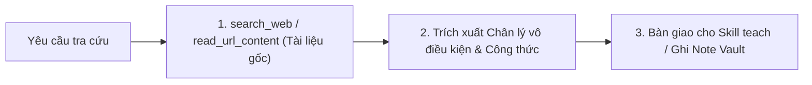

# Ground-Truth Research Skill for Obsidian

Mục tiêu: **Zero Hallucination (Không chấp nhận ảo giác)**. Đảm bảo mọi khái niệm, công thức, chuẩn kỹ thuật nạp vào Obsidian đều bắt nguồn từ tài liệu có thẩm quyền cao nhất.

---

## 1. Nguyên Tắc Cốt Lõi

1. **Tài liệu gốc (Primary Sources First):** Chỉ trích xuất từ Official Docs, RFC Standards, Linux Kernel, Source Code, Whitepapers. Tránh các bài blog tổng hợp thứ cấp không nguồn.
2. **Ngữ cảnh & Phiên bản:** Chỉ rõ phiên bản áp dụng (ví dụ: HTTP/2 vs HTTP/3, Postgres 14+, Python 3.11+).
3. **Khách quan:** Chỉ nêu các sự thật kỹ thuật có thể chứng minh và các điểm đánh đổi vật lý (Trade-offs).

---

## 2. Quy Trình 3 Bước

- **Bước 1:** Gọi `search_web` hoặc `read_url_content` để đọc trực tiếp đặc tả kỹ thuật, kèm URL dẫn chứng.
- **Bước 2:** Chắt lọc các tiên đề nền tảng và công thức chuẩn.
- **Bước 3:** Chuyển giao dữ kiện cho skill `teach` hoặc lưu vào `04 - Reference & Learning/` của Vault tương ứng.
