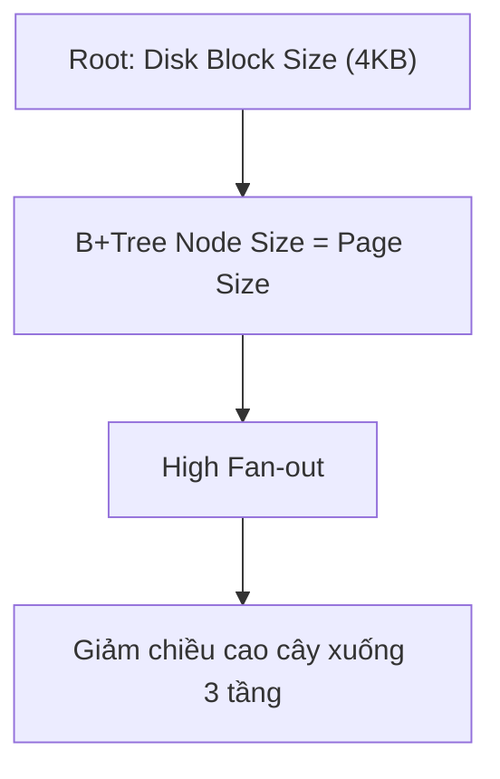

# Visualization Skill for Obsidian

Chỉ tạo hình ảnh / sơ đồ khi thể hiện cấu trúc, quan hệ phụ thuộc, phân cấp hoặc luồng dữ liệu vượt trội so với văn bản thuần.

---

## 1. Ma Trận Lựa Chọn Công Cụ

| Mục tiêu minh họa                                                                                   | Công cụ        | Vị trí Lưu trữ & Cách Render                                                           |
| :-------------------------------------------------------------------------------------------------- | :------------- | :------------------------------------------------------------------------------------- |
| **Cấu trúc & Luồng:** DAG, Flowchart, Sequence, State Machine, Cây dữ liệu, ERD, Kiến trúc hệ thống | **Mermaid**    | Viết trực tiếp khối `mermaid ... ` vào Note `.md` (Obsidian native render).            |
| **Bản vẽ tay & Sơ đồ tư duy phác thảo:** Mindmap, System Architecture vẽ tay                        | **Excalidraw** | Lưu tập trung tại thư mục gốc `Excalidraw/`, nhúng qua `![[Tên-Bản-Vẽ.excalidraw]]`.   |
| **Hình học & Bố cục tĩnh:** Memory layout, Con trỏ mảng, Vector, Đồ thị hàm số, Ảnh chụp            | **SVG / PNG**  | Lưu file vào `[Module]/99 - Attachments/images/`, nhúng qua `![[file-name.svg\|500]]`. |

---

## 2. Nguyên Tắc Thiết Kế Sơ Đồ

- **Tối giản thành phần:** Mỗi sơ đồ chỉ nên có từ 4–7 phần tử chính. Cắt bỏ mọi chi tiết thừa.
- **Theo nguyên lý gốc:** Root node (Chân lý vô điều kiện) nằm ở trên đỉnh, các nhánh suy diễn tỏa xuống dưới theo quan hệ nhân quả.

---

## 3. Cú Pháp Chuẩn

### Mermaid Block:

````markdown

````

### Nhúng Bản Vẽ Excalidraw / Ảnh:

```markdown
![[Overview-AI-agents.excalidraw]]
![[B-Tree-Node-Layout.svg|500]]
```
