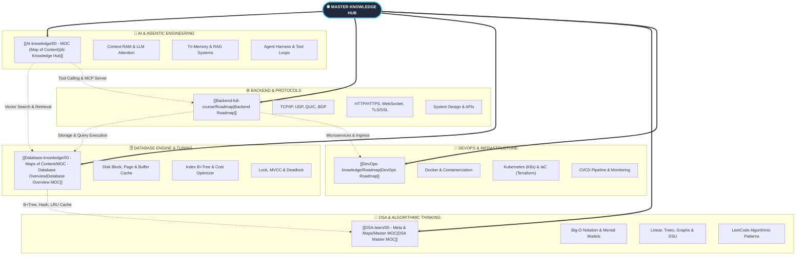

# 🌐 Computer Science & AI Master Knowledge Hub

> **Trung tâm điều hướng tổng quan toàn bộ hệ sinh thái tri thức (Second Brain).**
> Được tối ưu hóa cho đồ thị liên kết hai chiều (**Graph View**), tra cứu nhanh và tự học chuyên sâu theo **Alvar Method (First Principles)** cùng **Antigravity CLI**.

---

## 🗺️ 1. Bản Đồ Liên Kết Đa Miền (Cross-Domain Graph)

---

## 📚 2. Điều Hướng 5 Trụ Cột Tri Thức (Domain Modules)

| Trụ cột                  | Bản đồ trung tâm (MOC / Roadmap)                                                                | Lĩnh vực trọng tâm                                                                    |
| :----------------------- | :---------------------------------------------------------------------------------------------- | :------------------------------------------------------------------------------------ |
| 🧠 **AI & LLMOps**       | [[AI-knowledge/00 - MOC (Map of Content)\|🗺️ MOC - AI Knowledge Hub]]                           | Context RAM, Tri-Memory, PydanticAI, MCP, LangGraph, LLM-as-a-Judge, Continuous Eval. |
| 🗄️ **Database Engine**   | [[Database-knowledge/00 - Maps of Content/MOC - Database Overview\|🗺️ MOC - Database Overview]] | Disk I/O, Buffer Cache, B+Tree Index, Cost Optimizer, Lock & Deadlock, MVCC.          |
| 🧭 **DSA & Patterns**    | [[DSA-learn/00 - Meta & Maps/Master MOC\|🗺️ Master MOC - DSA]]                                  | Big-O, Mental Models, Data Structures, Algorithms, Two Pointers, Sliding Window, DP.  |
| ⚙️ **Backend Protocols** | [[Backend-full-course/Roadmap\|📋 Roadmap - Backend Engineering]]                               | TCP/IP, UDP, QUIC, BGP, WebSocket, HTTP/3, TLS/SSL, DNS, SFTP/SSH.                    |
| 🚀 **DevOps & Cloud**    | [[DevOps-knowledge/Roadmap\|📋 Roadmap - DevOps & Cloud Native]]                                | Linux Kernel, Docker Multi-stage, Kubernetes Ingress, Terraform IaC, Prometheus.      |

---

## ⚡ 3. Hướng Dẫn Tra Cứu & Học Tập Nhanh

- **Mở nhanh bất kỳ ghi chú nào:** Nhấn `Ctrl + O` (hoặc `Cmd + O` trên macOS) và gõ tên khái niệm.
- **Tìm kiếm toàn cục:** Nhấn `Ctrl + Shift + F` để tìm kiếm trên toàn bộ 5 mảng kiến thức.
- **Xem đồ thị liên kết:** Nhấn `Ctrl + G` để mở **Graph View** toàn cục.
- **Quy chuẩn nạp tri thức mới:** Xem chi tiết tại [[README#📐 5. Quy Định Chung Khi Nạp Tri Thức (Universal Specification)|Universal Specification trong README.md]].
- **Quy trình học tương tác cùng AI CLI:** Xem chi tiết tại [[docs/WORKFLOW_AI_LEARNING_OBSIDIAN|Workflow Học Tập agy CLI]].
