```mermaid
graph TD
    %% Styling Classes
    classDef main fill:#1e293b,stroke:#38bdf8,stroke-width:2px,color:#f8fafc,font-weight:bold;
    classDef foundation fill:#1e3a8a,stroke:#60a5fa,stroke-width:1.5px,color:#eff6ff;
    classDef memory fill:#064e3b,stroke:#34d399,stroke-width:1.5px,color:#ecfdf5;
    classDef rag fill:#701a75,stroke:#f472b6,stroke-width:1.5px,color:#fdf2f8;
    classDef harness fill:#7c2d12,stroke:#fb923c,stroke-width:1.5px,color:#fff7ed;
    classDef framework fill:#312e81,stroke:#818cf8,stroke-width:1.5px,color:#eef2ff;
    classDef eval fill:#831843,stroke:#fb7185,stroke-width:1.5px,color:#fff1f2;

    MOC(["🗺️ 00 - MOC: AI AGENT KNOWLEDGE HUB"]):::main

    subgraph M1 ["01. NGUYÊN LÝ ĐẦU TIÊN (First Principles)"]
        M1_1["01.1 - LLM Stateless Mechanics & Attention"]:::foundation
        M1_2["01.2 - Context RAM & Payload Assembly"]:::foundation
    end

    subgraph M2 ["02. HỆ THỐNG TRÍ NHỚ (Memory Systems)"]
        M2_1["02.1 - Tri-Memory Architecture Overview"]:::memory
        M2_2["02.2 - Procedural Memory & Skill Engineering"]:::memory
        M2_3["02.3 - Semantic & Episodic Memory"]:::memory
        M2_4["02.4 - Memory Distillation & Summarizer"]:::memory
    end

    subgraph M3 ["03. RAG & TRUY XUẤT (Information Retrieval)"]
        M3_1["03.1 - RAG Fundamentals & Vector Search"]:::rag
        M3_2["03.2 - Hybrid Retrieval (SQL + Vector)"]:::rag
        M3_3["03.3 - Advanced RAG & Semantic Routing"]:::rag
    end

    subgraph M4 ["04. HARNESS & LOOP ENGINEERING"]
        M4_1["04.1 - Agent Harness Core Concept"]:::harness
        M4_2["04.2 - Loop Engineering & Tool Calling"]:::harness
        M4_3["04.3 - End-Loop Guardrails & HITL"]:::harness
        M4_4["04.4 - Comprehensive Architecture"]:::harness
    end

    subgraph M5 ["05. FRAMEWORKS & TOOLING"]
        M5_1["05.1 - LangChain & LangGraph Deep Dive"]:::framework
        M5_2["05.2 - PydanticAI & Type-Safe Agents"]:::framework
        M5_3["05.3 - Model Context Protocol (MCP)"]:::framework
    end

    subgraph M6 ["06. LLMOps, TRACING & EVALUATION"]
        M6_1["06.1 - Tracing & Observability (LangFuse/LangSmith)"]:::eval
        M6_2["06.2 - Evaluation Systems & LLM-as-a-Judge"]:::eval
        M6_3["06.3 - Continuous Self-Evolution Loop"]:::eval
    end

    %% Routing / Knowledge Flow
    MOC --> M1
    MOC --> M2
    MOC --> M3
    MOC --> M4
    MOC --> M5
    MOC --> M6

    M1 -.-> M2
    M2 -.-> M3
    M3 -.-> M4
    M4 -.-> M5
    M5 -.-> M6
    M6 -.->|Continuous Feedback Loop| M4

    %% Clickable Navigation Links
    click M1_1 "01 - Fundamentals & First Principles/01.1 - LLM Stateless Mechanics & Attention" "Mở bài 01.1"
    click M1_2 "01 - Fundamentals & First Principles/01.2 - Context RAM & Payload Assembly" "Mở bài 01.2"

    click M2_1 "02 - Memory Systems/02.1 - Tri-Memory Architecture Overview" "Mở bài 02.1"
    click M2_2 "02 - Memory Systems/02.2 - Procedural Memory & Skill Engineering" "Mở bài 02.2"
    click M2_3 "02 - Memory Systems/02.3 - Semantic & Episodic Memory" "Mở bài 02.3"
    click M2_4 "02 - Memory Systems/02.4 - Memory Distillation & Summarizer Agents" "Mở bài 02.4"

    click M3_1 "03 - RAG & Information Retrieval/03.1 - RAG Fundamentals & Vector Search" "Mở bài 03.1"
    click M3_2 "03 - RAG & Information Retrieval/03.2 - Hybrid Retrieval (SQL Recency + Vector Relevance)" "Mở bài 03.2"
    click M3_3 "03 - RAG & Information Retrieval/03.3 - Advanced RAG & Retrieval Routing" "Mở bài 03.3"

    click M4_1 "04 - Agent Architecture & Loop Engineering/04.1 - Agent Harness Core Concept" "Mở bài 04.1"
    click M4_2 "04 - Agent Architecture & Loop Engineering/04.2 - Loop Engineering & Tool Calling" "Mở bài 04.2"
    click M4_3 "04 - Agent Architecture & Loop Engineering/04.3 - End-Loop Guardrails & HITL" "Mở bài 04.3"
    click M4_4 "04 - Agent Architecture & Loop Engineering/04.4 - Comprehensive Agent Architecture" "Mở bài 04.4"

    click M5_1 "05 - Frameworks & Tooling/05.1 - LangChain & LangGraph Deep Dive" "Mở bài 05.1"
    click M5_2 "05 - Frameworks & Tooling/05.2 - PydanticAI & Type-Safe Agents" "Mở bài 05.2"
    click M5_3 "05 - Frameworks & Tooling/05.3 - Model Context Protocol (MCP)" "Mở bài 05.3"

    click M6_1 "06 - LLMOps & Evaluation/06.1 - Tracing & Observability (LangFuse, LangSmith)" "Mở bài 06.1"
    click M6_2 "06 - LLMOps & Evaluation/06.2 - Evaluation Systems & LLM-as-a-Judge" "Mở bài 06.2"
    click M6_3 "06 - LLMOps & Evaluation/06.3 - Continuous Feedback & Self-Evolution Loop" "Mở bài 06.3"
```

# 🗺️ AI Agents & Engineering: Map of Content (MOC)

> Chào mừng đến với kho tri thức toàn diện về **AI Agent Architecture & Engineering**. Kho tài liệu được thiết kế theo tư duy **First Principles (Nguyên lý đầu tiên)**, đi từ bản chất tính toán vật lý đến các mô hình kiến trúc thực chiến (LangGraph, RAG, Memory, Evals, LLMOps).

---

---

## 📚 Mục Lục Chi Tiết Theo Chủ Đề (Domain Modules)

### 🔹 [[01 - Fundamentals & First Principles/01.1 - LLM Stateless Mechanics & Attention|01. Fundamentals & First Principles]]

- [[01 - Fundamentals & First Principles/01.1 - LLM Stateless Mechanics & Attention|01.1 - LLM Stateless Mechanics & Attention]]: Bản chất toán học $y = f(x)$, cơ chế vô trạng thái, không gian VRAM và Attention Matrix.
- [[01 - Fundamentals & First Principles/01.2 - Context RAM & Payload Assembly|01.2 - Context RAM & Payload Assembly]]: Giải mã "Context RAM", phân định vị trí thực thi (Client vs Cloud Backend vs LLM Provider).

---

### 🔹 [[02 - Memory Systems/02.1 - Tri-Memory Architecture Overview|02. Memory Systems (Hệ Thống Trí Nhớ)]]

- [[02 - Memory Systems/02.1 - Tri-Memory Architecture Overview|02.1 - Tri-Memory Architecture Overview]]: Tổng quan 3 tầng trí nhớ ngoại vi (Procedural, Semantic, Episodic).
- [[02 - Memory Systems/02.2 - Procedural Memory & Skill Engineering|02.2 - Procedural Memory & Skill Engineering]]: Định nghĩa quy tắc, kỹ năng thực thi (`SKILL.md`, System Prompts).
- [[02 - Memory Systems/02.3 - Semantic & Episodic Memory|02.3 - Semantic & Episodic Memory]]: Phân biệt Durable Facts (Vector Store) và Time-Series Event Logs (SQL DB).
- [[02 - Memory Systems/02.4 - Memory Distillation & Summarizer Agents|02.4 - Memory Distillation & Summarizer Agents]]: Cơ chế nén hội thoại tự động sau mỗi $N$ chats bằng LLM nhỏ/rẻ.

---

### 🔹 [[03 - RAG & Information Retrieval/03.1 - RAG Fundamentals & Vector Search|03. RAG & Information Retrieval (Truy Xuất Tri Thức)]]

- [[03 - RAG & Information Retrieval/03.1 - RAG Fundamentals & Vector Search|03.1 - RAG Fundamentals & Vector Search]]: Chunking, Embeddings, Top-K Cosine Similarity, Vector DBs (Pinecone, Qdrant, Milvus).
- [[03 - RAG & Information Retrieval/03.2 - Hybrid Retrieval (SQL Recency + Vector Relevance)|03.2 - Hybrid Retrieval (SQL Recency + Vector Relevance)]]: Kết hợp truy vấn SQL lọc thời gian thực và Semantic Search lọc ngữ nghĩa.
- [[03 - RAG & Information Retrieval/03.3 - Advanced RAG & Retrieval Routing|03.3 - Advanced RAG & Retrieval Routing]]: Query rewriting, Reranking, Self-RAG, Routing tri thức theo câu hỏi.

---

### 🔹 [[04 - Agent Architecture & Loop Engineering/04.1 - Agent Harness Core Concept|04. Agent Architecture & Loop Engineering]]

- [[04 - Agent Architecture & Loop Engineering/04.1 - Agent Harness Core Concept|04.1 - Agent Harness Core Concept]]: Ẩn dụ Horse vs Harness, kiềm chế tính ngẫu nhiên (Probabilistic) của LLM.
- [[04 - Agent Architecture & Loop Engineering/04.2 - Loop Engineering & Tool Calling|04.2 - Loop Engineering & Tool Calling]]: ReAct cycle, chuỗi gọi công cụ liên tiếp (Tool Calling Loops).
- [[04 - Agent Architecture & Loop Engineering/04.3 - End-Loop Guardrails & HITL|04.3 - End-Loop Guardrails & HITL]]: Thiết kế điều kiện dừng, Human-in-the-loop, Notification hooks chống treo vô tận.
- [[04 - Agent Architecture & Loop Engineering/04.4 - Comprehensive Agent Architecture|04.4 - Comprehensive Agent Architecture]]: Báo cáo kiến trúc tổng hợp kèm sơ đồ Excalidraw ![[Overview-AI-agents.excalidraw]].

---

### 🔹 [[05 - Frameworks & Tooling/05.1 - LangChain & LangGraph Deep Dive|05. Frameworks & Tooling (Công Cụ Triển Khai)]]

- [[05 - Frameworks & Tooling/05.1 - LangChain & LangGraph Deep Dive|05.1 - LangChain & LangGraph Deep Dive]]: StateGraphs, Nodes, Conditional Edges, Checkpointing, Cycles.
- [[05 - Frameworks & Tooling/05.2 - PydanticAI & Type-Safe Agents|05.2 - PydanticAI & Type-Safe Agents]]: Xây dựng Agent định kiểu chặt chẽ (Type-safe), Validation dữ liệu vào/ra.
- [[05 - Frameworks & Tooling/05.3 - Model Context Protocol (MCP)|05.3 - Model Context Protocol (MCP)]]: Giao thức chuẩn hóa kết nối Agent với Tools, Databases và Resources.

---

### 🔹 [[06 - LLMOps & Evaluation/06.1 - Tracing & Observability (LangFuse, LangSmith)|06. LLMOps, Tracing & Evaluation]]

- [[06 - LLMOps & Evaluation/06.1 - Tracing & Observability (LangFuse, LangSmith)|06.1 - Tracing & Observability]]: Thu thập Trace Tree, Latency breakdown, Token consumption.
- [[06 - LLMOps & Evaluation/06.2 - Evaluation Systems & LLM-as-a-Judge|06.2 - Evaluation Systems & LLM-as-a-Judge]]: Evals tự động, Chấm điểm độ chính xác, Rule assertions.
- [[06 - LLMOps & Evaluation/06.3 - Continuous Feedback & Self-Evolution Loop|06.3 - Continuous Feedback & Self-Evolution Loop]]: Chẩn đoán lỗi gốc, tự động nâng cấp System Prompt/Config, chu trình tự hoàn thiện.

---

## 🎓 Không Gian Thực Hành & Hồ Sơ Học Tập (Teaching Workspace)

- **Mục tiêu học tập**: [[MISSION|MISSION.md]]
- **Tài liệu & Nguồn tham khảo**: [[RESOURCES|RESOURCES.md]]
- **Sổ tay ghi chú người học**: [[NOTES|NOTES.md]]
- **Hồ sơ tiến độ (Learning Records)**:
  - [[07 - Teaching & Practice/learning-records/0001-agent-harness-and-loop-engineering|LR-0001: Agent Harness & Loop Engineering]]
  - [[07 - Teaching & Practice/learning-records/0002-context-ram-first-principles|LR-0002: Context RAM & Payload Assembly (First Principles)]]
- **Bài học trực quan tương tác (Interactive Lessons)**:
  - `lessons/0001-context-ram-first-principles.html`
- **Tài liệu tra cứu nhanh (Cheat Sheet Reference)**:
  - `reference/agent-harness-loop-engineering.html`
- **Bản vẽ sơ đồ Excalidraw**:
  - ![[Overview-AI-agents.excalidraw]]
