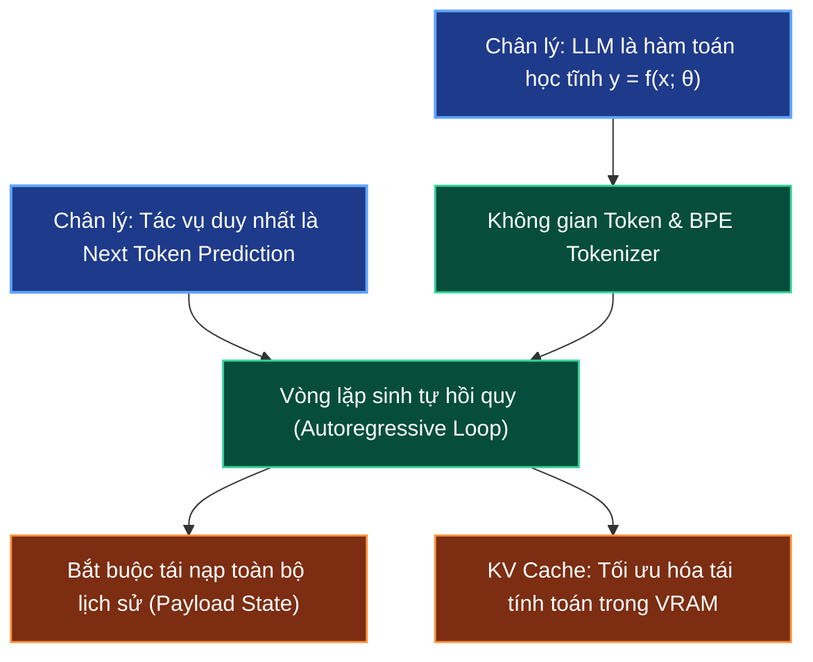

# 🧠 LLM Stateless Mechanics & Next Token Prediction

> **Điều hướng**: [[AI-knowledge/00 - MOC (Map of Content)|Quay lại MOC]] | [[AI-knowledge/01 - Fundamentals & First Principles/01.2 - Context RAM & Payload Assembly|Tiếp theo: 01.2 - Context RAM]]

---

## 1. Sơ Đồ Mermaid DAG Phụ Thuộc

---

## 2. Chân Lý Vô Điều Kiện (Unconditional Truths)

> [!NOTE]
>
> 1. **Tính chất vô trạng thái (Pure Stateless Function)**: Mô hình ngôn ngữ lớn (LLM) bản chất vật lý là một hàm toán học tĩnh $y = f(x; \theta)$. Sau khi hoàn tất pha huấn luyện, toàn bộ trọng số $\theta$ được đóng băng hoàn toàn. Mô hình không sở hữu bất kỳ bộ nhớ nội tại nào để ghi nhớ giữa hai lần gọi API riêng biệt.
> 2. **Bản chất tác vụ duy nhất (Singular Task Invariance)**: Dù thực hiện giải toán, làm thơ, viết mã nguồn hay đóng vai AI Agent, ở tầng phần cứng thấp nhất LLM chỉ thực hiện **duy nhất một bài toán**: Tính toán phân phối xác suất có điều kiện của token kế tiếp dựa trên chuỗi token ngữ cảnh đã có:
>    $$P(w_{t+1} \mid w_1, w_2, \dots, w_t)$$

---

## 3. Trực Giác Motivated Discovery (3Blue1Brown Intuition)

> [!TIP]
> **Vấn đề ngây thơ**: Nhiều người lầm tưởng ChatGPT "nhớ" được tên và ngữ cảnh của mình khi chat vì nó có ý thức hay bộ nhớ động như bộ não con người.
>
> **Thực tế cơ học**: Nếu bạn gửi lần 1: _"Tôi tên là Ryuuki"_, mô hình trả về: _"Chào Ryuuki"_. Khi bạn gửi lần 2: _"Tôi tên gì?"_, nếu chỉ gửi duy nhất chuỗi này, mô hình sẽ trả lời: _"Tôi không biết bạn là ai"_.
>
> **Động lực giải pháp**: Để tạo ra ảo giác "hội thoại liên tục", phần mềm bọc bên ngoài (Harness/Client) phải âm thầm ghép nối toàn bộ lịch sử hội thoại cũ thành một chuỗi duy nhất và gửi lại toàn bộ vào $x$ ở mỗi lượt truy vấn:
> $$x_{\text{turn 2}} = \text{"Tôi tên là Ryuuki \n Chào Ryuuki \n Tôi tên gì?"}$$
> Mọi suy luận logic của AI Agent đều sinh ra từ khả năng "nhìn lại" chuỗi lịch sử này thông qua ma trận tương quan giữa các token.

---

## 4. Phân Tích Kỹ Thuật Chuyên Sâu & $\LaTeX$

### 4.1. Toán Học Của Vòng Lặp Tự Hồi Quy (Autoregressive Loop)

Quá trình sinh văn bản của LLM diễn ra tuần tự từng token một theo chuỗi thời gian rời rạc:

$$
\begin{aligned}
\text{Bước 1:} \quad & w_{t+1} \sim P(w \mid w_1, \dots, w_t) \\
\text{Bước 2:} \quad & w_{t+2} \sim P(w \mid w_1, \dots, w_t, w_{t+1}) \\
\dots & \\
\text{Bước k:} \quad & w_{t+k} \sim P(w \mid w_1, \dots, w_{t+k-1})
\end{aligned}
$$

Tại mỗi bước, vector Logits $z \in \mathbb{R}^{|V|}$ (với $|V|$ là kích thước bộ từ vựng Vocabulary, thường từ $32{,}000$ đến $128{,}000$) được chuyển thành xác suất thông qua hàm **Softmax có tham số nhiệt độ ($T$)**:

$$P(w_{t+1} = v_i \mid w_{1:t}) = \frac{\exp(z_i / T)}{\sum_{j=1}^{|V|} \exp(z_j / T)}$$

- Khi $T \to 0$ (Argmax / Greedy Decoding): Mô hình luôn chọn token có xác suất cao nhất, câu trả lời mang tính xác định tuyệt đối (Deterministic).
- Khi $T > 0$ (Sampling / Top-p / Top-k): Tăng độ phong phú ngẫu nhiên của các từ được sinh ra.

### 4.2. Giới Hạn Vật Lý: Context Window & KV Cache

Do bản chất tự hồi quy, nếu mỗi lần sinh token $w_{t+1}$ mô hình phải tính toán lại toàn bộ biểu diễn của $w_1 \dots w_t$, khối lượng tính toán sẽ bùng nổ theo cấp số cộng $\mathcal{O}(N^2)$ bước.

Để giải quyết nút thắt này trên phần cứng GPU:

- **KV Cache**: Các ma trận Key ($K$) và Value ($V$) của các token quá khứ được giữ lại trực tiếp trong VRAM.
- Khi sinh token mới $w_{t+1}$, GPU chỉ cần tính toán vector Query ($Q_{t+1}$) cho duy nhất token hiện tại và nhân với bộ nhớ đệm $K_{\text{cache}}, V_{\text{cache}}$.
- **Đánh đổi (Trade-off)**: VRAM tiêu thụ cho KV Cache tăng tuyến tính theo độ dài ngữ cảnh và kích thước Batch:
  $$\text{Memory}_{\text{KV}} = 2 \times n_{\text{layers}} \times n_{\text{heads}} \times d_k \times n_{\text{tokens}} \times \text{bytes per param}$$

---

## 5. Spaced Repetition Flashcards & WikiLinks

### Flashcards (#card)

Tại sao LLM không thể tự ghi nhớ thông tin giữa hai lần gọi API độc lập nếu không được gửi kèm lịch sử? #card
Bởi vì LLM là một hàm toán học tĩnh vô trạng thái $y = f(x; \theta)$. Sau khi pre-training/fine-tuning, trọng số $\theta$ bị đóng băng hoàn toàn. Mô hình không có cơ chế ghi nhớ động; toàn bộ thông tin ngữ cảnh bắt buộc phải được đóng gói vào vector đầu vào $x$ (Context Window).

<!--ID: 1727515000001-->

Bản chất cốt lõi của tác vụ Next Token Prediction trong LLM là gì? #card
Là bài toán tối ưu hóa phân phối xác suất có điều kiện $P(w_{t+1} \mid w_1, \dots, w_t)$. Bất kể tác vụ bề mặt là giải toán, lập trình hay suy luận logic, ở tầng tính toán vật lý LLM chỉ dự đoán token tiếp theo có xác suất xuất hiện cao nhất dựa trên ngữ cảnh đã nhận.

<!--ID: 1727515000002-->

Vai trò vật lý của KV Cache trong quá trình suy luận (Inference) của LLM là gì? #card
Lưu trữ ma trận Key ($K$) và Value ($V$) của các token trước đó trong VRAM của GPU, giúp mô hình không phải tính toán lại các biểu diễn vector của chuỗi lịch sử ở mỗi bước sinh token mới, giảm độ phức tạp mỗi bước từ $\mathcal{O}(t)$ xuống $\mathcal{O}(1)$.

<!--ID: 1727515000003-->

### Liên Kết Hai Chiều (WikiLinks)

- Nền tảng tiếp theo: [[AI-knowledge/01 - Fundamentals & First Principles/01.2 - Context RAM & Payload Assembly|01.2 - Context RAM & Payload Assembly]]
- Động lực biểu diễn: [[AI-knowledge/01 - Fundamentals & First Principles/01.3 - Static vs Dynamic Embedding|01.3 - Static vs Dynamic Embedding]]
- Bản đồ tổng quan: [[AI-knowledge/00 - MOC (Map of Content)|MOC - AI Knowledge Hub]]
