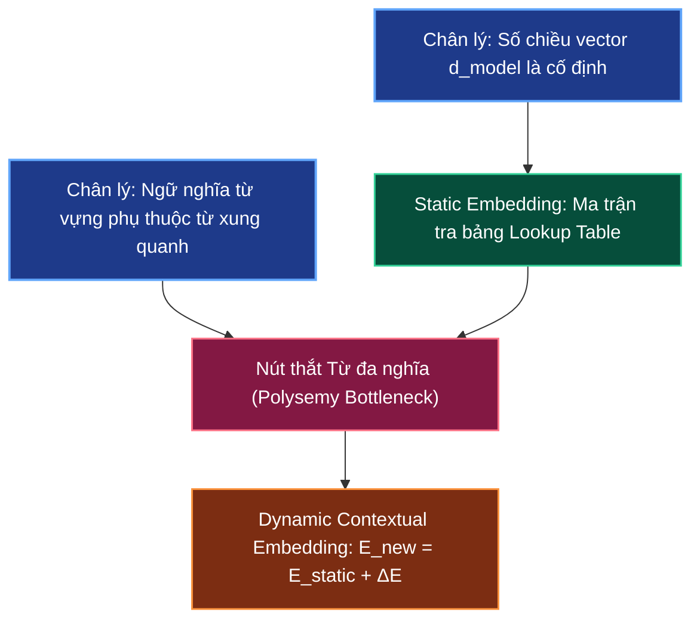

# 🧬 Static vs Dynamic Embedding: Từ Word2Vec Đến Biểu Diễn Ngữ Cảnh

> **Điều hướng**: [[AI-knowledge/00 - MOC (Map of Content)|Quay lại MOC]] | [[AI-knowledge/01 - Fundamentals & First Principles/01.1 - LLM Stateless Mechanics & Next Token Prediction|Trước: 01.1 - LLM Stateless Mechanics]] | [[AI-knowledge/01 - Fundamentals & First Principles/01.4 - Sequence Processing: RNN Bottleneck vs Transformer Parallelism|Tiếp: 01.4 - RNN vs Transformer]]

---

## 1. Sơ Đồ Mermaid DAG Phụ Thuộc



---

## 2. Chân Lý Vô Điều Kiện (Unconditional Truths)

> [!NOTE]
>
> 1. **Bất biến chiều không gian (Dimensionality Invariance)**: Kích thước chiều không gian nhúng ($d_{\text{model}}$, ví dụ: $300, 512, 4096$) là siêu tham số cố định của toàn bộ mạng nơ-ron. Mọi vector biểu diễn từ vựng trong mô hình đều có cùng một số chiều, không bao giờ thay đổi độ dài giữa các câu văn khác nhau.
> 2. **Định đề ngữ cảnh phân phối (Distributional Hypothesis - J.R. Firth, 1957)**: _"You shall know a word by the company it keeps"_. Một từ ngữ trong ngôn ngữ tự nhiên không sở hữu ngữ nghĩa độc lập tuyệt đối; ngữ nghĩa thực tế của nó được xác lập bởi mối quan hệ tương hỗ với các từ vựng xuất hiện cùng nó trong ngữ cảnh.
> 3. **Bản chất tra bảng tĩnh (Static Lookup Invariance)**: Trong các mô hình thế hệ cũ (Word2Vec, GloVe), vector nhúng là một phép tra bảng tĩnh (Lookup Table). Cùng một mã từ ID $i$ luôn luôn trích xuất ra đúng một hàng vector số học bất biến trong ma trận, hoàn toàn không có cơ chế chú ý (No Attention).

---

## 3. Trực Giác Motivated Discovery (3Blue1Brown Intuition)

> [!TIP]
> **Vấn đề ngây thơ**: Hãy xem xét từ `"bank"` trong hai câu:
>
> - Câu A: _"He sat on the river **bank** to fish."_ (Bờ sông)
> - Câu B: _"He deposited money into the **bank** account."_ (Ngân hàng)
>
> Với **Word2Vec (2013)**, mô hình coi từ điển như một bảng danh bạ. Thấy từ `"bank"` ở dòng 42, nó trả về đúng vector cố định:
> $$E_{\text{Word2Vec}}(\text{"bank"}) = \begin{bmatrix} 0.42 & -0.18 & \dots & 0.85 \end{bmatrix}^T \in \mathbb{R}^{300}$$
> Cả Câu A và Câu B đều nhận chung một vector vô hồn này. Hậu quả: Mô hình không thể biết _"bank"_ trong câu A là đất đá hay câu B là tổ chức tài chính.
>
> **Động lực của Transformer (2017)**: Thay vì chấp nhận vector tĩnh đó, ta coi $E_{\text{static}}$ chỉ là điểm xuất phát ban đầu. Mô hình cho phép từ `"bank"` "giao tiếp" với các từ xung quanh (_"river"_, _"fish"_ hoặc _"money"_, _"account"_) để tính ra một vector bổ sung $\Delta E$.
>
> Vector hoàn chỉnh cuối cùng (Phiên bản "Premium") được làm giàu:
> $$E_{\text{contextual}} = E_{\text{static}} + \Delta E$$
>
> - Trong Câu A: $\Delta E$ kéo vector `"bank"` trôi về vùng không gian địa lý/tự nhiên.
> - Trong Câu B: $\Delta E$ kéo vector `"bank"` trôi về vùng không gian tài chính/kinh tế.

---

## 4. Phân Tích Kỹ Thuật Chuyên Sâu & $\LaTeX$

### 4.1. Toán Học Của Static Embedding (Bản Chất Lookup Table)

Cho bộ từ vựng $|V|$, mỗi từ được biểu diễn bằng một One-Hot Vector $x \in \{0, 1\}^{|V|}$ (chỉ có duy nhất vị trí thứ $i$ mang giá trị 1). Ma trận nhúng $W_{\text{embed}} \in \mathbb{R}^{d \times |V|}$.

Phép nhúng từ tĩnh thực chất là phép nhân ma trận:
$$e_i = W_{\text{embed}} \cdot x_i = W_{\text{embed}}[:, i]$$

Vì $x_i$ chỉ có một giá trị $1$, phép nhân này không thực hiện phép tính số học nào mà tương đương với việc trích xuất cột thứ $i$ của ma trận $W_{\text{embed}}$.

$$\frac{\partial e_i}{\partial \text{Context}} = 0$$

Đạo hàm theo các từ xung quanh bằng $0$: Vector $e_i$ hoàn toàn độc lập với ngữ cảnh.

### 4.2. Cơ Chế Dynamic Contextual Embedding (Transformer)

Trong kiến trúc Transformer, vector đầu ra của tầng Self-Attention cho token thứ $i$ được định nghĩa bằng tổng có trọng số của các vector nội dung (Value $V$) từ tất cả $N$ token trong câu:

$$E_i^{\text{contextual}} = E_i^{\text{static}} + \Delta E_i$$

Trong đó, lượng bổ sung ngữ cảnh $\Delta E_i$ được sinh ra từ cơ chế Attention:

$$\Delta E_i = \sum_{j=1}^{N} \alpha_{ij} V_j$$

- $\alpha_{ij}$: Trọng số chú ý (Attention Weight) thể hiện mức độ từ $j$ đóng góp ngữ nghĩa cho từ $i$ ($\sum_{j=1}^N \alpha_{ij} = 1$).
- $V_j$: Vector thông tin thực tế mang theo của từ thứ $j$.

```text
Từ mẫu: "a big blue cat chases a mouse"
E("cat") [Static]     : [ 0.12, -0.05,  0.44, ... ] (Chỉ biết là loài mèo)
          +
ΔE("cat") [Contextual] : alpha_big * V("big") + alpha_blue * V("blue") + ...
          =
E_premium("cat")      : [ 0.89,  0.72,  0.11, ... ] (Con mèo to lớn, màu xanh)
```

---

## 5. Spaced Repetition Flashcards & WikiLinks

### Flashcards (#card)

Tại sao Word2Vec thất bại trong việc phân biệt nghĩa của các từ đa nghĩa (Polysemy) như "Apple" hay "Bank"? #card
Vì Word2Vec là ma trận tra cứu tĩnh (Static Lookup Table), gán cứng mỗi từ trong từ điển với đúng một hàng vector số học cố định. Khi trích xuất, vector này không có cơ chế tương tác với các từ lân cận, khiến đạo hàm của vector theo ngữ cảnh luôn bằng 0.

<!--ID: 1727515100001-->

Toán học cốt lõi biến một Static Embedding thành Dynamic Contextual Embedding trong Transformer là gì? #card
Cơ chế cộng vector làm giàu: $E_{\text{contextual}} = E_{\text{static}} + \Delta E$, trong đó $\Delta E = \sum_{j=1}^N \alpha_{ij} V_j$ là tổng có trọng số (Attention Weights $\alpha_{ij}$) của các vector Value ($V_j$) từ tất cả các từ trong câu văn.

<!--ID: 1727515100002-->

Số chiều của vector biểu diễn từ trong mô hình ngôn ngữ có bị thay đổi khi gặp câu văn phức tạp hơn không? #card
Không. Chiều không gian vector ($d_{\text{model}}$) là một siêu tham số bất biến của mô hình. Ngữ cảnh phức tạp chỉ làm thay đổi giá trị của các phần tử số học bên trong vector, chứ không thay đổi độ dài số chiều của vector.

<!--ID: 1727515100003-->

### Liên Kết Hai Chiều (WikiLinks)

- Nền tảng phía trước: [[AI-knowledge/01 - Fundamentals & First Principles/01.1 - LLM Stateless Mechanics & Next Token Prediction|01.1 - LLM Stateless Mechanics & Next Token Prediction]]
- Nút thắt tiếp theo: [[AI-knowledge/01 - Fundamentals & First Principles/01.4 - Sequence Processing: RNN Bottleneck vs Transformer Parallelism|01.4 - Sequence Processing: RNN Bottleneck vs Transformer Parallelism]]
- Cơ chế tính toán chi tiết: [[AI-knowledge/01 - Fundamentals & First Principles/01.5 - Scaled Dot-Product Self-Attention|01.5 - Scaled Dot-Product Self-Attention]]
- Bản đồ tổng quan: [[AI-knowledge/00 - MOC (Map of Content)|MOC - AI Knowledge Hub]]
