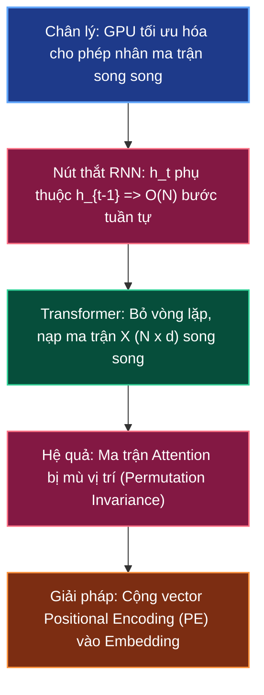

# ⚡ Sequence Processing: Nút Thắt RNN vs Đột Phá Song Song Transformer

> **Điều hướng**: [[AI-knowledge/00 - MOC (Map of Content)|Quay lại MOC]] | [[AI-knowledge/01 - Fundamentals & First Principles/01.3 - Static vs Dynamic Embedding|Trước: 01.3 - Static vs Dynamic Embedding]] | [[AI-knowledge/01 - Fundamentals & First Principles/01.5 - Scaled Dot-Product Self-Attention|Tiếp: 01.5 - Scaled Dot-Product Attention]]

---

## 1. Sơ Đồ Mermaid DAG Phụ Thuộc



---

## 2. Chân Lý Vô Điều Kiện (Unconditional Truths)

> [!NOTE]
>
> 1. **Bản chất phần cứng GPU (Hardware Mass-Parallelism)**: Bộ xử lý đồ họa (GPU / TPU) được cấu tạo từ hàng ngàn nhân tính toán đồng thời (SIMD / Tensor Cores), đạt thông lượng tối đa khi thực thi các phép toán đại số tuyến tính ma trận khổng lồ. Mọi thuật toán có tính phụ thuộc bước thời gian tuần tự $t \to t+1$ đều triệt tiêu ưu thế phần cứng của GPU.
> 2. **Ràng buộc tuần tự của RNN (Sequential Dependency)**: Mạng nơ-ron hồi quy bắt buộc phải tính trạng thái ẩn hiện tại $h_t$ dựa trên trạng thái ẩn quá khứ $h_{t-1}$. Phép tính tại bước $t$ không thể bắt đầu nếu bước $t-1$ chưa kết thúc.
> 3. **Bất biến hoán vị của cơ chế Attention thuần túy (Permutation Equivariance)**: Bản thân cơ chế Self-Attention xem tập hợp các token đầu vào như một "túi từ" (Bag of Words / Set). Nếu không có cơ chế đánh dấu vị trí, hai câu đảo trật tự như _"mèo cắn chuột"_ và _"chuột cắn mèo"_ sẽ sinh ra các tập vector biểu diễn giống hệt nhau.

---

## 3. Trực Giác Motivated Discovery (3Blue1Brown Intuition)

> [!TIP]
> **Vấn đề ngây thơ**: Trước năm 2017, ta xử lý chuỗi văn bản bằng cách cho RNN/LSTM "đọc" từng từ một từ trái sang phải.
>
> Hãy tưởng tượng bạn mua một siêu máy tính trang bị cụm GPU Nvidia H100 với hàng chục ngàn nhân xử lý song song. Nhưng khi chạy RNN, nhân GPU xử lý từ thứ $100$ buộc phải "ngồi chơi xơi nước" để đợi nhân xử lý từ thứ $99$, từ $98$ ... hoàn tất. Thời gian xử lý chuỗi $N$ từ tốn đúng $N$ bước thời gian tuần tự. Thêm vào đó, khi đi qua hàng trăm từ, thông tin ở đầu câu bị suy hao mờ nhạt (Vanishing Gradient / Information decay).
>
> **Động lực của Transformer (2017)**: _"Tại sao phải ép mô hình đọc tuần tự từng từ?"_
>
> Hãy xếp toàn bộ $N$ từ của câu vào một ma trận duy nhất $X \in \mathbb{R}^{N \times d_{\text{model}}}$ và nạp thẳng vào GPU trong **một lượt tính toán duy nhất**! Tất cả các từ nhìn thấy nhau cùng một lúc.
>
> **Thách thức phát sinh**: Khi xử lý đồng thời cả câu, mô hình mất hoàn toàn khái niệm từ nào đứng trước, từ nào đứng sau. Vì vậy, ta phải "đánh số trang" bằng cách cộng thêm một vector tọa độ vào từng từ:
> $$X_{\text{input}} = E_{\text{token}} + PE_{\text{position}}$$

---

## 4. Phân Tích Kỹ Thuật Chuyên Sâu & $\LaTeX$

### 4.1. So Sánh Độ Phức Tạp Tính Toán: RNN vs Transformer

| Tiêu chí                                | Mạng Hồi Quy (RNN / LSTM)                             | Kiến Trúc Transformer (Self-Attention)                                              |
| :-------------------------------------- | :---------------------------------------------------- | :---------------------------------------------------------------------------------- |
| **Công thức chuyển trạng thái**         | $h_t = \tanh(W x_t + U h_{t-1} + b)$                  | $\text{Attention}(Q, K, V) = \text{softmax}\left(\frac{Q K^T}{\sqrt{d_k}}\right) V$ |
| **Số bước tuần tự tối thiểu**           | $\mathcal{O}(N)$ (Bắt buộc tuần tự $N$ bước)          | $\mathcal{O}(1)$ (Xử lý toàn bộ ma trận trong 1 bước)                               |
| **Độ phức tạp tính toán trên mỗi tầng** | $\mathcal{O}(N \cdot d^2)$                            | $\mathcal{O}(N^2 \cdot d)$                                                          |
| **Đường dẫn truyền thông tin tối đa**   | $\mathcal{O}(N)$ (Thông tin phải nhảy qua $N$ nơ-ron) | $\mathcal{O}(1)$ (Bất kỳ 2 từ nào cũng kết nối trực tiếp)                           |
| **Khả năng mở rộng trên GPU**           | Rất kém (Nghẽn băng thông do chờ đợi)                 | Cực tốt (Tận dụng 100% Tensor Cores)                                                |

### 4.2. Cơ Chế Positional Encoding (Mã Hóa Vị Trí Hình Sin)

Để cung cấp thông tin thứ tự không gian cho ma trận đầu vào mà không làm thay đổi số chiều $d_{\text{model}}$, bài báo gốc _Attention Is All You Need_ sử dụng các hàm sóng hình Sin và Cosin với tần số biến thiên:

$$
\begin{aligned}
PE_{(pos, 2i)} &= \sin\left(\frac{pos}{10000^{2i/d_{\text{model}}}}\right) \\
PE_{(pos, 2i+1)} &= \cos\left(\frac{pos}{10000^{2i/d_{\text{model}}}}\right)
\end{aligned}
$$

- $pos$: Vị trí chỉ số của từ trong câu ($pos \in [0, N-1]$).
- $i$: Chỉ số chiều không gian ($i \in [0, d_{\text{model}}/2 - 1]$).
- Chu kỳ bước sóng kéo dài từ $2\pi$ đến $10000 \cdot 2\pi$.

```text
Từ "cat" ở vị trí pos = 3:
Vector nhúng từ E("cat")  : [  0.42, -0.18,  0.85, ... ] (512 chiều)
         +
Vector vị trí PE(pos = 3) : [  0.14,  0.98, -0.05, ... ] (512 chiều)
         =
Vector nạp vào GPU        : [  0.56,  0.80,  0.80, ... ] (512 chiều duy nhất)
```

**Tính chất toán học vượt trội**: Nhờ công thức biến đổi lượng giác $\cos(\alpha + \beta) = \cos\alpha\cos\beta - \sin\alpha\sin\beta$, vector vị trí tương đối $PE_{pos + k}$ có thể được biểu diễn tuyến tính qua $PE_{pos}$, giúp mô hình dễ dàng học cách chú ý theo khoảng cách tương đối giữa hai từ.

---

## 5. Spaced Repetition Flashcards & WikiLinks

### Flashcards (#card)

Tại sao mạng RNN/LSTM không thể tận dụng tối đa sức mạnh của các chip GPU hiện đại trong giai đoạn huấn luyện? #card
Vì RNN có tính phụ thuộc tuần tự theo thời gian: trạng thái ẩn $h_t$ bắt buộc phải chờ $h_{t-1}$ tính xong mới thực hiện được. Điều này tạo ra $\mathcal{O}(N)$ bước tuần tự, khiến hàng ngàn nhân xử lý song song của GPU bị nhàn rỗi trong quá trình chờ đợi dữ liệu.

<!--ID: 1727515200001-->

Tại sao kiến trúc Transformer bắt buộc phải bổ sung vector Positional Encoding vào vector từ vựng trước khi đưa vào tầng Attention? #card
Vì cơ chế Self-Attention xử lý tất cả các token song song đồng thời và có tính chất bất biến hoán vị (Permutation Equivariance), coi chuỗi như một tập hợp không thứ tự. Nếu không có Positional Encoding, mô hình hoàn toàn không thể phân biệt được ngữ nghĩa giữa các câu có cùng từ ngữ nhưng khác thứ tự (ví dụ: "chó cắn mèo" vs "mèo cắn chó").

<!--ID: 1727515200002-->

Độ dài đường dẫn truyền thông tin (Path length) giữa hai từ bất kỳ trong câu ở Transformer so với RNN khác nhau như thế nào? #card
Trong RNN, thông tin giữa hai từ cách nhau $N$ vị trí phải truyền tuần tự qua $N$ bước ẩn ($\mathcal{O}(N)$), gây suy thoái ngữ cảnh. Trong Transformer, ma trận Self-Attention kết nối trực tiếp mọi cặp từ trong 1 bước tính toán duy nhất ($\mathcal{O}(1)$).

<!--ID: 1727515200003-->

### Liên Kết Hai Chiều (WikiLinks)

- Nền tảng phía trước: [[AI-knowledge/01 - Fundamentals & First Principles/01.3 - Static vs Dynamic Embedding|01.3 - Static vs Dynamic Embedding]]
- Đột phá cốt lõi tiếp theo: [[AI-knowledge/01 - Fundamentals & First Principles/01.5 - Scaled Dot-Product Self-Attention|01.5 - Scaled Dot-Product Self-Attention]]
- Cấu trúc mở rộng: [[AI-knowledge/01 - Fundamentals & First Principles/01.6 - Multi-Head Attention & Representation Subspaces|01.6 - Multi-Head Attention & Representation Subspaces]]
- Bản đồ tổng quan: [[AI-knowledge/00 - MOC (Map of Content)|MOC - AI Knowledge Hub]]
