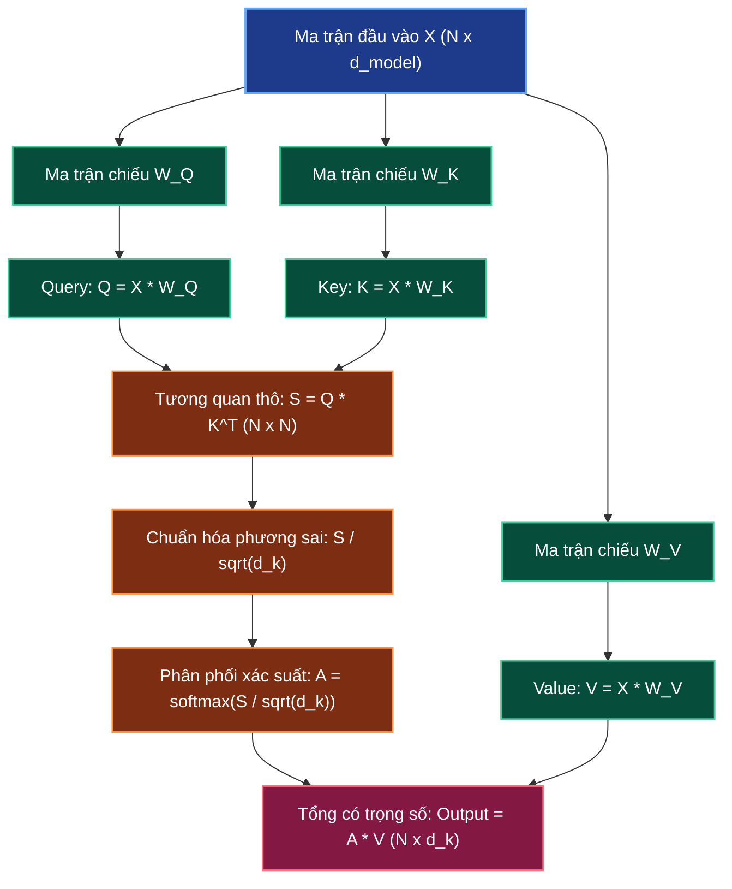

# 🎯 Scaled Dot-Product Self-Attention: Bộ Ba Q, K, V & Triệt Tiêu Gradient

> **Điều hướng**: [[AI-knowledge/00 - MOC (Map of Content)|Quay lại MOC]] | [[AI-knowledge/01 - Fundamentals & First Principles/01.4 - Sequence Processing: RNN Bottleneck vs Transformer Parallelism|Trước: 01.4 - RNN vs Transformer]] | [[AI-knowledge/01 - Fundamentals & First Principles/01.6 - Multi-Head Attention & Representation Subspaces|Tiếp: 01.6 - Multi-Head Attention]]

---

## 1. Sơ Đồ Mermaid DAG Phụ Thuộc

---

## 2. Chân Lý Vô Điều Kiện (Unconditional Truths)

> [!NOTE]
>
> 1. **Ý nghĩa hình học của Tích vô hướng (Geometric Dot Product)**: Tích vô hướng của hai vector $u \cdot v = \|u\| \|v\| \cos\alpha$ là phép toán đại số tuyến tính cơ bản duy nhất đo lường mức độ đồng hướng (Alignment) giữa hai biểu diễn vector. Góc kẹp $\alpha \to 0 \implies \cos\alpha \to 1$, tích vô hướng đạt cực đại.
> 2. **Tách biệt vai trò (Separation of Concerns in Q, K, V)**: Để một từ vừa có thể đi hỏi, vừa có thể được tìm thấy, và vừa có thể đóng góp nội dung, không thể dùng cùng một vector duy nhất. Ba ma trận chiếu học được $W_Q, W_K, W_V$ phân định rạch ròi 3 vai trò:
>    - **Query ($Q$)**: Từ này đang tìm kiếm thông tin gì từ các từ khác?
>    - **Key ($K$)**: Từ này sở hữu nhãn định danh gì để các từ khác tìm kiếm?
>    - **Value ($V$)**: Nội dung ngữ nghĩa thực tế mà từ này sẽ trao đi nếu Key được khớp.
> 3. **Bẫy bão hòa của hàm Softmax (Softmax Saturation Trap)**: Khi các giá trị đầu vào $z$ của hàm Softmax có độ lớn tuyệt đối quá lớn, Softmax bị đẩy vào vùng bão hòa cực trị ($S_i \to 1$, $S_j \to 0$). Tại vùng này, đạo hàm của Softmax tiệm cận $0$, gây hiện tượng **Triệt tiêu Gradient (Vanishing Gradient)** khiến mạng nơ-ron không thể huấn luyện qua Backpropagation.

---

## 3. Trực Giác Motivated Discovery (3Blue1Brown Intuition)

> [!TIP]
> **Ẩn dụ Thư viện & YouTube**:
> Hãy tưởng tượng cơ chế tìm kiếm video trên YouTube:
>
> - **Query ($Q$)**: Bạn gõ vào thanh tìm kiếm: _"con mèo to màu xanh"_ (Nhu cầu tìm kiếm).
> - **Key ($K$)**: Tiêu đề và thẻ tag của hàng triệu video trên hệ thống (Nhãn để so khớp).
> - **Value ($V$)**: Nội dung video thực tế bên trong mà bạn sẽ xem nếu tiêu đề khớp với từ khóa tìm kiếm.
>
> **Tại sao không lấy luôn vector từ gốc mà phải nhân qua $W_Q, W_K, W_V$?**
> Vì các con số trong ma trận $W_Q, W_K, W_V$ chính là các **tham số học được (Trainable Parameters)**. Lúc khởi tạo ngẫu nhiên (như đứa trẻ vào lớp 1), mô hình không biết từ nào cần liên kết với từ nào. Thông qua quá trình huấn luyện Backpropagation trên hàng tỷ câu văn, mô hình tự động điều chỉnh $W_Q$ và $W_K$ sao cho Query của tính từ (_big, blue_) tự động "bắt sóng" được Key của danh từ (_cat_).
>
> **Tại sao bắt buộc phải chia cho $\sqrt{d_k}$?**
> Giả sử vector Query và Key có 64 chiều. Mỗi chiều là một con số ngẫu nhiên. Khi bạn nhân vô hướng 64 cặp số rồi cộng lại, tổng tích lũy sẽ ngày càng to ra. Một con số quá lớn (ví dụ $z = 50$) đưa vào Softmax $e^{50}$ sẽ đè bẹp hoàn toàn các số khác, khiến đầu ra thành $[0, 0, 1, 0, 0]$. Khi xác suất đã là 100%, đạo hàm bằng 0, mô hình trở nên "điếc đặc", không thể học hỏi thêm được gì nữa. Chia cho $\sqrt{64} = 8$ chính là chiếc "phanh hãm" đưa các con số về vùng hoạt động an toàn của gradient.

---

## 4. Phân Tích Kỹ Thuật Chuyên Sâu & $\LaTeX$

### 4.1. Công Thức Scaled Dot-Product Attention Tổng Quát

$$\text{Attention}(Q, K, V) = \text{softmax}\left(\frac{Q K^T}{\sqrt{d_k}}\right) V$$

Trong đó:

- $X \in \mathbb{R}^{N \times d_{\text{model}}}$: Ma trận chứa $N$ tokens đầu vào của câu.
- $W_Q, W_K \in \mathbb{R}^{d_{\text{model}} \times d_k}$: Ma trận chiếu Query và Key ($d_k = 64$).
- $W_V \in \mathbb{R}^{d_{\text{model}} \times d_v}$: Ma trận chiếu Value ($d_v = 64$).
- $Q = X W_Q \in \mathbb{R}^{N \times d_k}$
- $K = X W_K \in \mathbb{R}^{N \times d_k}$
- $V = X W_V \in \mathbb{R}^{N \times d_v}$

Ma trận tích vô hướng $S = Q K^T \in \mathbb{R}^{N \times N}$ ghi lại độ tương quan giữa tất cả $N$ tokens với nhau (ví dụ: với câu 8 từ, $S$ là ma trận $8 \times 8 = 64$ điểm số).

### 4.2. Chứng Minh Toán Học: Nguồn Gốc Hệ Số $\sqrt{d_k}$

Xét hai vector $q, k \in \mathbb{R}^{d_k}$ có các thành phần $q_i, k_i$ là các biến ngẫu nhiên độc lập có kỳ vọng bằng $0$ và phương sai bằng $1$:
$$\mathbb{E}[q_i] = \mathbb{E}[k_i] = 0, \quad \text{Var}(q_i) = \text{Var}(k_i) = 1$$

Tích vô hướng giữa $q$ và $k$:
$$Z = q \cdot k = \sum_{i=1}^{d_k} q_i k_i$$

1. **Tính kỳ vọng của $Z$**:
   $$\mathbb{E}[Z] = \sum_{i=1}^{d_k} \mathbb{E}[q_i k_i] = \sum_{i=1}^{d_k} \mathbb{E}[q_i] \mathbb{E}[k_i] = 0$$

2. **Tính phương sai của $Z$**:
   Vì các biến độc lập, phương sai của tổng bằng tổng các phương sai:
   $$\text{Var}(Z) = \sum_{i=1}^{d_k} \text{Var}(q_i k_i)$$
   Áp dụng công thức phương sai tích hai biến độc lập có kỳ vọng bằng 0:
   $$\text{Var}(q_i k_i) = \mathbb{E}[q_i^2 k_i^2] - (\mathbb{E}[q_i k_i])^2 = \mathbb{E}[q_i^2]\mathbb{E}[k_i^2] - 0 = \text{Var}(q_i)\text{Var}(k_i) = 1 \times 1 = 1$$
   $$\implies \text{Var}(Z) = \sum_{i=1}^{d_k} 1 = d_k$$

Độ lệch chuẩn của tích vô hướng là $\sigma = \sqrt{\text{Var}(Z)} = \sqrt{d_k}$. Khi số chiều $d_k = 64$, độ biến thiên trải dài trên biên độ $\pm 8\sigma$.

3. **Chuẩn hóa phương sai về 1**:
   $$\text{Var}\left(\frac{Z}{\sqrt{d_k}}\right) = \frac{1}{(\sqrt{d_k})^2} \text{Var}(Z) = \frac{d_k}{d_k} = 1$$

### 4.3. Đạo Hàm Của Softmax & Hiện Tượng Triệt Tiêu Gradient

Xét hàm Softmax: $S_i = \frac{e^{z_i}}{\sum_{j} e^{z_j}}$. Đạo hàm riêng của $S_i$ theo $z_k$:

$$
\frac{\partial S_i}{\partial z_k} = \begin{cases}
S_i (1 - S_i) & \text{khi } i = k \\
-S_i S_k & \text{khi } i \ne k
\end{cases}
$$

- Nếu không chia cho $\sqrt{d_k}$, một phần tử $z_{\text{max}}$ sẽ áp đảo hoàn toàn các phần tử còn lại, dẫn đến $S_{\text{max}} \approx 1$ và $S_{k \ne \text{max}} \approx 0$.
- Khi đó:
  $$\frac{\partial S_{\text{max}}}{\partial z_{\text{max}}} \approx 1 \times (1 - 1) = 0, \quad \frac{\partial S_i}{\partial z_k} \approx -0 \times 0 = 0$$
- Toàn bộ Jacobian Matrix của Softmax sụp đổ về $0$. Tín hiệu đạo hàm khi Backpropagation bị triệt tiêu hoàn toàn, mô hình ngừng học.

---

## 5. Spaced Repetition Flashcards & WikiLinks

### Flashcards (#card)

Trong công thức Attention, Query (Q), Key (K) và Value (V) được tạo ra từ chuỗi đầu vào X như thế nào? #card
Được tạo ra thông qua các phép nhân ma trận chiếu tuyến tính học được: $Q = X W_Q$, $K = X W_K$, $V = X W_V$, trong đó $W_Q, W_K \in \mathbb{R}^{d_{\text{model}} \times d_k}$ và $W_V \in \mathbb{R}^{d_{\text{model}} \times d_v}$ chứa các trọng số tham số được tối ưu hóa liên tục trong quá trình huấn luyện Backpropagation.

<!--ID: 1727515300001-->

Chứng minh toán học giải thích tại sao tích vô hướng của hai vector d*k chiều lại có phương sai bằng d_k? #card
Vì nếu các thành phần $q_i, k_i$ độc lập có kỳ vọng bằng 0 và phương sai bằng 1, thì $\text{Var}(q_i k_i) = 1$. Khi lấy tổng tích vô hướng trên $d_k$ chiều: $\text{Var}(q \cdot k) = \sum*{i=1}^{d_k} \text{Var}(q_i k_i) = d_k$. Do đó độ lệch chuẩn bằng $\sqrt{d_k}$.

<!--ID: 1727515300002-->

Tại sao giá trị tích vô hướng quá lớn lại gây ra hiện tượng Vanishing Gradient trong hàm Softmax? #card
Vì đạo hàm của Softmax là $S_i(\delta_{ij} - S_j)$. Khi các giá trị đầu vào quá lớn, xác suất Softmax bị đẩy vào trạng thái cực đoan ($S_{\text{max}} \approx 1$ và các $S$ khác $\approx 0$), khiến tích $S_i(1 - S_i)$ và $-S_i S_j$ đều tiệm cận 0, làm triệt tiêu hoàn toàn tín hiệu gradient truyền ngược.

<!--ID: 1727515300003-->

### Liên Kết Hai Chiều (WikiLinks)

- Nền tảng phía trước: [[AI-knowledge/01 - Fundamentals & First Principles/01.4 - Sequence Processing: RNN Bottleneck vs Transformer Parallelism|01.4 - Sequence Processing: RNN Bottleneck vs Transformer Parallelism]]
- Mở rộng đa chiều tiếp theo: [[AI-knowledge/01 - Fundamentals & First Principles/01.6 - Multi-Head Attention & Representation Subspaces|01.6 - Multi-Head Attention & Representation Subspaces]]
- Bản đồ tổng quan: [[AI-knowledge/00 - MOC (Map of Content)|MOC - AI Knowledge Hub]]
