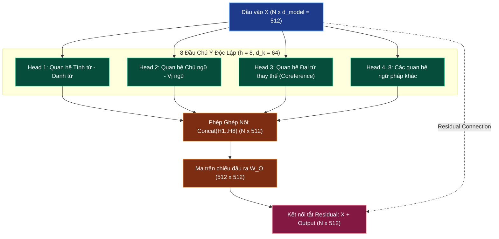

# 👁️ Multi-Head Attention: Đa Phân Vùng Không Gian Biểu Diễn

> **Điều hướng**: [[AI-knowledge/00 - MOC (Map of Content)|Quay lại MOC]] | [[AI-knowledge/01 - Fundamentals & First Principles/01.5 - Scaled Dot-Product Self-Attention|Trước: 01.5 - Scaled Dot-Product Attention]] | [[AI-knowledge/02 - Memory Systems/02.1 - Tri-Memory Architecture Overview|Tiếp theo: 02.1 - Tri-Memory Architecture]]

---

## 1. Sơ Đồ Mermaid DAG Phụ Thuộc

---

## 2. Chân Lý Vô Điều Kiện (Unconditional Truths)

> [!NOTE]
>
> 1. **Bảo toàn số chiều mô hình (Dimension Conservation)**: Tổng số chiều của các heads phải khớp chính xác với kích thước mô hình:
>    $$h \times d_k = d_{\text{model}}$$
>    Trong bài báo Transformer gốc: $h = 8$ heads, $d_k = d_v = 64 \implies 8 \times 64 = 512 = d_{\text{model}}$.
> 2. **Đa dạng hóa góc nhìn ngữ nghĩa (Multi-Aspect Subspace Invariance)**: Một từ trong câu đồng thời tham gia vào nhiều cấu trúc ngữ pháp (cú pháp, ngữ nghĩa, vai trò chủ/vị, đại từ chỉ định). Một đầu chú ý đơn lẻ chỉ có thể sinh ra duy nhất một phân phối Softmax $\alpha_{ij}$; nó bị ép phải trung bình hóa các mối quan hệ, làm loãng tín hiệu đặc thù. Multi-Head Attention cho phép mô hình chiếu biểu diễn vào nhiều không gian con (Subspaces) khác nhau đồng thời.
> 3. **Vai trò tái tổng hợp của $W_O$ (Linear Projection Recombination)**: Phép ghép nối `Concat` thuần túy chỉ là hành động xếp chồng các ma trận cạnh nhau theo trục chiều không gian. Ma trận học được $W_O \in \mathbb{R}^{d_{\text{model}} \times d_{\text{model}}}$ là nơi duy nhất hòa trộn và cho phép các thông tin từ các head khác nhau tương tác đại số với nhau.

---

## 3. Trực Giác Motivated Discovery (3Blue1Brown Intuition)

> [!TIP]
> **Ẩn dụ Hội Đồng Chuyên Gia**:
> Hãy xem xét câu văn nổi tiếng trong xử lý ngôn ngữ tự nhiên:
> _"The animal didn't cross the street because **it** was too tired."_
>
> Một từ đơn lẻ như đại từ _"it"_ đòi hỏi nhiều câu hỏi phải được giải quyết cùng một lúc:
>
> - **Chuyên gia 1 (Cú pháp)**: _"Từ 'it' đang làm chủ ngữ cho vị ngữ nào?"_ $\to$ Khớp với _"was"_.
> - **Chuyên gia 2 (Giải quyết đại từ - Coreference Resolution)**: _"Từ 'it' đang thay thế cho thực thể nào?"_ $\to$ Phải nhìn lại câu trước và khớp cực mạnh với _"the animal"_ (vì con vật mới biết mệt, con đường _"street"_ không biết mệt).
> - **Chuyên gia 3 (Ngữ nghĩa vị ngữ)**: _"Tại sao lại có hành động này?"_ $\to$ Khớp với _"too tired"_.
>
> Nếu chỉ có **1 Head Attention duy nhất**, mô hình buộc phải cộng dồn các câu hỏi này lại làm một. Kết quả là sự chú ý bị chia đều mờ nhạt cho cả _"animal"_, _"street"_, _"tired"_.
>
> **Đột phá của Multi-Head**: Mô hình cắt nhỏ 512 chiều thành 8 "lát cắt" độc lập (mỗi lát 64 chiều). 8 Head đóng vai trò như 8 chuyên gia với 8 góc nhìn chuyên biệt, cùng soi rọi vào câu văn cùng một lúc mà không làm nhiễu loạn nhau.
>
> **Bài toán Đánh Đổi (Trade-off) Không Gian**:
> Nếu bạn muốn tăng số chuyên gia từ 8 lên 16 người mà không muốn chi thêm tiền mua thêm ghế (giữ nguyên $d_{\text{model}} = 512$), bạn bắt buộc phải thu hẹp "tập tài liệu" của mỗi chuyên gia từ 64 trang xuống 32 trang ($16 \times 32 = 512$). Mô hình có nhiều góc nhìn hơn, nhưng độ sâu biểu đạt chi tiết của từng góc nhìn sẽ bị suy giảm.

---

## 4. Phân Tích Kỹ Thuật Chuyên Sâu & $\LaTeX$

### 4.1. Công Thức Toán Học Của Multi-Head Attention

$$\text{MultiHead}(Q, K, V) = \text{Concat}(\text{head}_1, \text{head}_2, \dots, \text{head}_h) W_O$$

Với mỗi head thứ $i \in [1, h]$:
$$\text{head}_i = \text{Attention}\left(Q W_Q^{(i)}, K W_K^{(i)}, V W_V^{(i)}\right)$$

- Các ma trận chiếu tham số:
  $$W_Q^{(i)} \in \mathbb{R}^{d_{\text{model}} \times d_k}, \quad W_K^{(i)} \in \mathbb{R}^{d_{\text{model}} \times d_k}, \quad W_V^{(i)} \in \mathbb{R}^{d_{\text{model}} \times d_v}$$
- Ma trận chiếu đầu ra:
  $$W_O \in \mathbb{R}^{h \cdot d_v \times d_{\text{model}}} = \mathbb{R}^{d_{\text{model}} \times d_{\text{model}}}$$

### 4.2. Bảo Toàn Chi Phí Tính Toán (Computational Cost Invariance)

Một nhận định sai lầm thường gặp là cho rằng chạy 8 heads sẽ tốn gấp 8 lần tài nguyên tính toán so với 1 head.

**Thực tế toán học**:

- Với Single-Head Attention có số chiều đầy đủ $d_{\text{model}}$:
  $$Q, K \in \mathbb{R}^{N \times d_{\text{model}}} \implies Q K^T \text{ tốn } \mathcal{O}(N^2 \cdot d_{\text{model}}) \text{ phép tính.}$$
- Với Multi-Head Attention ($h$ heads, mỗi head $d_k = d_{\text{model}} / h$):
  - Mỗi head tính $Q^{(i)} (K^{(i)})^T$ tốn:
    $$\mathcal{O}\left(N^2 \cdot \frac{d_{\text{model}}}{h}\right)$$
  - Tổng chi phí tính toán cho cả $h$ heads là:
    $$h \times \mathcal{O}\left(N^2 \cdot \frac{d_{\text{model}}}{h}\right) = \mathcal{O}(N^2 \cdot d_{\text{model}})$$

**Kết luận First Principles**: Chi phí tính toán FLOPs của Multi-Head Attention hoàn toàn tương đương với Single-Head Attention đầy đủ số chiều, nhưng Multi-Head mang lại năng lực phân tách không gian con vượt trội.

### 4.3. Bảng Tham Số Tiêu Biểu Trong Thực Tế

| Mô hình                     | $d_{\text{model}}$ | Số Heads ($h$) | $d_k = d_v$ | Số tầng (Layers) |
| :-------------------------- | :----------------- | :------------- | :---------- | :--------------- |
| **Transformer Base (2017)** | 512                | 8              | 64          | 6                |
| **Transformer Big (2017)**  | 1024               | 16             | 64          | 6                |
| **GPT-3 (175B)**            | 12288              | 96             | 128         | 96               |
| **LLaMA-3 (8B)**            | 4096               | 32             | 128         | 32               |

---

## 5. Spaced Repetition Flashcards & WikiLinks

### Flashcards (#card)

Tại sao Multi-Head Attention lại vượt trội hơn Single-Head Attention dù có cùng số chiều biểu diễn tổng thể d_model? #card
Vì Single-Head chỉ có thể sinh ra duy nhất một phân phối trọng số chú ý Softmax cho mỗi token, làm loãng các mối quan hệ ngữ pháp khác nhau. Multi-Head phân tách không gian thành $h$ không gian con (Subspaces) độc lập, cho phép mô hình đồng thời theo dõi nhiều mối quan hệ ngữ nghĩa (cú pháp, đại từ, liên kết câu) cùng một lúc.

<!--ID: 1727515400001-->

Vai trò của ma trận chiếu đầu ra W*O trong khối Multi-Head Attention là gì? #card
Sau khi ghép nối (Concat) kết quả của $h$ heads thành một ma trận có kích thước $N \times d*{\text{model}}$, ma trận chiếu học được $W_O \in \mathbb{R}^{d_{\text{model}} \times d_{\text{model}}}$ thực hiện phép biến đổi tuyến tính để các thông tin từ các không gian con khác nhau được hòa trộn và tương tác với nhau trước khi đưa sang khối tiếp theo.

<!--ID: 1727515400002-->

Chi phí tính toán FLOPs của Multi-Head Attention (h heads, d*k = d_model / h) so với Single-Head Attention (1 head, d_model) như thế nào? #card
Hoàn toàn tương đương nhau. Mỗi head chỉ tính toán trên số chiều $d_k = d*{\text{model}}/h$, do đó tổng chi phí tính toán của $h$ heads gộp lại: $h \times \mathcal{O}(N^2 \cdot d_k) = \mathcal{O}(N^2 \cdot d_{\text{model}})$.

<!--ID: 1727515400003-->

### Liên Kết Hai Chiều (WikiLinks)

- Cơ chế tính toán nền tảng: [[AI-knowledge/01 - Fundamentals & First Principles/01.5 - Scaled Dot-Product Self-Attention|01.5 - Scaled Dot-Product Self-Attention]]
- Kết nối sang hệ thống trí nhớ: [[AI-knowledge/02 - Memory Systems/02.1 - Tri-Memory Architecture Overview|02.1 - Tri-Memory Architecture Overview]]
- Bản đồ tổng quan: [[AI-knowledge/00 - MOC (Map of Content)|MOC - AI Knowledge Hub]]
