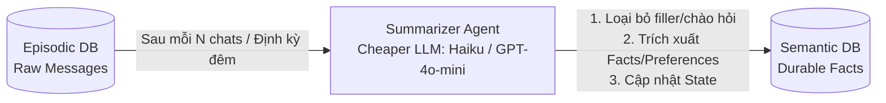

> **Chủ đề**: Kỹ thuật nén và tinh chế bộ nhớ tự động bằng Summarizer Agent  
> **Điều hướng**: [[00 - MOC (Map of Content)|Quay lại MOC]] | [[02 - Memory Systems/02.3 - Semantic & Episodic Memory|Trước: 02.3 - Semantic & Episodic]] | [[03 - RAG & Information Retrieval/03.1 - RAG Fundamentals & Vector Search|Tiếp: 03.1 - RAG Fundamentals]]

---

## 1. Vấn Đề Tràn Bộ Nhớ (Memory Bloat Problem)

Nếu một hệ thống AI Agent ghi lại 10.000 tin nhắn mỗi ngày:
1. **Context Window Exceeded**: Không thể nhồi nhét hàng nghìn tin vào prompt.
2. **Chi phí Token**: Chi phí API tăng theo cấp số nhân.
3. **Nhiễu Ngữ Cảnh (Context Noise / Needle in a Haystack)**: LLM bị phân tâm bởi các thông tin chào hỏi râu ria, giảm độ chính xác của câu trả lời.

---

## 2. Giải Pháp: Vòng Lặp Chưng Cất Định Kỳ (Distillation Loop)

Thay vì giữ nguyên văn bản thô, ta thiết lập một **Summarizer Agent** chạy ngầm:



---

## 3. Thiết Kế System Prompt Cho Summarizer Agent

```markdown
Bạn là Memory Distillation Agent. Nhiệm vụ của bạn là đọc một đoạn hội thoại dài và trích xuất các Sự Thật Bền Vững (Durable Facts) về người dùng và hệ thống.

### Quy Tắc:
1. LOẠI BỎ: Câu chào hỏi, câu đùa, các chi tiết mang tính tạm thời trong ngày.
2. GIỮ LẠI:
   - Thông tin cá nhân/dự án (Tên, vai trò, công nghệ sử dụng, sở thích).
   - Quyết định quan trọng (Kiến trúc đã chốt, quy tắc code đã thống nhất).
   - Vấn đề tồn đọng chưa được giải quyết.
3. OUTPUT FORMAT: Trả về danh sách JSON gồm các mệnh đề facts ngắn gọn, độc lập ngữ cảnh.
```

---

## 4. Tối Ưu Hóa Chi Phí (Cost Optimization)
- **Sử dụng Model Tier rẻ**: Dùng các mô hình lightweight (ví dụ: `claude-3-5-haiku`, `gpt-4o-mini`, `gemini-1.5-flash`, hoặc local open-source LLMs như Llama 3 8B) để chạy Summarizer Agent.
- **Batch Processing**: Gom nhóm 100-500 tin nhắn trong một batch thay vì kích hoạt sau từng câu nói.

---

## 5. Tài Liệu Liên Quan
- [[02 - Memory Systems/02.3 - Semantic & Episodic Memory|02.3 - Semantic & Episodic Memory]]
- [[03 - RAG & Information Retrieval/03.1 - RAG Fundamentals & Vector Search|03.1 - RAG Fundamentals & Vector Search]]
