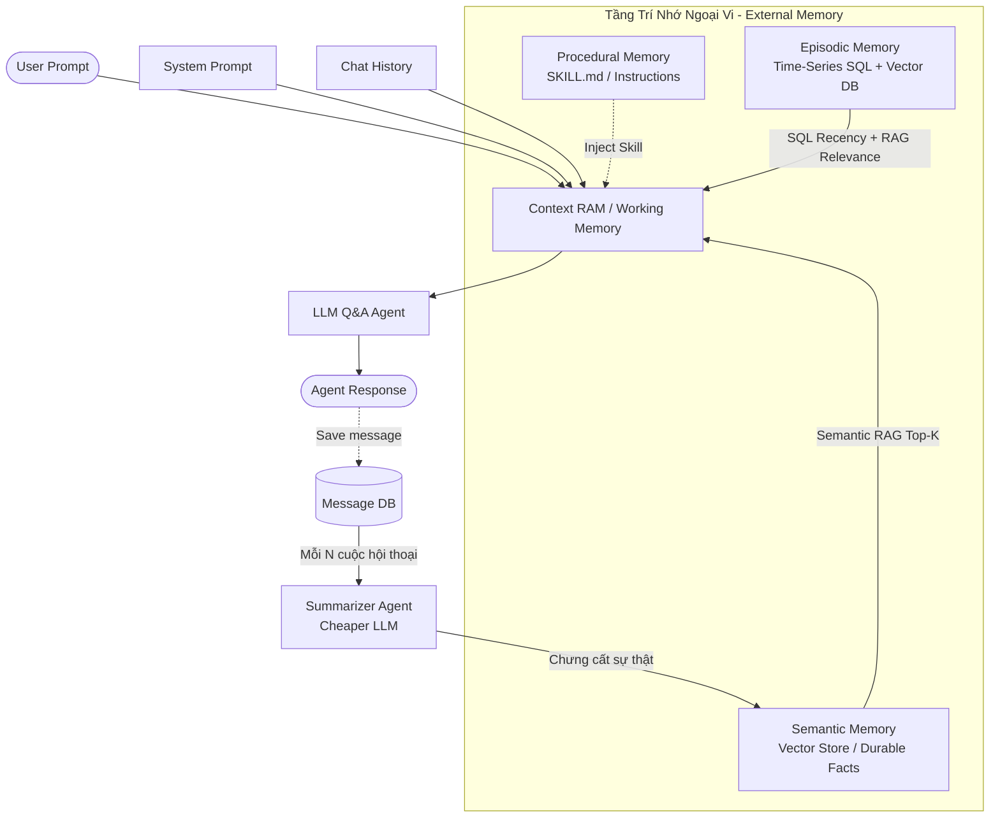
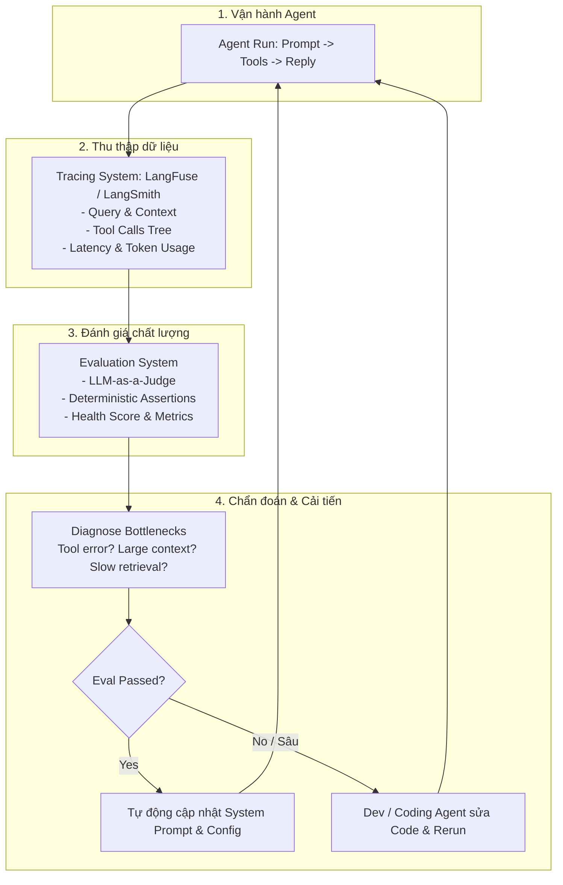

# AI Agent Harness & Loop Engineering: Kiến Trúc Toàn Diện

> **Nguồn video**: [You Can Learn AI Agent Harness & Loop Engineering In 19 Min | LLM Ops, Eval, Tracing, RAG](https://youtu.be/GrNbuWWJYiI)  
> **Tác giả**: Sean (John)  
> **Sơ đồ kiến trúc Excalidraw**: ![[Overview-AI-agents.excalidraw]]

---

## 1. Ẩn dụ cốt lõi: Con ngựa (LLM) và Bộ cương (Harness)

```
        ┌──────────────────────────────────────────────────────────┐
        │                     AGENT HARNESS                        │
        │                                                          │
        │   ┌──────────────────────────────────────────────────┐   │
        │   │               THE HORSE (LLM Engine)             │   │
        │   │  - Thông minh, tri thức toàn cầu                 │   │
        │   │  - Sinh từ theo xác suất (Probabilistic)          │   │
        │   │  - Ngẫu nhiên (Randomness), không biết bạn      │   │
        │   └────────────────────────┬─────────────────────────┘   │
        │                            │                             │
        │   ┌────────────────────────▼─────────────────────────┐   │
        │   │             BỘ CƯƠNG KIỂM SOÁT (Harness)         │   │
        │   │  - Context RAM / Working Memory                  │   │
        │   │  - Tri-Memory Layer (Procedural, Semantic, Epis.) │   │
        │   │  - Tool Calls & Loop Engineering                 │   │
        │   │  - End-Loop Guardrails & Human-in-the-loop       │   │
        │   │  - LLMOps: Tracing, Evaluation, Self-Evolution   │   │
        │   └──────────────────────────────────────────────────┘   │
        └──────────────────────────────────────────────────────────┘
```

- **LLM thuần túy**: Là "con ngựa hoang dã" – cực khỏe, biết mọi kiến thức nhân loại nhưng bản chất là bộ máy dự đoán xác suất token tiếp theo. Nó có tính ngẫu nhiên và không biết ngữ cảnh doanh nghiệp/cá nhân của bạn.
- **Harness**: Là toàn bộ hệ thống khung phần mềm (frameworks như LangGraph, LangChain, PydanticAI) giúp định hướng, kiềm chế tính ngẫu nhiên, cấp phát trí nhớ và công cụ để LLM hoàn thành công việc chính xác, an toàn.

---

## 2. Vòng đời Single Agent Run & Context RAM

Một lượt chạy của Agent (**Agent Run**) là một tiến trình **tạm thời (Ephemeral)**:
1. **Input**: User Prompt + System Prompt + Current Chat History.
2. **Context RAM / Working Memory**: Không gian nhớ ngắn hạn được nạp vào context window của LLM.
3. **LLM Execution**: Trả về câu trả lời hoặc quyết định gọi tool.
4. **Vấn đề cốt tử**: Khi phiên kết thúc, toàn bộ dữ liệu trong Context RAM biến mất nếu không có tầng lưu trữ ngoại vi (External Memory).

---

## 3. Kiến Trúc 3 Tầng Trí Nhớ (Tri-Memory Architecture)



### 3.1. Procedural Memory (Trí nhớ thủ tục / Kỹ năng)
- **Nội dung**: Quy định agent phải hành động thế nào, quy trình xử lý công việc, danh sách kỹ năng (`SKILL.md`, text prompt, workflow rules).
- **Lưu trữ**: Files Markdown hoặc Database.

### 3.2. Semantic Memory (Trí nhớ ngữ nghĩa / Sự thật bền vững)
- **Nội dung**: Thông tin cốt lõi dài hạn về người dùng, tổ chức, chính sách công ty (Durable Facts, User Profiles).
- **Cơ chế chưng cất tự động (Distillation)**: Sau mỗi $N$ cuộc hội thoại (ví dụ: 2000 chats), một **Summarizer Agent** (chạy model nhỏ, chi phí rẻ) tự động nén lịch sử, trích xuất facts mới và lưu vào Vector Store.
- **Truy xuất**: RAG (Top-K semantic similarity search).

### 3.3. Episodic Memory (Trí nhớ tình tiết / Sự kiện theo thời gian)
- **Nội dung**: Lịch sử các cuộc hội thoại quá khứ, các chuỗi sự kiện có gắn nhãn thời gian (Time-series log).
- **Cơ chế truy xuất kết hợp (Hybrid Retrieval)**:
  - **SQL Query**: Khi cần lọc theo mốc thời gian hoặc thuộc tính cụ thể (ví dụ: *10 tin nhắn gần nhất với khách hàng X*).
  - **RAG / Semantic Search**: Khi cần tìm kiếm sự kiện theo ngữ nghĩa (ví dụ: *20 trường hợp khiếu nại chất lượng sản phẩm chưa được giải quyết*).

---

## 4. Loop Engineering & End-Loop Guardrails

```
             ┌──────────────────────────────────────────────┐
             │            LOOP ENGINEERING FLOW             │
             │                                              │
             │   User Request (Phức tạp / Đa bước)         │
             │          │                                   │
             │          ▼                                   │
             │   ┌──────────────┐                           │
             │   │ LLM Planning │                           │
             │   └──────┬───────┘                           │
             │          │                                   │
             │          ▼                                   │
     ┌───────────► Tool Call 1 (e.g. Query CRM)             │
     │                  │                                   │
     │                  ▼                                   │
     │             Observation                              │
     │                  │                                   │
     │                  ▼                                   │
     │             Tool Call 2 (e.g. Stripe Refund)         │
     │                  │                                   │
     │                  ▼                                   │
     │             Observation                              │
     │                  │                                   │
     │                  ▼                                   │
     │         ┌───────────────────┐                        │
     │         │ End-Loop Guardrail│                        │
     │         └───┬─────────────┬─┘                        │
     │  Chưa xong  │             │ Đạt điều kiện dừng       │
     └─────────────┘             │                          │
                                 ▼                          │
                       Return Final Response                │
                                                            │
        [Guardrails: Max Iterations | Human Approval | UI Alert]
        └──────────────────────────────────────────────────┘
```

- **Loop (Vòng lặp tác tử)**: Thay vì chỉ hỏi-đáp 1 lần, LLM tự động suy luận, gọi tool, nhận kết quả quan sát (observation), rồi tiếp tục gọi tool tiếp theo cho đến khi hoàn thành mục tiêu.
- **Nguy cơ**: Không có điểm dừng -> Infinite Loop, tốn chi phí token, thực thi sai lệch.
- **End-Loop Guardrails (Bộ hãm vòng lặp)**:
  - **Task Completion Check**: Xác thực output đạt tiêu chí hoàn thành.
  - **Human-in-the-loop (HITL)**: Tự động dừng để hỏi ý kiến người dùng khi gặp phân nhánh quan trọng (ví dụ: xác nhận hoàn tiền cho 8 khách hàng).
  - **Proactive Alerts / Notifications**: Bắn thông báo ra giao diện người dùng khi cần quyền thay vì để Agent bị treo vô ích.

---

## 5. LLMOps & Evaluation: Vòng Lặp Tự Tiến Hóa (Self-Evolution)



1. **Tracing (LangFuse / LangSmith)**: Ghi lại toàn bộ cây thực thi (Trace Tree) gồm: prompt đầu vào, văn bản trích xuất từ RAG, số lần gọi tool, độ trễ từng bước (latency), lượng token tiêu thụ.
2. **Evaluation (Hệ thống đánh giá)**:
   - Sử dụng **LLM-as-a-judge** chấm điểm chất lượng câu trả lời.
   - Kết hợp kiểm tra tự động xác định (deterministic checks: tool có được gọi đúng không, meeting có được tạo không).
3. **Diagnosis (Chẩn đoán nguyên nhân gốc)**:
   - Phân tích vì sao độ trễ cao (ví dụ: Context RAM quá tải do RAG thừa dữ liệu).
   - Xác định lỗi logic tool call hoặc system prompt không rõ ràng.
4. **Self-Evolution & Deployment**:
   - Tinh chỉnh tự động System Prompt, Model Hyperparameters, RAG knobs.
   - Với lỗi code phức tạp: Đưa trace log cho Coding Agent (Claude Code / Dev) sửa code và chạy lại quy trình đánh giá.

---

## 6. Tổng Kết Bảng Tra Cứu Nhanh

| Thành phần            | Vai trò                                              | Công nghệ / Công cụ tiêu biểu                          |
| --------------------- | ---------------------------------------------------- | ------------------------------------------------------ |
| **Harness Core**      | Khung điều phối, kiểm soát tính ngẫu nhiên của LLM   | LangGraph, LangChain, PydanticAI                       |
| **Context RAM**       | Bộ nhớ làm việc tức thời của 1 lượt chạy             | LLM Context Window                                     |
| **Procedural Memory** | Quy tắc, kỹ năng, hướng dẫn hành vi                  | Files Markdown (`SKILL.md`), Database                  |
| **Semantic Memory**   | Tri thức bền vững về user & tổ chức                  | Vector DBs (Pinecone, Qdrant, Chroma, Supabase)        |
| **Episodic Memory**   | Lịch sử chat và sự kiện theo chuỗi thời gian         | PostgreSQL, SQLite, TimescaleDB, Vector DB             |
| **Summarizer**        | Nén hội thoại, trích xuất facts tự động              | Open-source / Cheaper LLMs (Claude Haiku, GPT-4o-mini) |
| **Loop Guardrails**   | Kiểm soát số bước lặp, an toàn, phê duyệt người dùng | Schema validation, Iteration counters, HITL hooks      |
| **Tracing**           | Thu thập Trace Tree, Latency, Token Metrics          | LangFuse, LangSmith, Arize Phoenix                     |
| **Evaluation**        | Chấm điểm chất lượng & sức khỏe hệ thống             | LLM-as-a-Judge, Ragas, DeepEval, Pytest                |
