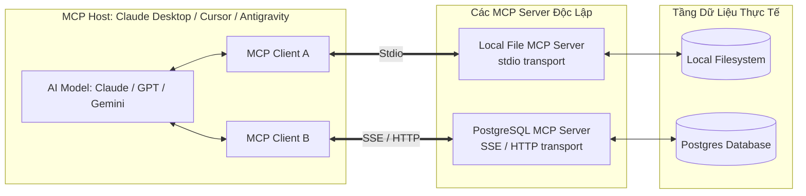

# 05.3 - Model Context Protocol (MCP): Giao Thức Chuẩn Hóa Cho AI Agent

> **Chủ đề**: Giao thức mở chuẩn hóa kết nối AI Models với Tools, Resources và Prompts  
> **Nguồn tài liệu chính**:
> - [Model Context Protocol Official Docs](https://modelcontextprotocol.io/)
> - [Video 1: Understanding Model Context Protocol (cGuyrANVi4A)](https://www.youtube.com/watch?v=cGuyrANVi4A)
> - [Video 2: MCP vs APIs & The Future of AI Integration (185XGEMefgc)](https://www.youtube.com/watch?v=185XGEMefgc)  
> **Điều hướng**: [[00 - MOC (Map of Content)|Quay lại MOC]] | [[05 - Frameworks & Tooling/05.2 - PydanticAI & Type-Safe Agents|Trước: 05.2 - PydanticAI]] | [[06 - LLMOps & Evaluation/06.1 - Tracing & Observability (LangFuse, LangSmith)|Tiếp: 06.1 - Tracing]]

---

## 1. Ẩn Dụ Cốt Lõi: Cổng USB-C Cho Thế Giới AI

Trước khi có cổng USB-C, mỗi thiết bị cần một loại cáp riêng (Lightning, Micro-USB, Mini-USB, cáp nguồn tròn).

```
[TRƯỚC MCP: Phân mảnh N x M]               [SAU MCP: Chuẩn hóa USB-C]

 Claude ──┬──► Custom GitHub Code          Claude ──┐
 ChatGPT ──┼──► Custom Postgres Code       ChatGPT ──┼──► [MCP PROTOCOL] ──┬──► GitHub MCP
 Cursor  ──┼──► Custom Slack Code          Cursor  ──┤   (JSON-RPC 2.0)    ├──► Postgres MCP
 Custom  ──┴──► Custom Jira Code           Custom  ──┘                     └──► Local File MCP
```

- **Vấn đề cũ**: Với $N$ mô hình/ứng dụng AI và $M$ nguồn dữ liệu, cộng đồng phải viết $N \times M$ bộ tích hợp riêng lẻ. Mỗi khi API thay đổi hoặc prompt thay đổi, kết nối bị gãy.
- **Giải pháp MCP (Anthropic khởi xướng)**: Chuẩn hóa giao thức giao tiếp chung. Bạn chỉ cần viết **1 MCP Server** cho dữ liệu của mình, mọi AI Client (Claude, ChatGPT, Cursor, Antigravity, LangGraph) đều có thể cắm vào dùng ngay lập tức.

---

## 2. Bản Chất: MCP Khác REST API Truyền Thống Như Thế Nào?

| Tiêu Chí | REST API Truyền Thống | Model Context Protocol (MCP) |
|---|---|---|
| **Đối tượng sử dụng (Client)** | Chương trình máy tính viết bởi lập trình viên (Deterministic). | **Mô hình AI tự suy luận (Probabilistic & Reasoning).** |
| **Cơ chế hoạt động** | Yêu cầu lập trình viên biết trước endpoint, method, headers, schema. | **Tự động khám phá (Auto-discovery)**: Server tự quảng bá danh sách Tools/Resources kèm JSON Schema. |
| **Bản chất** | Giao kèo mã nguồn (Code-level contract). | **Giao thức ngữ nghĩa (Semantic Protocol)** cung cấp Context sống. |
| **Vị trí** | Tầng hạ tầng dữ liệu. | **Tầng Middleware** nằm giữa AI Model và REST API backend. |

> [!TIP]
> **MCP không thay thế API**: MCP hoạt động **bên trên (on top of)** API. MCP Server đóng vai trò là "người phiên dịch", biến các API phức tạp thành dạng ngữ cảnh và công cụ mà mô hình AI có thể hiểu và tự quyết định khi nào nên gọi.

---

## 3. Kiến Trúc 3 Thành Phần Của MCP



1. **MCP Host**: Ứng dụng điều phối AI (ví dụ: Claude Desktop, Antigravity CLI, Cursor, LangGraph App).
2. **MCP Client**: Module bên trong Host, duy trì kết nối 1-1 với các Server thông qua giao thức JSON-RPC.
3. **MCP Server**: Ứng dụng con nhẹ (lightweight subprocess hoặc remote server) cung cấp tài nguyên cho Model.
4. **Transport Layer (Giao vận)**:
   - **`stdio` (Standard Input/Output)**: Chạy như tiến trình con (subprocess) cục bộ trên máy. Cực kỳ bảo mật, nhanh, không cần mở port mạng.
   - **`sse` (Server-Sent Events qua HTTP)**: Dành cho các MCP Server chạy từ xa trên máy chủ đám mây.

---

## 4. Ba Khối Khả Năng Cơ Bản (MCP Primitives)

Mỗi MCP Server có thể công khai 3 loại tài nguyên:

```
┌──────────────────────────────────────────────────────────┐
│                       MCP SERVER                         │
│                                                          │
│  1. TOOLS (Hàm hành động - Model có thể thực thi)        │
│     - `query_database(sql)`                              │
│     - `send_slack_message(channel, text)`                │
│                                                          │
│  2. RESOURCES (Dữ liệu chỉ đọc - Context thụ động)       │
│     - `file:///workspace/logs/today.log`                 │
│     - `postgres://schema/customers`                      │
│                                                          │
│  3. PROMPTS (Mẫu Prompt có cấu trúc sẵn)                 │
│     - `code_review_prompt(pr_id)`                        │
│     - `debug_error_prompt(log_trace)`                    │
└──────────────────────────────────────────────────────────┘
```

---

## 5. Hướng Dẫn Từng Bước: Tự Viết 1 MCP Server Cho Riêng Bạn

Cách nhanh và chuẩn mực nhất hiện nay là sử dụng thư viện **`FastMCP`** của Python hoặc **`@modelcontextprotocol/sdk`** của TypeScript.

### Cách 1: Tạo MCP Server Bằng Python (Khuyên Dùng)

#### Bước 1: Cài đặt thư viện
```bash
pip install mcp
```

#### Bước 2: Viết mã nguồn MCP Server (`my_mcp_server.py`)
```python
from mcp.server.fastmcp import FastMCP
import os
import datetime

# 1. Khởi tạo MCP Server với tên định danh
mcp = FastMCP("My-Knowledge-Server")

# 2. Định nghĩa một TOOL (Công cụ mà Model có thể gọi)
@mcp.tool()
def search_local_notes(keyword: str) -> str:
    """Tìm kiếm ghi chú markdown trong thư mục học tập."""
    results = []
    vault_path = os.path.expanduser("~/Long-project/Obsidian-learn/AI-knowledge")
    for root, _, files in os.walk(vault_path):
        for f in files:
            if f.endswith(".md") and keyword.lower() in f.lower():
                results.append(os.path.join(root, f))
    return f"Tìm thấy {len(results)} files:\n" + "\n".join(results)

@mcp.tool()
def calculate_growth_rate(current: float, previous: float) -> float:
    """Tính toán tỷ lệ tăng trưởng phần trăm giữa 2 mốc thời gian."""
    if previous == 0:
        return 0.0
    return ((current - previous) / previous) * 100.0

# 3. Định nghĩa một RESOURCE (Tài nguyên chỉ đọc)
@mcp.resource("system://status")
def get_system_status() -> str:
    """Cung cấp trạng thái hệ thống hiện tại."""
    return f"Hệ thống hoạt động bình thường vào lúc: {datetime.datetime.now().isoformat()}"

# 4. Định nghĩa một PROMPT TEMPLATE (Mẫu chỉ dẫn)
@mcp.prompt()
def review_ai_architecture(topic: str) -> str:
    """Tạo prompt chuẩn để review kiến trúc AI."""
    return f"Hãy đóng vai chuyên gia First Principles, đánh giá toàn diện về kiến trúc: {topic}."

if __name__ == "__main__":
    # Chạy server qua giao thức stdio
    mcp.run(transport="stdio")
```

---

### Bước 3: Kiểm Thử Với MCP Inspector (GUI Test Tool)

Anthropic cung cấp công cụ **MCP Inspector** cho phép bạn test giao diện và chạy thử tool trực tiếp trên trình duyệt mà chưa cần cấu hình vào Claude:

```bash
npx @modelcontextprotocol/inspector python3 my_mcp_server.py
```
*Trình duyệt sẽ mở tại `http://localhost:5173` để bạn xem danh sách Tools, click gọi thử hàm và xem kết quả JSON-RPC.*

---

### Bước 4: Cấu Hình MCP Server Vào Ứng Dụng (Claude Desktop / Cursor / Antigravity)

Để Client nhận diện được server của bạn, thêm cấu hình vào file `claude_desktop_config.json`:
* **Linux/macOS**: `~/.config/Claude/claude_desktop_config.json`
* **Windows**: `%APPDATA%\Claude\claude_desktop_config.json`

```json
{
  "mcpServers": {
    "my-knowledge-server": {
      "command": "python3",
      "args": [
        "/home/ryuuki/Long-project/Obsidian-learn/AI-knowledge/my_mcp_server.py"
      ]
    }
  }
}
```

Khi mở Claude Desktop hoặc Cursor, biểu tượng 🔨 Tool sẽ sáng lên, cho phép AI tự động gọi các hàm `search_local_notes` hay `calculate_growth_rate` bạn vừa viết!

---

---

## 6. Phân Loại 4 Mẫu Thiết Kế MCP Server Cho Từng Loại Ứng Dụng (App Patterns)

Việc build MCP Server có giống nhau giữa các ứng dụng không?
- **Về mặt Giao thức (Protocol Interface)**: **100% GIỐNG NHAU**. Mọi MCP Server đều dùng chung chuẩn JSON-RPC 2.0 (`tools/list`, `tools/call`, `resources/read`), cấu hình trong file JSON của Client hoàn toàn tương tự.
- **Về mặt Logic Xử Lý Bên Trong (Implementation)**: Khác nhau tùy thuộc vào **Ứng dụng đích (Target App)** mà MCP muốn kết nối:

```
                                  ┌─────────────────────────────────────────┐
                                  │               MCP SERVER                │
                                  │     (Chuẩn hóa giao thức JSON-RPC)      │
                                  └────────────────────┬────────────────────┘
                                                       │
         ┌─────────────────────────┬───────────────────┴─────────────────────┬────────────────────────┐
         ▼                         ▼                                         ▼                        ▼
┌─────────────────┐       ┌─────────────────┐                       ┌─────────────────┐      ┌─────────────────┐
│ 1. LOCAL / OS   │       │ 2. CLOUD SAAS   │                       │ 3. DATABASES    │      │ 4. GUI & BROWSERS
│    APPS         │       │    APIS         │                       │                 │      │                 │
│ - Filesystem    │       │ - GitHub, Slack │                       │ - PostgreSQL    │      │ - Chrome (CDP)  │
│ - Git, Bash CLI │       │ - Jira, Notion  │                       │ - Redis, Vector │      │ - Blender (RPC) │
│ ──► Subprocess  │       │ ──► HTTP/REST   │                       │ ──► TCP Socket  │      │ ──► WebSocket   │
└─────────────────┘       └─────────────────┘                       └─────────────────┘      └─────────────────┘
```

1. **Local / OS Native Tools (Git, Filesystem, Terminal)**:
   - *Logic*: Dùng `subprocess.run()`, module `os`, `pathlib` của ngôn ngữ để thao tác file hoặc chạy lệnh local.
2. **Cloud SaaS Services (GitHub, Slack, Jira, Notion, Linear)**:
   - *Logic*: Dùng `httpx.AsyncClient` hoặc SDK chính thức của bên thứ ba, truyền `API_KEY` / `OAuth Token` lấy từ biến môi trường.
3. **Database Servers (Postgres, SQLite, MongoDB, Qdrant)**:
   - *Logic*: Sử dụng Database Drivers (`asyncpg`, `sqlalchemy`, `redis-py`) để duy trì Connection Pool qua cổng TCP.
4. **GUI / Desktop / Browser Apps (Chrome DevTools, Figma, Blender)**:
   - *Logic*: Kết nối qua WebSocket hoặc IPC nội bộ (ví dụ Chrome DevTools Protocol - CDP) để tương tác DOM, chụp ảnh màn hình hoặc điều khiển 3D viewport.

---

## 7. 5 Trụ Cột Tối Ưu Hóa MCP Server Chạy Tốt Nhất (Optimization Best Practices)

Để một MCP Server chạy nhanh, tiết kiệm chi phí token và không làm LLM bị "lú", cần áp dụng 5 kỹ thuật tối ưu sau:

### 7.1. Tối Ưu Hóa Token & Context Budget (Tối Quan Trọng)
- **Mô tả Tool súc tích (Brief Descriptions)**: Viết docstring mô tả tool ngắn gọn (1-2 câu), tập trung vào *mục đích* và *khi nào nên dùng*. Mô tả dài hàng trăm từ sẽ ngốn token trong mỗi lượt gọi của Agent.
- **Cắt ngắn Output & Phân trang (Truncation & Pagination)**:
  - Tuyệt đối không trả về 100.000 dòng log thô làm tràn Context Window.
  - Luôn giới hạn `limit=50`, hỗ trợ tham số `offset` hoặc `page`, và kèm thông báo `[Truncated... Hiển thị 50/1000 kết quả]`.
- **Phân loại Eager vs Lazy Loading**: Với hệ thống có hàng chục tools, chỉ load danh sách tool cơ bản, các tool chuyên sâu chỉ load khi được yêu cầu.

### 7.2. Tối Ưu Độ Trễ & Thông Lượng (Async I/O & Connection Pooling)
- **Luôn dùng Async I/O**: Dùng `async def` và `httpx.AsyncClient()` thay vì hàm đồng bộ chặn luồng (blocking).
- **Tái sử dụng Connection Pool**: Khởi tạo Client HTTP hoặc DB Connection Pool một lần lúc server start, tránh tạo mới kết nối ở mỗi lần gọi tool:
  ```python
  # TỐT: Tái sử dụng session
  http_client = httpx.AsyncClient(timeout=10.0)

  @mcp.tool()
  async def fetch_data(endpoint: str) -> str:
      resp = await http_client.get(endpoint)
      return resp.text
  ```

### 7.3. Caching Nội Bộ (In-Memory / TTL Cache)
- Các tài nguyên ít thay đổi (như Schema Database, danh sách Project IDs, Metadata file) nên được lưu trong cache RAM với thời gian hết hạn (TTL - Time to live) khoảng 5-10 phút để giảm tải truy vấn lặp lại.

### 7.4. Phản Hồi Lỗi Có Định Hướng (Self-Correction Error Messages)
Khi Tool gặp lỗi (ví dụ sai tham số, không tìm thấy ID), **không được quăng raw traceback 500**. Hãy trả về thông báo lỗi có tính hướng dẫn để LLM biết cách tự sửa:
```python
# TỐT: Giúp LLM tự sửa sai
if not user_found:
    return "Error: User ID 'usr_99' không tồn tại. Gợi ý: Hãy gọi tool `list_users()` để lấy ID chính xác."
```

### 7.5. An Toàn & Phân Tách Read-Only vs Mutation
- Đặt tên rõ ràng (`get_...`, `list_...` cho tác vụ đọc; `create_...`, `delete_...` cho tác vụ ghi).
- Hỗ trợ tham số `dry_run: bool = False` cho các thao tác rủi ro cao (xóa dữ liệu, gửi email hàng loạt) để AI có thể chạy mô phỏng kiểm tra trước khi thực thi thật.

---

## 8. Bảo Mật & Best Practices Trong MCP

1. **Nguyên tắc Phê duyệt quyền (Human Approval)**: Đối với các tool nhạy cảm (ghi đè file, gọi lệnh terminal, gửi tiền), MCP Host bắt buộc phải hiển thị popup yêu cầu người dùng bấm `"Chấp thuận"` trước khi server thực thi.
2. **Schema Rõ Ràng (Strict Type Annotations)**: Luôn viết docstrings rõ ràng và chú thích kiểu dữ liệu đầy đủ trong Python/TypeScript để LLM hiểu chính xác ý nghĩa tham số.
3. **Thực thi trong Sandbox**: Chạy MCP Server trong môi trường có phân quyền tối thiểu (Least Privilege).

---

## 9. Tài Liệu Liên Quan
- [[04 - Agent Architecture & Loop Engineering/04.2 - Loop Engineering & Tool Calling|04.2 - Loop Engineering & Tool Calling]]
- [[05 - Frameworks & Tooling/05.1 - LangChain & LangGraph Deep Dive|05.1 - LangChain & LangGraph Deep Dive]]
- [[05 - Frameworks & Tooling/05.2 - PydanticAI & Type-Safe Agents|05.2 - PydanticAI & Type-Safe Agents]]
- [[00 - MOC (Map of Content)|Quay lại MOC]]

