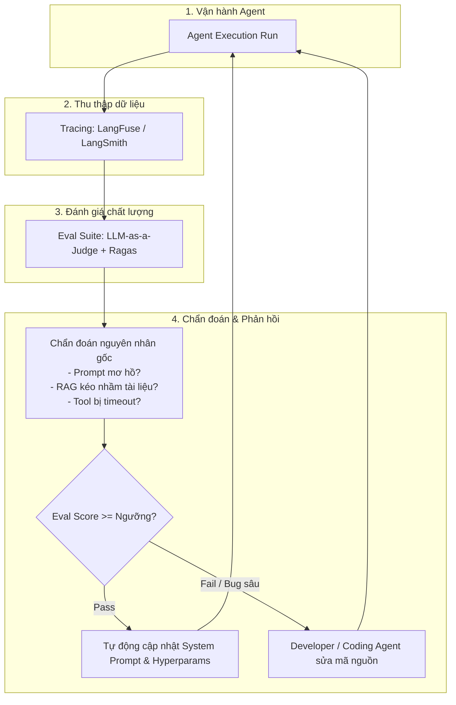

# 06.3 - Continuous Feedback & Self-Evolution Loop

> **Chủ đề**: Vòng lặp phản hồi tự động, chẩn đoán lỗi gốc và tự tiến hóa của hệ thống AI Agent  
> **Điều hướng**: [[00 - MOC (Map of Content)|Quay lại MOC]] | [[06 - LLMOps & Evaluation/06.2 - Evaluation Systems & LLM-as-a-Judge|Trước: 06.2 - Evaluation Systems]]

---

## 1. Vòng Lặp Tự Tiến Hóa Toàn Diện (The Self-Evolution Loop)

---

## 2. Quy Trình Chẩn Đoán Lỗi Gốc (Root Cause Diagnosis)

Khi một Agent Run bị đánh giá thất bại (Score < 0.7):
1. **Lỗi RAG (Context Error)**:
   - *Hiện tượng*: Câu trả lời ảo giác hoặc thiếu số liệu.
   - *Chẩn đoán*: Chunking size quá nhỏ làm mất ngữ cảnh, hoặc Embedding model không bắt được từ khóa chuyên ngành.
   - *Khắc phục*: Tăng Chunk Size, bổ sung Reranking hoặc Hybrid Search.
2. **Lỗi Kỹ Năng / Chỉ Dẫn (Instruction Error)**:
   - *Hiện tượng*: Agent bỏ qua bước xác nhận người dùng hoặc format JSON sai.
   - *Chẩn đoán*: System Prompt bị dài dòng, quy tắc không rõ ràng.
   - *Khắc phục*: Cập nhật lại file `SKILL.md` (Procedural Memory), thêm ví dụ Few-shot.
3. **Lỗi Công Cụ (Tool Execution Error)**:
   - *Hiện tượng*: Tool trả về lỗi 400 hoặc 500 liên tục.
   - *Chẩn đoán*: Schema định nghĩa sai tham số hoặc API bên thứ ba thay đổi.
   - *Khắc phục*: Cập nhật mã nguồn Tool và Pydantic validator.

---

## 3. Tổng Kết Vòng Đời Hoàn Chỉnh Của Kỹ Sư AI Agent

Một kỹ sư AI Agent không chỉ viết prompt đơn thuần, mà xây dựng một **hệ sinh thái khép kín**:
1. Thiết kế **Harness** kiểm soát LLM.
2. Quản trị **Tri-Memory** và **Hybrid RAG**.
3. Cài đặt **Guardrails & StateGraph**.
4. Giám sát bằng **Tracing & Evals** để hệ thống liên tục tự cải tiến.

---

## 4. Tài Liệu Liên Quan
- [[00 - MOC (Map of Content)|Quay lại Bản Đồ Tổng Quan (MOC)]]
- [[04 - Agent Architecture & Loop Engineering/04.4 - Comprehensive Agent Architecture|04.4 - Comprehensive Agent Architecture]]
