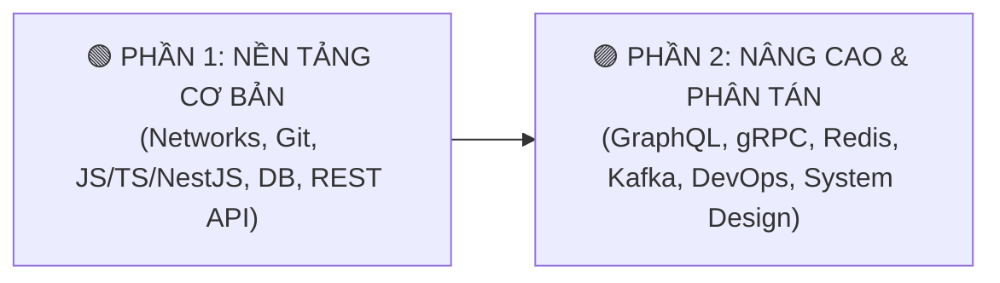

---
tags:
  - backend
  - moc
  - dashboard
type: moc
status: in-progress
created: 2026-09-25
updated: 2026-09-25
aliases:
  - Backend Master Dashboard
---

# 🚀 Backend Engineering Master Dashboard

> [[00 - Master Knowledge Hub|🌐 Master Vault Hub]] / [[Roadmap - Backend Full Course|📋 Master Roadmap]]

---

## 🧭 Điều Hướng Hai Phần Lộ Trình

|  Phần Học  | Lĩnh Vực Cốt Lõi                                                     |   Tiến Độ   | Liên Kết MOC                                  |
| :--------: | :------------------------------------------------------------------- | :---------: | :-------------------------------------------- |
| **Phần 1** | Mạng máy tính, Git, TypeScript, NestJS, Database, REST API           | 🟡 Đang học | [[MOC - Part 1 Core Foundations\|MOC Phần 1]] |
| **Phần 2** | GraphQL, gRPC, Redis Caching, Kafka Streaming, DevOps, System Design | ⚪ Chờ học  | [[MOC - Part 2 Advanced Systems\|MOC Phần 2]] |

---

## 🎯 Mục Tiêu Đạt Chuẩn (Definition of Done)

1. **Nền tảng vững chắc:** Hiểu từ gốc cơ chế gói tin mạng (TCP, HTTP/3, WebSocket) và vòng đời Event Loop của JavaScript/Node.js.
2. **Framework thực chiến:** Làm chủ kiến trúc module, DI, Guards, Interceptors của **NestJS**.
3. **Thiết kế hệ thống:** Tự tin thiết kế kiến trúc Backend chịu tải cao, áp dụng đúng Redis Cache, Kafka Event-Driven và các nguyên lý System Design.
