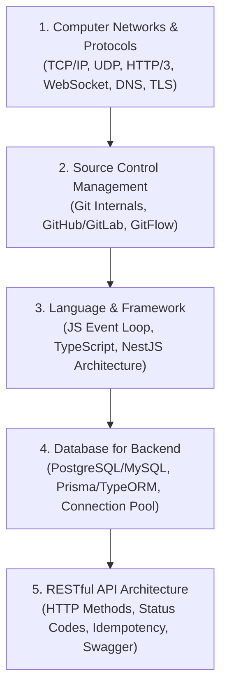
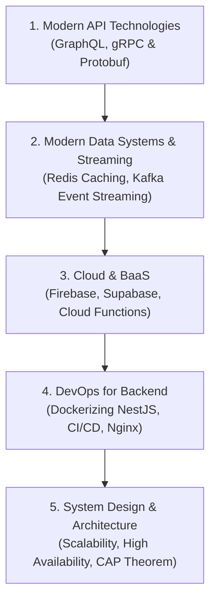

---
tags:
  - backend
  - roadmap
type: moc
status: in-progress
created: 2026-09-25
updated: 2026-09-25
aliases:
  - Roadmap Backend Engineering
---

# 📋 Lộ Trình Toàn Diện Backend Engineering (Full Course)

> [[00 - Master Dashboard|🧭 Dashboard]] / [[MOC - Part 1 Core Foundations|🟢 MOC Phần 1]] / [[MOC - Part 2 Advanced Systems|🟣 MOC Phần 2]]

---

## 🟢 PHẦN 1: NỀN TẢNG CƠ BẢN (CORE FOUNDATIONS)

### 1. [[00 - Networks MOC|Mạng Máy Tính & Giao Thức (Networks & Protocols)]]

- **Core Transport:** Hiểu bản chất [[TCP - IP|TCP]], [[UDP]], [[QUIC]], và [[BGP]].
- **Web & Remote:** Phân biệt [[HTTP - HTTPS]], [[WebSocket]], [[SSH]], và mã hóa [[TLS]].
- **Hệ thống điều hành mạng:** Cơ chế phân giải [[DNS]], cấp phát [[DHCP]], [[ARP]], và kiểm tra lỗi [[ICMP]].

### 2. [[00 - Git MOC|Quản Lý Mã Nguồn (Git & Source Control)]]

- Bản chất cấu trúc dữ liệu Directed Acyclic Graph (DAG) của Git: Blob, Tree, Commit, Ref.
- Quy trình phân nhánh: GitFlow vs Trunk-based Development, xử lý Merge Conflicts, Interactive Rebase.

### 3. [[00 - NestJS Ecosystem MOC|Ngôn Ngữ & Framework (JS, TS & NestJS)]]

- **JavaScript Core:** V8 Engine, Memory Heap, Call Stack, Event Loop (Microtask vs Macrotask), Asynchronous Programming.
- **TypeScript:** Type System, Generics, Utility Types, Decorators, Strict Type Safety.
- **NestJS Framework:** Inversion of Control (IoC), Dependency Injection (DI), Modules, Controllers, Services, Pipes (Validation), Guards (Auth), Interceptors (Logging/Transform), Exception Filters.

### 4. [[00 - Backend DB MOC|Cơ Sở Dữ Liệu Cho Backend (Databases)]]

- _Liên kết sâu với module [[Database-knowledge/00 - Maps of Content/MOC - Database Overview|Database-knowledge]]_.
- Thiết kế Schema & Normalization trong RDBMS (PostgreSQL, MySQL).
- Sử dụng ORM hiện đại: **Prisma** và **TypeORM** trong NestJS.
- Connection Pooling, Transaction Isolation, Database Migrations trong Production.

### 5. [[00 - REST MOC|Thiết Kế & Xây Dựng RESTful API]]

- 6 Ràng buộc kiến trúc của REST (Stateless, Client-Server, Cacheable...).
- Thiết kế URI chuẩn, Resource Naming, HTTP Status Codes chuẩn xác.
- Idempotency trong API, Phân trang (Offset vs Cursor-based), Rate Limiting cơ bản.
- Tự động hóa tài liệu API với OpenAPI/Swagger trong NestJS.

---

## 🟣 PHẦN 2: NÂNG CAO & HỆ THỐNG HIỆN ĐẠI (ADVANCED & DISTRIBUTED SYSTEMS)

### 1. [[00 - Modern API MOC|Công Nghệ API Hiện Đại (GraphQL & gRPC)]]

- **GraphQL:** Schema Definition Language (SDL), Query, Mutation, Subscription, Resolvers, giải quyết bài toán N+1 với DataLoader.
- **gRPC & Protocol Buffers:** Nhị phân hóa dữ liệu, Unary RPC, Server/Client Streaming, giao tiếp giữa các Microservices trên nền HTTP/2.

### 2. [[00 - Data Systems MOC|Hệ Thống Dữ Liệu Hiện Đại & Message Queue (Redis & Kafka)]]

- **Redis:** In-memory Data Structures (String, Hash, List, Set, Sorted Set), Caching Strategies (Cache-Aside, Write-Through, Write-Behind), Distributed Lock (Redlock), Pub/Sub.
- **Kafka / Message Broker:** Event-driven Architecture, Producer, Broker, Topic, Partition, Consumer Group, Exactly-Once Semantics, Event Sourcing.

### 3. [[00 - BaaS MOC|Nền Tảng Cloud & Backend-as-a-Service (BaaS)]]

- Hệ sinh thái Firebase (Firebase Auth, Cloud Firestore, Firebase Cloud Messaging).
- Supabase (PostgreSQL-as-a-Service, Row Level Security, Realtime Subscriptions).

### 4. [[00 - Backend DevOps MOC|DevOps Cho Kỹ Sư Backend]]

- _Liên kết sâu với module [[DevOps-knowledge/Roadmap|DevOps-knowledge]]_.
- Viết `Dockerfile` tối ưu Multi-stage build cho ứng dụng NestJS.
- Tự động hóa CI/CD với GitHub Actions / GitLab CI.
- Cấu hình NGINX làm Reverse Proxy, SSL Termination và Load Balancer.

### 5. [[00 - System Design MOC|Tư Duy Thiết Kế Hệ Thống (System Design & Architecture)]]

- Kiến trúc Monolith vs Microservices vs Modular Monolith.
- Chiến lược mở rộng: Horizontal Scaling, Database Read Replicas, Database Sharding.
- Độ tin cậy hệ thống: Circuit Breaker Pattern, Retry with Exponential Backoff, Dead Letter Queue (DLQ).
- Các định lý phân tán: CAP Theorem, PACELC Theorem, Eventual Consistency.
