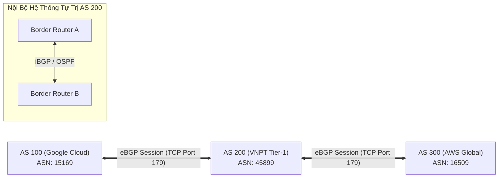

# 🗺️ Giao Thức BGP (Border Gateway Protocol)

> [[00 - Networks MOC|📁 Computer Networks MOC]] / [[MOC - Part 1 Core Foundations|🟢 Part 1 MOC]]

---

## 1. Bản Đồ Khái Niệm (Mermaid DAG)

---

## 2. Chân Lý Vô Điều Kiện (First Principles)

> [!NOTE] Tiên Đề Bất Biến
> **Internet không phải là một mạng đơn nhất, mà là một liên mạng của các Hệ thống Tự trị (Autonomous Systems - AS).**
>
> BGP là giao thức định tuyến liên miền (**Inter-domain Routing Protocol**) duy nhất giữ cho Internet toàn cầu vận hành. BGP là một giao thức **Path-Vector**: Nó không đo lường đường đi bằng số lượng router trung gian hay tốc độ dây dẫn, mà định tuyến dựa trên **danh sách các AS phải đi qua (AS-Path)** và các **chính sách kinh tế / thỏa thuận thương mại (Policy-based Routing)** giữa các nhà mạng.

---

## 3. Trực Giác Motivated Discovery

> [!TIP] Động Lực Phát Minh (Tại sao OSPF hay RIP không chạy được cho Internet toàn cầu?)
> Các giao thức định tuyến nội bộ như [[RIP & OSPF]] yêu cầu router phải ghi nhớ trạng thái từng kết nối hoặc broadcast bảng định tuyến liên tục. Nếu áp dụng quy mô Internet với hơn 950.000 dải mạng (Prefixes):
>
> 1. Bộ nhớ RAM và CPU của mọi router trên thế giới sẽ nổ tung vì không thể tính toán thuật toán Dijkstra trên quy mô hàng triệu nút.
> 2. Các nhà mạng (Viettel, VNPT, AT&T) là đối thủ kinh doanh; họ không muốn công khai sơ đồ mạng nội bộ cho đối thủ và cần quyền quyết định đẩy lưu lượng qua đường nào có chi phí rẻ nhất. BGP ra đời để định tuyến theo chính sách kinh tế (Policy) thay vì chỉ chạy thuật toán tìm đường ngắn nhất.

---

## 4. Phân Tích Kỹ Thuật Chuyên Sâu

### 4.1. Kiến Trúc Hoạt Động & Phiên BGP

- **Chạy trên nền TCP Port 179:** Khác với RIP (UDP) hay OSPF (chạy thẳng trên IP), BGP tận dụng độ tin cậy của TCP để truyền bảng định tuyến mà không cần tự xây dựng cơ chế ACK hoặc phân đoạn gói tin.
- **Phân loại BGP:**
  - **eBGP (External BGP):** Kết nối giữa 2 router thuộc 2 Autonomous System khác nhau. Bắt buộc kết nối trực tiếp (TTL = 1 mặc định).
  - **iBGP (Internal BGP):** Kết nối giữa các router BGP trong cùng một Autonomous System để đồng bộ hóa thông tin định tuyến ngoại miền ra toàn mạng.

---

### 4.2. BGP Attributes & Thuật Toán Chọn Đường (Best Path Selection)

Khi có nhiều đường đến cùng một dải IP đích, BGP chọn đường theo thứ tự ưu tiên các thuộc tính (Attributes):

1. **Weight (Cisco specific):** Giá trị cục bộ cao nhất được ưu tiên (chỉ có ý nghĩa trong nội bộ router).
2. **Local Preference:** Giá trị cao nhất được ưu tiên (áp dụng trong toàn bộ AS để chọn cổng ra).
3. **Originate:** Tuyến đường do chính router này tạo ra (locally originated).
4. **AS-Path:** Đường có **danh sách AS ngắn nhất** được ưu tiên (ngắn nhất về số bước nhảy AS).
5. **Origin Code:** IGP < EGP < Incomplete.
6. **MED (Multi-Exit Discriminator):** Giá trị thấp nhất được ưu tiên (gợi ý cho AS láng giềng chọn cổng vào).
7. **eBGP over iBGP:** Tuyến học từ eBGP luôn được ưu tiên hơn iBGP.

---

### 4.3. Rủi Ro Bảo Mật: BGP Hijacking & RPKI

- **BGP Hijacking:** BGP được thiết kế dựa trên sự tin tưởng lẫn nhau giữa các kỹ sư mạng thời kỳ đầu, hoàn toàn không có cơ chế xác thực nguồn gốc. Nếu một nhà mạng công bố nhầm hoặc cố tình quảng bá một dải IP (như DNS 8.8.8.8) với AS-Path ngắn hơn, lưu lượng toàn cầu sẽ bị hút về nhà mạng đó.
- **Giải pháp bảo vệ:** **RPKI (Resource Public Key Infrastructure)** sử dụng chữ ký số mật mã để xác thực quyền sở hữu hợp pháp của một AS đối với dải IP tương ứng (Route Origin Authorization - ROA), loại bỏ việc quảng bá đường đi giả mạo.

---

## 5. Spaced Repetition Flashcards & Tham Chiếu

### Flashcards

BGP hoạt động trên tầng Transport nào và sử dụng cổng (port) nào? #card
BGP sử dụng kết nối TCP trên cổng 179 để đảm bảo việc truyền bảng định tuyến tin cậy.

Thuộc tính AS-Path trong BGP đóng vai trò gì trong việc phòng chống lỗi mạng? #card
Giúp phòng chống vòng lặp định tuyến (Routing Loop Prevention): Nếu một router nhận được bản tin BGP mà trong thuộc tính AS-Path đã chứa số ASN của chính mình, nó sẽ lập tức hủy bỏ gói tin đó.

Sự khác biệt cốt lõi giữa eBGP và iBGP là gì? #card
eBGP chạy giữa các router thuộc các Autonomous System khác nhau (để trao đổi đường đi liên mạng), còn iBGP chạy giữa các router trong cùng một Autonomous System (để phân phối thông tin định tuyến ngoại miền vào nội bộ).

### Tham Chiếu

- [[TCP - IP]] - Giao thức tầng transport làm nền móng cho phiên kết nối BGP.
- [[RIP & OSPF]] - Các giao thức định tuyến nội bộ hoạt động bên trong một Autonomous System.
- [[DNS]] - Dịch vụ hạ tầng bị ảnh hưởng trực tiếp nếu xảy ra sự cố BGP Hijacking.
