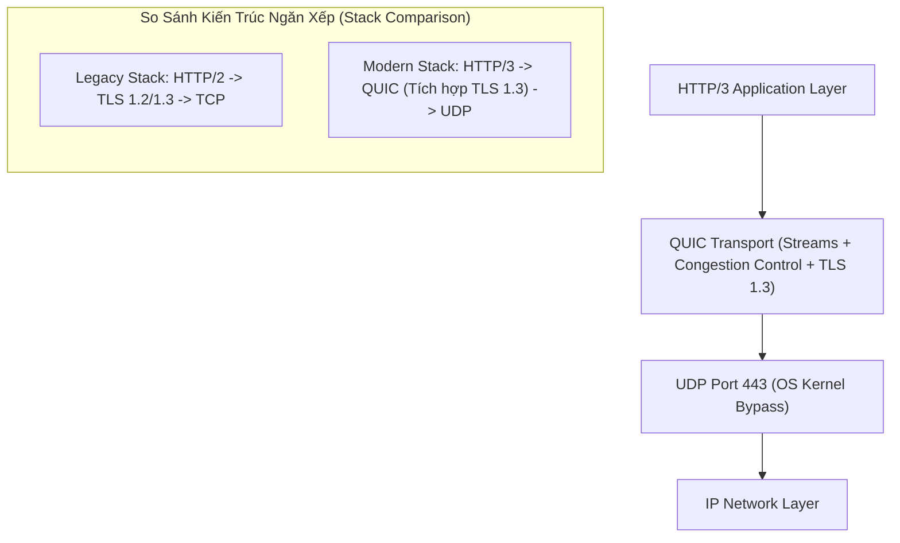

# 🚀 Giao Thức QUIC (Quick UDP Internet Connections)

> [[00 - Networks MOC|📁 Computer Networks MOC]] / [[MOC - Part 1 Core Foundations|🟢 Part 1 MOC]]

---

## 1. Bản Đồ Khái Niệm (Mermaid DAG)

---

## 2. Chân Lý Vô Điều Kiện (First Principles)

> [!NOTE] Tiên Đề Bất Biến
> **QUIC dời toàn bộ logic truyền tải tin cậy và ghép kênh từ Kernel Space sang User Space trên nền UDP.**
>
> Bằng cách vận hành trên UDP:
>
> 1. QUIC **loại bỏ hoàn toàn hiện tượng Head-of-Line (HoL) Blocking** ở tầng giao vận: Mỗi stream bên trong QUIC hoạt động độc lập; nếu gói tin của Stream A bị mất, chỉ Stream A bị dừng chờ, Stream B và C vẫn tiếp tục được xử lý bình thường.
> 2. QUIC tích hợp mã hóa **TLS 1.3 ngay trong pha bắt tay đầu tiên**, rút ngắn thời gian khởi tạo kết nối xuống còn **1-RTT** hoặc **0-RTT** (đối với kết nối lặp lại).

---

## 3. Trực Giác Motivated Discovery

> [!TIP] Động Lực Phát Minh (Tại sao HTTP/2 chạy trên TCP vẫn bị lag khi mạng kém?)
> HTTP/2 cho phép gửi hàng trăm request/response đồng thời trên một kết nối TCP duy nhất (Multiplexing). Tuy nhiên, dưới con mắt của TCP trong hệ điều hành, đó chỉ là **một dòng byte đơn nhất (single byte stream)**.
>
> Khi có 1 gói TCP bị rớt trên đường truyền Wi-Fi hoặc 4G, Kernel hệ điều hành sẽ chặn toàn bộ luồng và không chuyển bất kỳ byte nào lên ứng dụng cho đến khi gói bị mất được gửi lại thành công. Một gói tin rớt làm tắc nghẽn toàn bộ hàng chục stream! QUIC sinh ra để tách các stream thành các thực thể độc lập ở tầng Transport.

---

## 4. Phân Tích Kỹ Thuật Chuyên Sâu

### 4.1. Kiến Trúc & Sơ Đồ Cấu Trúc

![[quic_architecture.jpg]]

QUIC không dựa vào TCP của hệ điều hành mà tự quản lý:

- Cơ chế ACK riêng biệt cho từng stream.
- Thuật toán kiểm soát tắc nghẽn hiện đại (BBR, NewReno).
- Mọi gói tin QUIC (ngoại trừ một số thông tin header bắt buộc) đều được mã hóa bằng TLS 1.3, ngăn chặn hoàn toàn việc các thiết bị trung gian (Middleboxes) đọc trộm hoặc can thiệp dữ liệu.

---

### 4.2. Rút Ngắn Độ Trễ: 0-RTT và 1-RTT Handshake

![[quic_handshake_comparison.jpg]]

| Giai Đoạn                    | TCP + TLS 1.2                 | TCP + TLS 1.3                 | QUIC (HTTP/3)                             |
| :--------------------------- | :---------------------------- | :---------------------------- | :---------------------------------------- |
| **Bắt tay lần đầu**          | 3 RTT (TCP 1 RTT + TLS 2 RTT) | 2 RTT (TCP 1 RTT + TLS 1 RTT) | **1 RTT** (Gộp TCP + TLS vào 1 lần)       |
| **Tái kết nối (Resumption)** | 2 RTT                         | 1 RTT                         | **0 RTT** (Gửi kèm Application Data ngay) |

---

### 4.3. Chuyển Đổi Kết Nối Mượt Mà (Connection Migration)

![[quic_connection_migration.jpg]]

- **Vấn đề trên TCP:** Kết nối TCP được định danh bởi **4-tuple**: `(Source IP, Source Port, Dest IP, Dest Port)`. Khi bạn đang dùng điện thoại rời khỏi nhà (chuyển từ Wi-Fi sang 4G), địa chỉ Source IP thay đổi $
  ightarrow$ Toàn bộ kết nối TCP bị đứt gãy, phải bắt tay lại từ đầu.
- **Giải pháp của QUIC:** QUIC sử dụng một trường định danh ngẫu nhiên gọi là **Connection ID (64-bit)** độc lập với IP/Port. Khi chuyển mạng từ Wi-Fi sang 4G, gói tin vẫn mang Connection ID cũ $
  ightarrow$ Server nhận diện ngay phiên làm việc, cuộc gọi video hoặc quá trình tải file tiếp diễn mà không bị gián đoạn dù chỉ 1 giây.

---

## 5. Spaced Repetition Flashcards & Tham Chiếu

### Flashcards

QUIC giải quyết vấn đề Head-of-Line Blocking của HTTP/2 trên TCP như thế nào? #card
QUIC chuyển cơ chế stream từ tầng Application xuống tầng Transport trên nền UDP. Mỗi stream có bộ đệm và sequence number độc lập; khi một gói tin của một stream bị mất, chỉ stream đó bị tạm dừng, các stream khác vẫn tiếp tục truyền nhận bình thường.

Cơ chế Connection Migration của QUIC hoạt động dựa vào yếu tố nào thay vì 4-tuple của TCP? #card
Dựa vào Connection ID (64-bit) độc lập với địa chỉ IP và Port. Khi thiết bị đổi mạng (ví dụ từ Wi-Fi sang 4G), Connection ID không đổi giúp phiên truyền tiếp tục liên tục mà không cần handshake lại.

Thời gian thiết lập kết nối lần đầu (Initial Handshake) của QUIC tốn bao nhiêu RTT? #card
Đúng 1 RTT, do QUIC gộp quá trình thiết lập kết nối transport và trao đổi khóa mật mã TLS 1.3 vào cùng một chu kỳ gửi-nhận.

### Tham Chiếu

- [[UDP]] - Giao thức nền tảng mà QUIC chạy trên.
- [[TCP - IP]] - Giao thức truyền thống mà QUIC đang dần thay thế trong lưu lượng Web.
- [[HTTP - HTTPS]] - Chuẩn HTTP/3 chính thức sử dụng QUIC làm giao thức transport mặc định.
- [[TLS]] - Giao thức mật mã được tích hợp sâu bên trong QUIC.
