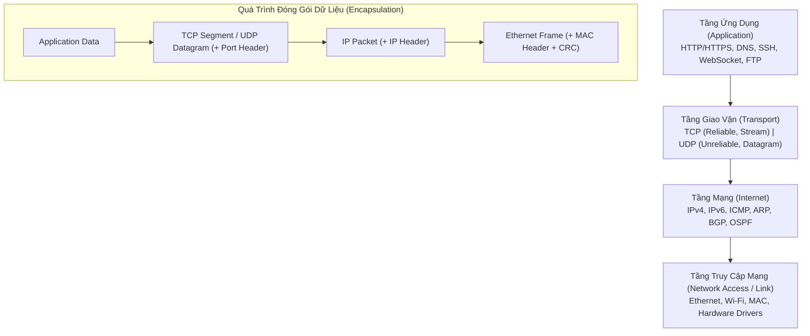
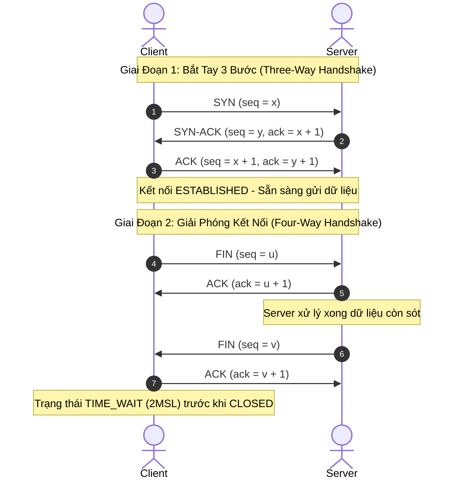

# 🌐 Mô Hình TCP/IP (Internet Protocol Suite)

> [[00 - Networks MOC|📁 Computer Networks MOC]] / [[MOC - Part 1 Core Foundations|🟢 Part 1 MOC]]

---

## 1. Bản Đồ Khái Niệm (Mermaid DAG)

---

## 2. Chân Lý Vô Điều Kiện (First Principles)

> [!NOTE] Tiên Đề Bất Biến
> Mọi gói tin truyền qua mạng IP toàn cầu đều là **Best-effort** (không cam kết tới đích, không cam kết giữ nguyên thứ tự, không cam kết tính toàn vẹn).
>
> Giao thức **TCP** tạo ra ảo ảnh về một **Kênh truyền tin cậy (Reliable Byte Stream)** bên trên một hạ tầng mạng vốn dĩ không đáng tin cậy bằng cách sử dụng:
>
> 1. Đánh số thứ tự từng byte (**Sequence Numbers**).
> 2. Xác nhận nhận tin (**Acknowledgments - ACK**).
> 3. Truyền lại khi mất gói (**Retransmission Timer / Fast Retransmit**).
> 4. Kiểm soát luồng (**Flow Control - Sliding Window**) và kiểm soát tắc nghẽn (**Congestion Control**).

---

## 3. Trực Giác Motivated Discovery

> [!TIP] Động Lực Phát Minh (Tại sao TCP/IP thắng thế trước mô hình OSI 7 tầng?)
> Mô hình OSI 7 tầng được thiết kế bởi ủy ban lý thuyết, phân chia quá nhiều lớp trung gian (Presentation, Session) gây lãng phí CPU và bộ nhớ đệm cho mỗi lần đóng gói.
>
> Các kỹ sư thiết kế **TCP/IP** (DARPA) tiếp cận từ thực tế triển khai: Gom toàn bộ logic định dạng và phiên làm việc vào ứng dụng (Application Layer), gom tầng liên kết và vật lý thành Network Access. Kết quả là mô hình 4 tầng gọn nhẹ, chạy trực tiếp trong Kernel hệ điều hành với chi phí tài nguyên tối thiểu.

---

## 4. Phân Tích Kỹ Thuật Chuyên Sâu

### 4.1. Cấu Trúc 4 Tầng Chuẩn RFC 1122

| Tầng (Layer)       | Đơn Vị Dữ Liệu (PDU)           | Giao Thức Tiêu Biểu                  | Nhiệm Vụ Cốt Lõi                                                       |
| :----------------- | :----------------------------- | :----------------------------------- | :--------------------------------------------------------------------- |
| **Application**    | Data / Message                 | HTTP/3, HTTPS, DNS, SSH, WebSocket   | Giao tiếp trực tiếp với logic ứng dụng người dùng                      |
| **Transport**      | Segment (TCP) / Datagram (UDP) | [[TCP - IP\|TCP]], [[UDP]], [[QUIC]] | Truyền dữ liệu tiến trình - tiến trình (Port-to-Port), kiểm soát luồng |
| **Internet**       | Packet                         | IPv4, IPv6, [[ICMP]], [[ARP]]        | Định địa chỉ logic, định tuyến xuyên qua các mạng khác nhau            |
| **Network Access** | Frame                          | Ethernet (802.3), Wi-Fi (802.11)     | Chuyển đổi khung nhị phân thành tín hiệu điện/quang/sóng               |

---

### 4.2. Quá Trình Thiết Lập & Giải Phóng Kết Nối TCP

- **SYN Flood Attack:** Kẻ tấn công gửi hàng loạt `SYN` nhưng không gửi `ACK` cuối cùng, làm cạn kiệt hàng đợi kết nối (SYN backlog queue) của server.
  - _Giải pháp:_ Kích hoạt **SYN Cookies** trong Linux Kernel (`sysctl -w net.ipv4.tcp_syncookies=1`).
- **Trạng thái TIME_WAIT:** Client phải chờ $2 imes ext{MSL}$ (Maximum Segment Lifetime, thường là 60 giây) trước khi đóng hoàn toàn để đảm bảo gói ACK cuối cùng đến đích và tránh gói tin cũ lạc vào phiên kết nối mới.

---

### 4.3. Kiểm Soát Luồng & Tắc Nghẽn (Flow & Congestion Control)

1. **Sliding Window (Kiểm soát luồng):**
   - Phía nhận thông báo dung lượng bộ đệm còn trống qua trường `Window Size` trong TCP Header.
   - Phía gửi không bao giờ được gửi vượt quá cửa sổ này, ngăn chặn tràn bộ đệm máy nhận.
2. **Congestion Control (Kiểm soát tắc nghẽn mạng):**
   - Thuật toán TCP Reno / Cubic điều chỉnh cửa sổ tắc nghẽn ($cwnd$):
     - **Slow Start:** Tăng $cwnd$ theo hàm mũ ($2^n$) sau mỗi RTT cho đến khi chạm ngưỡng $ssthresh$.
     - **Congestion Avoidance:** Tăng tuyến tính từng segment sau mỗi RTT.
     - **Fast Retransmit & Fast Recovery:** Khi nhận được 3 ACK trùng lặp (Triple Duplicate ACKs), TCP nhận diện mất gói và truyền lại ngay lập tức mà không cần đợi Retransmission Timeout (RTO).

---

### 4.4. Ứng Dụng Trong Kỹ Thuật Backend

- **Connection Pooling:** Chi phí bắt tay TCP Three-way Handshake là 1 RTT (chưa tính TLS). Với Database (PostgreSQL, MySQL), thiết lập kết nối mới tốn hàng chục ms. Backend bắt buộc dùng Connection Pool (như HikariCP, pgBouncer, Prisma Pool) để tái sử dụng kết nối TCP đã mở.
- **TCP Keepalive vs Application Heartbeat:** TCP Keepalive ở tầng OS chỉ kiểm tra socket còn sống hay không. Ứng dụng Backend cần Heartbeat ở tầng ứng dụng (như WebSocket Ping/Pong) để phát hiện treo tiến trình xử lý.

---

## 5. Spaced Repetition Flashcards & Tham Chiếu

### Flashcards

Quá trình bắt tay 3 bước của TCP diễn ra theo thứ tự các cờ (flags) nào? #card
SYN (từ Client) -> SYN-ACK (từ Server) -> ACK (từ Client).

Tại sao Client phải chuyển sang trạng thái TIME_WAIT trong 2MSL sau khi đóng kết nối TCP? #card
Để đảm bảo gói tin ACK cuối cùng đến được Server (nếu mất gói, Server gửi lại FIN thì Client vẫn còn ở đó để ACK lại), đồng thời để tất cả các gói tin cũ của phiên này biến mất hoàn toàn khỏi mạng trước khi IP/Port được tái sử dụng.

Tấn công SYN Flood khai thác cơ chế nào của TCP và giải pháp trong Linux Kernel là gì? #card
Khai thác hàng đợi bán kết nối (SYN backlog) bằng cách gửi SYN nhưng không gửi lại ACK cuối cùng. Giải pháp là bật SYN Cookies (`net.ipv4.tcp_syncookies=1`) để không cấp phát bộ nhớ hàng đợi cho đến khi nhận được ACK hợp lệ.

### Tham Chiếu

- [[UDP]] - Giao thức tầng giao vận phi kết nối tốc độ cao.
- [[QUIC]] - Giao thức hiện đại thay thế TCP trong HTTP/3.
- [[HTTP - HTTPS]] - Giao thức tầng ứng dụng phổ biến nhất chạy trên TCP/TLS.
