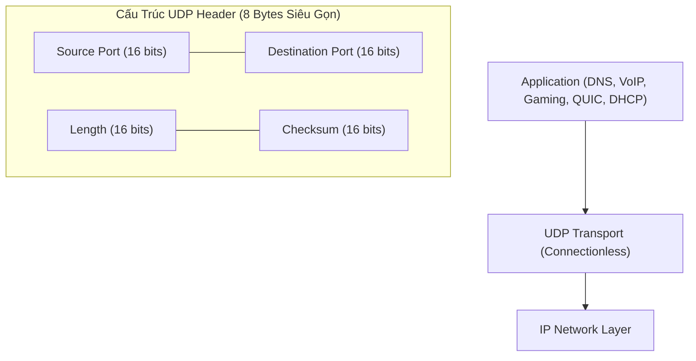

# ⚡ Giao Thức UDP (User Datagram Protocol)

> [[00 - Networks MOC|📁 Computer Networks MOC]] / [[MOC - Part 1 Core Foundations|🟢 Part 1 MOC]]

---

## 1. Bản Đồ Khái Niệm (Mermaid DAG)

---

## 2. Chân Lý Vô Điều Kiện (First Principles)

> [!NOTE] Tiên Đề Bất Biến
> **UDP là giao thức phi kết nối (Connectionless) và phi trạng thái (Stateless).**
>
> Hệ điều hành không lưu giữ trạng thái phiên, không thực hiện bắt tay khởi tạo, không đánh số thứ tự dữ liệu, không có cơ chế ACK và không tự động truyền lại khi mất gói. UDP chỉ cung cấp đúng 2 dịch vụ tối thiểu bên trên tầng IP:
>
> 1. Ghép/Tách kênh tiến trình thông qua số cổng (**Port Multiplexing**).
> 2. Kiểm tra tính toàn vẹn cơ bản của gói tin thông qua trường **Checksum**.

---

## 3. Trực Giác Motivated Discovery

> [!TIP] Động Lực Phát Minh (Tại sao lại chấp nhận mất gói tin?)
> Trong các ứng dụng thời gian thực như gọi thoại (VoIP), phát sóng trực tiếp (Livestream) hoặc game đối kháng trực tuyến: **Một gói tin đến muộn (Delayed Packet) hoàn toàn vô giá trị.**
>
> Nếu sử dụng TCP, khi mất 1 frame hình ảnh, toàn bộ luồng truyền dữ liệu sẽ bị khựng lại (Head-of-Line Blocking) để chờ TCP phát hiện timeout và gửi lại gói đó. Đến lúc gói tin được gửi lại thành công sau 200ms thì khoảnh khắc đó trên màn hình người dùng đã trôi qua. UDP loại bỏ hoàn toàn cơ chế chờ đợi này: mất thì bỏ qua, tập trung hiển thị ngay dữ liệu mới nhất.

---

## 4. Phân Tích Kỹ Thuật Chuyên Sâu

### 4.1. Cấu Trúc Header 8 Byte

So sánh kích thước Header giữa TCP và UDP:

- **TCP Header:** Tối thiểu 20 bytes (có thể lên tới 60 bytes khi có Options).
- **UDP Header:** Cố định đúng 8 bytes (64 bits):
  - `Source Port` (16 bits): Cổng ứng dụng gửi.
  - `Destination Port` (16 bits): Cổng ứng dụng nhận.
  - `Length` (16 bits): Chiều dài toàn bộ datagram (Header + Payload) tính bằng byte (tối thiểu là 8).
  - `Checksum` (16 bits): Kiểm tra lỗi bit trên header và payload (tùy chọn trong IPv4 nhưng bắt buộc trong IPv6).

---

### 4.2. So Sánh Kiến Trúc: TCP vs UDP

| Tiêu Chí                | TCP (Transmission Control Protocol)       | UDP (User Datagram Protocol)            |
| :---------------------- | :---------------------------------------- | :-------------------------------------- |
| **Bản chất kết nối**    | Hướng kết nối (Connection-oriented)       | Phi kết nối (Connectionless)            |
| **Độ trễ khởi tạo**     | 1 RTT (3-way handshake)                   | 0 RTT (Gửi ngay lập tức)                |
| **Đảm bảo thứ tự**      | Cam kết 100% đúng thứ tự byte             | Không cam kết, gói tin có thể đảo lộn   |
| **Mất gói**             | Tự động phát hiện và gửi lại              | Bỏ qua gói mất, không gửi lại           |
| **Kiểm soát tắc nghẽn** | Có (Sliding Window, Congestion Avoidance) | Không (Gửi tối đa theo tốc độ ứng dụng) |
| **Overhead Header**     | 20 - 60 Bytes                             | Đúng 8 Bytes                            |
| **Mô hình truyền**      | Điểm - Điểm (Unicast)                     | Unicast, Broadcast, Multicast           |

---

### 4.3. Kỹ Thuật Nâng Cao: Tự Hiện Thực Độ Tin Cậy Trên Nền UDP

Nhiều hệ thống hiện đại tận dụng tốc độ của UDP nhưng cài đặt cơ chế tin cậy tùy biến ở tầng ứng dụng (Application Layer):

1. **QUIC (HTTP/3):** Tận dụng UDP để tránh Head-of-Line Blocking của OS Kernel, tích hợp sẵn mã hóa TLS 1.3 và kiểm soát luồng độc lập trên từng stream.
2. **WebRTC:** Sử dụng SRTCP/SCTP trên nền UDP để truyền tải âm thanh, video và dữ liệu ngang hàng độ trễ dưới 100ms.
3. **DNS Query:** Sử dụng UDP port 53 vì chỉ có 1 request và 1 response; nếu quá thời gian mà không thấy kết quả, client tự gửi lại truy vấn mới mà không tốn công bắt tay TCP.

---

## 5. Spaced Repetition Flashcards & Tham Chiếu

### Flashcards

Header của giao thức UDP có kích thước cố định là bao nhiêu bytes và gồm những trường nào? #card
Cố định 8 bytes, gồm 4 trường (mỗi trường 16 bits): Source Port, Destination Port, Length, Checksum.

Tại sao DNS mặc định truy vấn qua UDP port 53 thay vì TCP? #card
Vì truy vấn DNS thông thường chỉ gồm 1 gói tin Request và 1 gói tin Response nhỏ (< 512 bytes). Dùng UDP có độ trễ 0-RTT, không tốn tài nguyên bắt tay 3 bước trên máy chủ DNS phục vụ hàng triệu truy vấn mỗi giây.

Hiện tượng Head-of-Line Blocking ở tầng Transport của TCP được giải quyết như thế nào khi chuyển sang dùng UDP? #card
UDP không có hàng đợi tuần tự bắt buộc ở Kernel. Các giao thức tầng ứng dụng (như QUIC) có thể chia dữ liệu thành nhiều stream độc lập; mất gói ở stream này không làm gián đoạn việc nhận dữ liệu của stream khác.

### Tham Chiếu

- [[TCP - IP]] - Giao thức truyền vận tin cậy đối trọng với UDP.
- [[QUIC]] - Giao thức tầng giao vận hiện đại phát triển trên nền UDP.
- [[DNS]] - Dịch vụ phân giải tên miền ứng dụng UDP phổ biến nhất.
