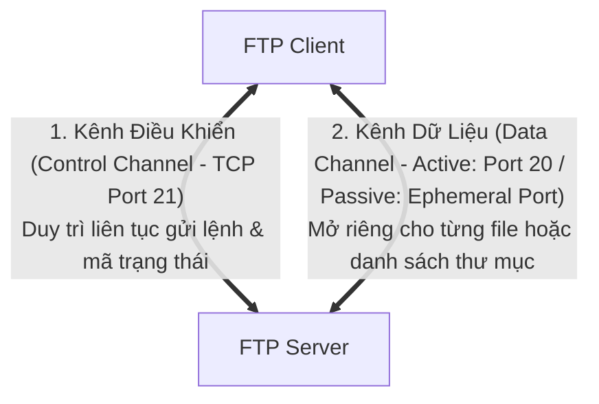
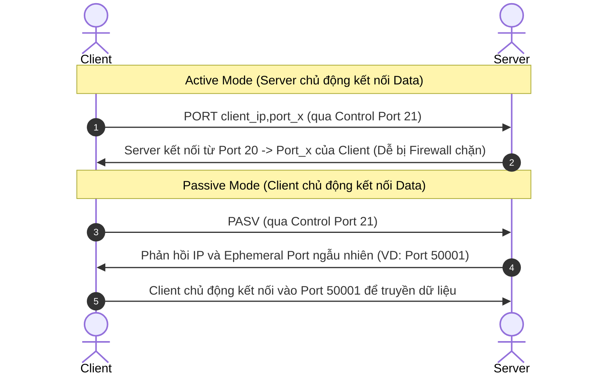

# 📁 Giao Thức Truyền Tệp FTP (File Transfer Protocol)

> [[00 - Networks MOC|📁 Computer Networks MOC]] / [[MOC - Part 1 Core Foundations|🟢 Part 1 MOC]]

---

## 1. Bản Đồ Khái Niệm (Mermaid DAG)

---

## 2. Chân Lý Vô Điều Kiện (First Principles)

> [!NOTE] Tiên Đề Bất Biến
> **FTP là giao thức hai kênh độc lập (Dual-channel Architecture).**
>
> Khác với phần lớn các giao thức mạng gộp chung lệnh và dữ liệu vào một socket, FTP tách biệt hoàn toàn:
>
> 1. **Control Connection:** Mở trên cổng TCP 21, tồn tại suốt phiên làm việc để truyền lệnh văn bản (USER, PASS, LIST, RETR, STOR) và mã trạng thái.
> 2. **Data Connection:** Được tạo mới và tự động đóng lại cho **mỗi lần truyền một tệp tin hoặc một danh sách thư mục**.

---

## 3. Trực Giác Motivated Discovery

> [!TIP] Động Lực Phát Minh (Tại sao chế độ Active Mode bị sụp đổ bởi Firewall/NAT?)
>
> - **Active Mode:** Client kết nối vào port 21 của Server để ra lệnh. Khi cần tải file, Server sẽ **chủ động kết nối ngược lại một cổng ngẫu nhiên trên Client**. Khi mạng gia đình và văn phòng bắt đầu dùng Router NAT/Firewall, Firewall của Client coi kết nối từ Server đến là cuộc xâm nhập trái phép và chặn đứng ngay lập tức!
> - **Passive Mode (PASV):** Ra đời để giải quyết lỗi NAT. Client yêu cầu server mở một cổng tạm thời (Ephemeral Port), và **Client luôn là bên chủ động khởi tạo cả 2 kết nối**.

---

## 4. Phân Tích Kỹ Thuật Chuyên Sâu

### 4.1. Chi Tiết Hai Chế Độ Kết Nối

---

### 4.2. Rủi Ro Bảo Mật & Lý Do Đào Thải FTP Thuần

- **Plain-text Credentials & Data:** FTP gửi tên đăng nhập, mật khẩu và dữ liệu file hoàn toàn dưới dạng văn bản thô (Cleartext). Bất kỳ ai bắt gói tin trên cùng mạng LAN hoặc switch đều có thể đọc trọn thông tin.
- **Tấn công FTP Bounce Attack:** Kẻ tấn công lợi dụng lệnh `PORT` để ép FTP Server gửi dữ liệu đến một máy nạn nhân khác nhằm quét cổng mạng nội bộ hoặc tấn công từ chối dịch vụ.
- **Khuyến nghị kỹ thuật:** Cấm tuyệt đối sử dụng FTP thuần trên hạ tầng Backend hiện đại; thay thế hoàn toàn bằng [[SFTP]] hoặc [[FTPS]].

---

## 5. Spaced Repetition Flashcards & Tham Chiếu

### Flashcards

Tại sao chế độ FTP Active Mode thường thất bại khi Client đặt sau router NAT hoặc tường lửa (Firewall)? #card
Vì trong Active Mode, Server là bên chủ động khởi tạo kết nối Data Channel ngược lại địa chỉ IP và Port của Client; kết nối chiều vào này mặc định bị Firewall/NAT của Client chặn lại vì không nhận diện được phiên làm việc hợp lệ.

Hai kênh kết nối độc lập của giao thức FTP đảm nhiệm các vai trò gì? #card
Kênh điều khiển (Control Channel - TCP Port 21) dùng để gửi lệnh và xác thực người dùng trong suốt phiên; Kênh dữ liệu (Data Channel) được mở và đóng riêng cho mỗi lần truyền tải nội dung file hoặc danh sách thư mục.

Tại sao FTP thuần không còn được chấp nhận trong các tiêu chuẩn bảo mật hiện đại như PCI-DSS hay ISO 27001? #card
Vì FTP truyền toàn bộ thông tin đăng nhập (Username/Password) và nội dung tệp tin dưới dạng văn bản thô (Plain Text) không có mã hóa, dễ dàng bị nghe lén (Sniffing) và giả mạo trên đường truyền.

### Tham Chiếu

- [[FTPS]] - Phiên bản nâng cấp mã hóa bằng SSL/TLS của FTP.
- [[SFTP]] - Giao thức truyền tệp an toàn chạy qua SSH thay thế hoàn toàn FTP.
- [[TCP - IP]] - Nền tảng giao vận điều phối cả hai kênh kết nối của FTP.
