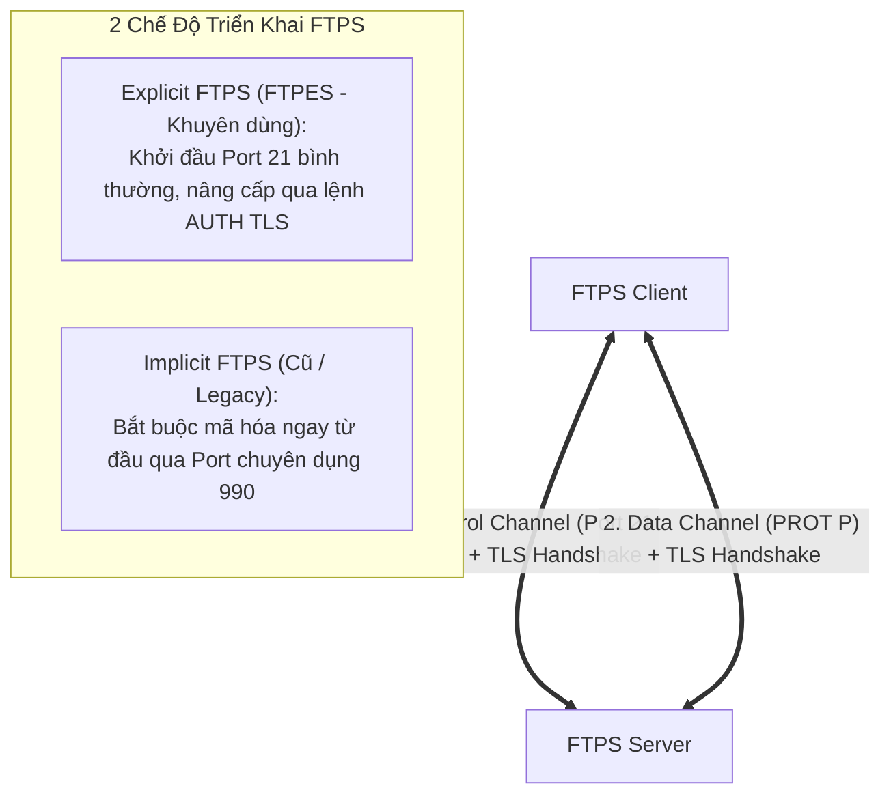

# 🔐 Giao Thức Truyền Tệp Bảo Mật FTPS (FTP over SSL/TLS)

> [[00 - Networks MOC|📁 Computer Networks MOC]] / [[MOC - Part 1 Core Foundations|🟢 Part 1 MOC]]

---

## 1. Bản Đồ Khái Niệm (Mermaid DAG)

---

## 2. Chân Lý Vô Điều Kiện (First Principles)

> [!NOTE] Tiên Đề Bất Biến
> **FTPS là sự ghép nối giữa giao thức truyền thống FTP với lớp mã hóa [[TLS]].**
>
> FTPS vẫn duy trì cấu trúc **hai kênh kết nối riêng biệt** của FTP:
>
> 1. Kênh điều khiển được bảo vệ bằng TLS Handshake và chứng chỉ số X.509.
> 2. Kênh dữ liệu bắt buộc phải được bảo vệ bằng lệnh `PROT P` (Private); nếu không cấu hình lệnh này, kênh dữ liệu truyền file vẫn có thể bị hở dưới dạng văn bản thô dù kênh đăng nhập đã được mã hóa!

---

## 3. Trực Giác Motivated Discovery

> [!TIP] Động Lực Phát Minh (Nâng cấp bảo mật cho hạ tầng sẵn có)
> Nhiều ngân hàng, bệnh viện và hệ thống máy chủ Mainframe đã đầu tư hàng triệu USD vào phần mềm quản lý phân quyền và script FTP từ thập niên 90.
>
> Khi các đạo luật bảo mật dữ liệu (PCI-DSS, HIPAA) ra đời, họ không thể đập bỏ toàn bộ hệ thống để chuyển sang công nghệ khác. **FTPS** ra đời như một bản vá tương thích: Giữ nguyên toàn bộ tập lệnh FTP cũ, chỉ chèn thêm lớp bắt tay TLS để mã hóa kênh truyền mà không cần thay đổi logic ứng dụng cốt lõi.

---

## 4. Phân Tích Kỹ Thuật Chuyên Sâu

### 4.1. Explicit FTPS (FTPES) vs Implicit FTPS

| Đặc Tính                   | Explicit FTPS (FTPES)                                      | Implicit FTPS                                         |
| :------------------------- | :--------------------------------------------------------- | :---------------------------------------------------- |
| **Cổng kết nối mặc định**  | Cổng 21 chuẩn của FTP                                      | Cổng riêng biệt 990                                   |
| **Cơ chế kích hoạt**       | Client gửi lệnh `AUTH TLS` hoặc `AUTH SSL` sau khi kết nối | Bắt buộc bắt tay TLS ngay khi socket vừa mở           |
| **Tính tương thích ngược** | Cho phép fallback về FTP thường nếu server không hỗ trợ    | Không tương thích ngược                               |
| **Chuẩn hóa IETF**         | Được chuẩn hóa chính thức trong **RFC 4217**               | Coi là deprecated nhưng vẫn tồn tại trong hệ thống cũ |

---

### 4.2. Cơ Chế Bảo Vệ Kênh Dữ Liệu Qua Lệnh PROT

Sau khi mã hóa kênh điều khiển, Client phải thỏa thuận mức độ bảo vệ cho kênh dữ liệu:

- `PROT C` (Clear): Kênh dữ liệu gửi văn bản thô không mã hóa (Không an toàn!).
- `PROT P` (Private): Kênh dữ liệu bắt buộc thiết lập một phiên TLS handshake riêng biệt trước khi truyền bất kỳ byte dữ liệu nào.

---

### 4.3. Khó Khăn Triển Khai So Với SFTP

Mặc dù giải quyết được vấn đề mã hóa, FTPS vẫn kế thừa nhược điểm cố hữu của FTP:

- Sử dụng nhiều cổng kết nối (Port 21 + Dải cổng Passive Ephemeral ports từ 50000-51000).
- Rất khó cấu hình Firewall và NAT trong môi trường Cloud (AWS VPC, Docker, Kubernetes) vì Firewall phải mở hàng loạt cổng dữ liệu.

---

## 5. Spaced Repetition Flashcards & Tham Chiếu

### Flashcards

Lệnh FTP nào được Client gửi đi trong chế độ Explicit FTPS để yêu cầu nâng cấp kết nối lên kênh truyền mã hóa TLS? #card
Lệnh `AUTH TLS` (hoặc `AUTH SSL`).

Tại sao việc cấu hình FTPS trên môi trường Cloud (như Docker hay AWS EC2) thường phức tạp hơn SFTP? #card
Vì FTPS vẫn sử dụng kiến trúc hai kênh kết nối (cần mở port 21 và một dải cổng ngẫu nhiên Passive Ports cho Data Channel), đòi hỏi cấu hình tường lửa và NAT Traversal phức tạp hơn nhiều so với việc chỉ cần 1 port 22 duy nhất của SFTP.

Lệnh `PROT P` trong phiên làm việc FTPS có tác dụng kỹ thuật gì? #card
Kích hoạt mã hóa bảo mật toàn diện (Private mode) cho kênh truyền dữ liệu (Data Channel), đảm bảo tệp tin được mã hóa bằng TLS khi truyền qua mạng.

### Tham Chiếu

- [[FTP]] - Giao thức truyền tệp nền tảng gốc.
- [[TLS]] - Lớp bảo mật mã hóa cốt lõi được tích hợp vào FTPS.
- [[SFTP]] - Giao thức đối thủ chạy trên SSH thường được ưu tiên hơn trong DevOps.
