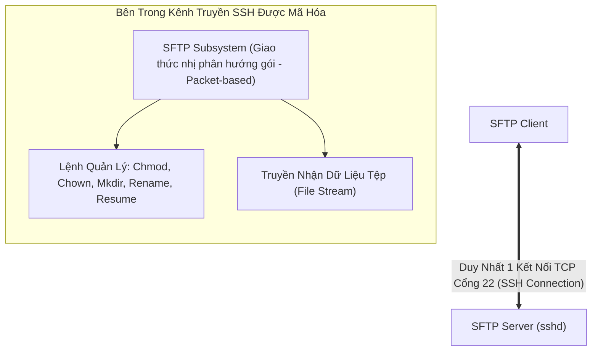

# 🚀 Giao Thức Truyền Tệp Qua SSH (SFTP)

> [[00 - Networks MOC|📁 Computer Networks MOC]] / [[MOC - Part 1 Core Foundations|🟢 Part 1 MOC]]

---

## 1. Bản Đồ Khái Niệm (Mermaid DAG)

---

## 2. Chân Lý Vô Điều Kiện (First Principles)

> [!NOTE] Tiên Đề Bất Biến
> **SFTP HOÀN TOÀN KHÔNG PHẢI LÀ FTP!**
>
> Mặc dù cùng có chữ "FTP" trong tên gọi, SFTP là một giao thức nhị phân hoàn toàn độc lập được thiết kế từ đầu bởi nhóm IETF SECSH.
>
> SFTP hoạt động như một **phân hệ con (Subsystem)** chạy bên trong một phiên kết nối [[SSH]] (Secure Shell) duy nhất trên **TCP Port 22**. Toàn bộ các thao tác ra lệnh, xác thực người dùng và truyền tải dữ liệu đều được ghép kênh (Multiplexed) và mã hóa xuyên suốt bên trong một socket duy nhất.

---

## 3. Trực Giác Motivated Discovery

> [!TIP] Động Lực Phát Minh (Tại sao kỹ sư DevOps và Backend chọn SFTP thay vì FTPS?)
> Khi triển khai máy chủ Linux trên Cloud (AWS, GCP, DigitalOcean):
>
> 1. Máy chủ Linux nào cũng đã cài sẵn và mở cổng **Port 22 cho SSH**.
> 2. Nếu dùng FTPS: Phải cài thêm phần mềm (vsftpd/proftpd), cấu hình chứng chỉ TLS riêng, quản lý tài khoản người dùng riêng, và mở hàng trăm port Passive trên Firewall.
> 3. Với **SFTP**: Chỉ cần bật tùy chọn `Subsystem sftp /usr/lib/openssh/sftp-server` có sẵn trong SSH. Tái sử dụng 100% tài khoản Linux và cặp SSH Key hiện có. Tường lửa chỉ cần mở đúng 1 port 22 duy nhất.

---

## 4. Phân Tích Kỹ Thuật Chuyên Sâu

### 4.1. Bảng So Sánh Toàn Diện: FTP vs FTPS vs SFTP

| Tiêu Chí                    | FTP (Truyền Thống)           | FTPS (FTP over TLS)                   | SFTP (SSH File Transfer)                        |
| :-------------------------- | :--------------------------- | :------------------------------------ | :---------------------------------------------- |
| **Giao thức nền tảng**      | FTP thuần                    | FTP + [[TLS]]                         | **[[SSH]]-2 Subsystem**                         |
| **Số lượng kết nối**        | 2 kênh (Control + Data)      | 2 kênh (Control + Data)               | **Đúng 1 kết nối duy nhất**                     |
| **Cổng mạng (Ports)**       | Port 21 + Port 20 / Dải PASV | Port 21 / 990 + Dải PASV              | **Chỉ dùng Port 22**                            |
| **Thân thiện Firewall/NAT** | Kém                          | Kém                                   | **Cực kỳ thân thiện (Chỉ cần mở port 22)**      |
| **Cơ chế xác thực**         | Mật khẩu văn bản thô         | Mật khẩu + Chứng chỉ X.509            | **SSH Public/Private Key, Mật khẩu**            |
| **Tính năng thao tác tệp**  | Cơ bản (Upload/Download)     | Cơ bản                                | **Đầy đủ (Đổi tên atomic, phân quyền, resume)** |
| **Mức độ khuyên dùng**      | Cấm sử dụng                  | Chỉ dùng khi bắt buộc với hệ thống cũ | **Tiêu chuẩn công nghiệp số 1 hiện nay**        |

---

### 4.2. Quản Lý File Từ Xa Nâng Cao

Khác với FTP chỉ coi file là luồng byte đơn giản, SFTP cung cấp các lệnh hệ thống tệp hoàn chỉnh:

- **Khôi phục tải đứt đoạn (Resume Upload/Download):** SFTP hỗ trợ thao tác đọc/ghi ngẫu nhiên dựa trên Offset byte (`SSH_FXP_READ` / `SSH_FXP_WRITE`).
- **Thao tác tập tin nguyên tử (Atomic Operations):** Hỗ trợ đổi tên tệp an toàn, đọc và thay đổi quyền sở hữu (`chmod`, `chown`) trực tiếp trên file server mà không cần mở phiên terminal riêng.

---

## 5. Spaced Repetition Flashcards & Tham Chiếu

### Flashcards

Tại sao nói SFTP không có bất kỳ mối quan hệ kỹ thuật nào với giao thức FTP truyền thống? #card
Vì SFTP là một giao thức nhị phân hoàn toàn độc lập chạy như một phân hệ (subsystem) bên trong kết nối SSH-2 qua cổng 22 duy nhất, không sử dụng tập lệnh và không dùng mô hình hai kênh kết nối của FTP.

Lợi thế lớn nhất của SFTP so với FTPS khi triển khai trên hạ tầng điện toán đám mây là gì? #card
SFTP chỉ yêu cầu mở duy nhất một cổng TCP 22 trên Firewall và NAT, trong khi FTPS yêu cầu mở cả port điều khiển lẫn một dải cổng ngẫu nhiên (Passive ports) cho kênh dữ liệu.

Phương thức xác thực nào được coi là chuẩn an toàn cao nhất khi sử dụng SFTP cho các tác vụ tự động hóa Backend (Cronjob/CI/CD)? #card
Sử dụng cặp khóa mật mã SSH Key (như Ed25519 hoặc RSA 4096-bit) có giới hạn quyền truy cập, không sử dụng mật khẩu gõ tay.

### Tham Chiếu

- [[SSH]] - Giao thức cung cấp kênh truyền và lớp xác thực bảo mật cho SFTP.
- [[FTP]] - Giao thức truyền tệp truyền thống tiền thân.
- [[FTPS]] - Giải pháp truyền tệp mã hóa sử dụng TLS thay vì SSH.
