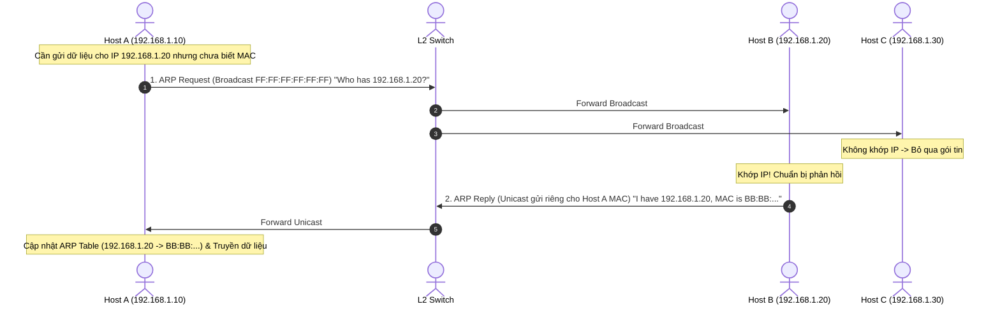

# 🔗 Giao Thức Phân Giải Địa Chỉ ARP (Address Resolution Protocol)

> [[00 - Networks MOC|📁 Computer Networks MOC]] / [[MOC - Part 1 Core Foundations|🟢 Part 1 MOC]]

---

## 1. Bản Đồ Khái Niệm (Mermaid DAG)

---

## 2. Chân Lý Vô Điều Kiện (First Principles)

> [!NOTE] Tiên Đề Bất Biến
> **Tầng Mạng (Layer 3) định tuyến bằng địa chỉ IP logic, nhưng Card mạng và Switch ở Tầng Liên Kết (Layer 2) chỉ có thể chuyển tiếp khung tin bằng địa chỉ phần cứng vật lý (MAC Address).**
>
> Giao thức ARP là cây cầu thiết yếu duy nhất liên kết Layer 3 và Layer 2 trong mạng cục bộ (LAN/Ethernet). Nếu không biết địa chỉ MAC đích của máy nhận (hoặc MAC của Default Gateway), một gói tin IP sẽ **không bao giờ được đóng gói thành Ethernet Frame để gửi đi**.

---

## 3. Trực Giác Motivated Discovery

> [!TIP] Động Lực Phát Minh (Tại sao router không định tuyến bằng địa chỉ MAC?)
> Địa chỉ MAC được gắn cứng vào chip phần cứng khi sản xuất tại nhà máy (như số căn cước công dân). Các số MAC nằm rải rác ngẫu nhiên trên toàn cầu, không có tính phân cấp theo địa lý.
>
> Nếu Internet định tuyến bằng MAC: Mọi router trên toàn thế giới phải lưu hàng tỷ địa chỉ MAC và không thể gom nhóm (Aggregating / Subnetting). Do đó, IP sinh ra để định vị logic theo khu vực (như địa chỉ bưu điện: Tỉnh $
> ightarrow$ Quận $
> ightarrow$ Phố), còn ARP ra đời để khi gói tin đã về đến đúng khu phố (mạng LAN), nó sẽ tìm ra người mang số căn cước MAC tương ứng.

---

## 4. Phân Tích Kỹ Thuật Chuyên Sâu

### 4.1. Cấu Trúc Khung Bản Tin ARP (RFC 826)

Khung ARP có kích thước cố định 28 bytes khi chạy trên Ethernet/IPv4:

- `Hardware Type (16 bits)`: Loại phần cứng (Ethernet = `0x0001`).
- `Protocol Type (16 bits)`: Giao thức mạng (IPv4 = `0x0800`).
- `Hardware / Protocol Size (8 bits each)`: Chiều dài địa chỉ MAC (6 bytes) và IPv4 (4 bytes).
- `Opcode (16 bits)`: `1` cho ARP Request, `2` cho ARP Reply.
- `Sender Hardware Address (SHA)`: MAC của máy gửi.
- `Sender Protocol Address (SPA)`: IP của máy gửi.
- `Target Hardware Address (THA)`: MAC đích (để trống hoặc `00:00:00:00:00:00` trong Request).
- `Target Protocol Address (TPA)`: IP cần tra cứu.

---

### 4.2. Bảng ARP Cache & Gratuitous ARP

1. **Bảng ARP Cache:**
   - Để tránh gửi broadcast liên tục, hệ điều hành lưu bản ánh xạ IP $\leftrightarrow$ MAC trong bộ nhớ cache (`arp -a`). Bản ghi tự động hết hạn sau vài phút (ARP Cache Aging).
2. **Gratuitous ARP (Bản tin ARP tự nguyện):**
   - Thiết bị tự gửi ARP Request hỏi chính địa chỉ IP của mình.
   - _Mục đích 1:_ Phát hiện xung đột địa chỉ IP (nếu có máy khác trả lời, nghĩa là có người đang dùng trùng IP).
   - _Mục đích 2 (HA / Failover):_ Khi cụm Keepalived / Virtual IP (VIP) chuyển quyền từ Node Master sang Backup, Node Backup gửi Gratuitous ARP để ép Switch cập nhật lại bảng MAC port ngay lập tức.

---

### 4.3. Rủi Ro An Ninh: ARP Spoofing / Poisoning

Do ARP hoàn toàn không có cơ chế xác thực danh tính:

- Kẻ tấn công liên tục gửi ARP Reply giả mạo cho Host A và Router, tự nhận mình là Gateway.
- Kết quả: Toàn bộ lưu lượng Internet của nạn nhân bị chuyển hướng qua máy kẻ tấn công (**Man-in-the-Middle**).
- _Biện pháp phòng thủ:_ Cấu hình **DAI (Dynamic ARP Inspection)** trên Switch phối hợp cùng **DHCP Snooping** để kiểm tra tính hợp lệ của gói tin ARP.

---

## 5. Spaced Repetition Flashcards & Tham Chiếu

### Flashcards

Bản tin ARP Request được gửi dưới dạng phương thức truyền nào và tại sao? #card
Được gửi dưới dạng Broadcast (địa chỉ MAC đích `FF:FF:FF:FF:FF:FF`), vì máy gửi chưa biết địa chỉ MAC của máy nhận nên phải hỏi tất cả các máy trong mạng LAN.

Gratuitous ARP đóng vai trò gì trong các giải pháp High Availability (HA) cho Backend như Keepalived? #card
Khi máy chủ Master gặp sự cố và Server Backup nhận quyền quản lý Virtual IP (VIP), nó phát đi Gratuitous ARP để cập nhật tức thì bảng MAC trên Switch, hướng lưu lượng về card mạng mới mà không làm gián đoạn hệ thống.

Tại sao giao thức ARP không thể hoạt động xuyên qua các Router sang mạng khác? #card
Vì bản tin ARP Request là gói tin Broadcast ở tầng 2 (Layer 2), mà Router theo thiết kế mặc định sẽ chặn toàn bộ các gói tin Broadcast để chia tách miền quảng bá (Broadcast Domain).

### Tham Chiếu

- [[TCP - IP]] - Giao thức Internet tầng 3 mà ARP làm nhiệm vụ phân giải địa chỉ.
- [[DHCP]] - Cấp phát địa chỉ IP khởi đầu để ARP sau đó ánh xạ với MAC.
- [[ICMP]] - Giao thức chẩn đoán mạng phụ thuộc vào ARP để vận chuyển gói tin cục bộ.
