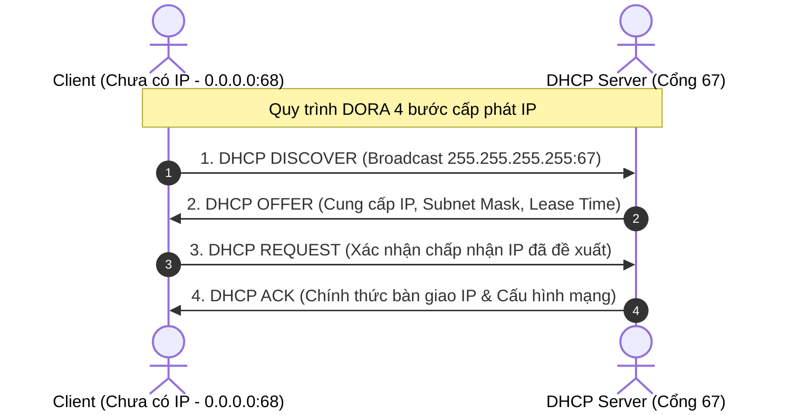

# ⚙️ Giao Thức Cấp Phát IP Động DHCP (Dynamic Host Configuration Protocol)

> [[00 - Networks MOC|📁 Computer Networks MOC]] / [[MOC - Part 1 Core Foundations|🟢 Part 1 MOC]]

---

## 1. Bản Đồ Khái Niệm (Mermaid DAG)

---

## 2. Chân Lý Vô Điều Kiện (First Principles)

> [!NOTE] Tiên Đề Bất Biến
> **Một nút mạng không thể giao tiếp qua bộ giao thức TCP/IP nếu chưa được cấp phát ít nhất: Địa chỉ IP, Mặt nạ mạng (Subnet Mask) và Cổng mặc định (Default Gateway).**
>
> DHCP tự động hóa hoàn toàn việc cấu hình các thông số này trên mạng cục bộ (LAN), sử dụng cơ chế **Cho thuê địa chỉ (IP Lease)** có thời hạn để tái sử dụng tài nguyên địa chỉ IP và triệt tiêu khả năng phát sinh xung đột địa chỉ IP (IP Address Conflict).

---

## 3. Trực Giác Motivated Discovery

> [!TIP] Động Lực Phát Minh (Tại sao không cài IP tĩnh thủ công?)
> Hãy hình dung một văn phòng với 500 nhân viên và khách ra vào liên tục với laptop, smartphone:
>
> 1. Nếu cấu hình thủ công: Kỹ sư mạng phải đến từng máy gõ IP, Gateway, DNS. Khách về thì IP đó bị bỏ phí; người mới vào gõ nhầm IP trùng máy khác làm sập kết nối cả hai.
> 2. Với **DHCP**: Thiết bị mới cắm cáp hoặc kết nối Wi-Fi lập tức tự phát sóng tìm server và nhận đủ toàn bộ cấu hình mạng trong vòng chưa đầy 1 giây.

---

## 4. Phân Tích Kỹ Thuật Chuyên Sâu

### 4.1. Chi Tiết Chu Trình DORA 4 Bước

1. **DHCP DISCOVER:**
   - Client chưa có IP nên đặt Source IP = `0.0.0.0`, Dest IP = `255.255.255.255` (Layer 2 Broadcast `FF:FF:FF:FF:FF:FF`).
   - Gửi từ UDP Port 68 đến UDP Port 67.
2. **DHCP OFFER:**
   - DHCP Server nhận được bản tin, chọn một IP còn rỗi trong dải cấp phát (Pool) và gửi đề xuất: IP, Subnet Mask, Gateway, DNS, Lease Duration.
3. **DHCP REQUEST:**
   - Client gửi broadcast thông báo toàn mạng biết nó chọn đề nghị của Server nào (nếu có nhiều DHCP server cùng phản hồi OFFER), đồng thời ngầm báo cho các server khác thu hồi lại đề xuất của họ.
4. **DHCP ACK (Acknowledgment):**
   - Server xác nhận chính thức khóa IP đó vào danh bạ cấp phát cho địa chỉ MAC của Client.

---

### 4.2. Cơ Chế Gia Hạn Thời Gian Thuê (Lease Renewal)

- Khi đạt **50% thời gian thuê (T1 timer)**: Client gửi trực tiếp bản tin `DHCP REQUEST` (Unicast) đến DHCP Server để xin gia hạn. Nếu Server phản hồi ACK, bộ đếm thời gian được đặt lại từ đầu.
- Nếu không thấy phản hồi, đến **87.5% thời gian thuê (T2 timer)**: Client chuyển sang gửi `DHCP REQUEST` dưới dạng Broadcast cho toàn mạng để tìm bất kỳ DHCP server nào có thể tiếp nhận.
- Nếu hết 100% thời gian (Lease Expiration): Client bắt buộc phải dừng sử dụng IP đó và quay lại từ bước `DHCP DISCOVER`.

---

### 4.3. An Ninh DHCP: Lỗ Hổng & Giải Pháp

- **Rogue DHCP Server:** Kẻ tấn công cắm một DHCP server giả mạo vào mạng nội bộ, phát IP và chỉ định Gateway trỏ về máy của hắn để thực hiện nghe lén Man-in-the-Middle.
  - _Giải pháp:_ Kích hoạt **DHCP Snooping** trên Switch mạng: Chỉ cho phép cổng nối đến DHCP Server chính thức (Trusted Port) được gửi gói tin DHCP Reply/Ack.
- **DHCP Starvation:** Kẻ tấn công liên tục đổi địa chỉ MAC ảo gửi hàng ngàn DHCP Discover để xin sạch dải IP, làm cạn kiệt tài nguyên mạng (Denial of Service).

---

## 5. Spaced Repetition Flashcards & Tham Chiếu

### Flashcards

Quá trình cấp phát IP động của giao thức DHCP gồm 4 bước viết tắt là gì và diễn ra theo thứ tự nào? #card
DORA: Discover (Client) -> Offer (Server) -> Request (Client) -> Acknowledge (Server).

Tại sao bước DHCP Discover của Client phải gửi dưới dạng gói tin Broadcast với địa chỉ nguồn 0.0.0.0? #card
Vì lúc này Client vừa khởi động, chưa có địa chỉ IP hợp lệ và chưa biết địa chỉ IP của DHCP Server trong mạng nội bộ là gì.

Kỹ thuật DHCP Snooping trên thiết bị chuyển mạch (Switch) giải quyết rủi ro bảo mật nào? #card
Ngăn chặn máy chủ DHCP giả mạo (Rogue DHCP Server) phát cấu hình mạng và Default Gateway sai lệch cho người dùng nội bộ để nghe lén dữ liệu.

### Tham Chiếu

- [[UDP]] - Giao thức tầng giao vận mà DHCP sử dụng (Port 67 và 68).
- [[ARP]] - Giao thức được dùng ngay sau khi nhận IP để kiểm tra xem có ai dùng trùng IP không (Gratuitous ARP).
- [[DNS]] - Thông tin máy chủ DNS luôn được đính kèm trong gói cấu hình của DHCP.
