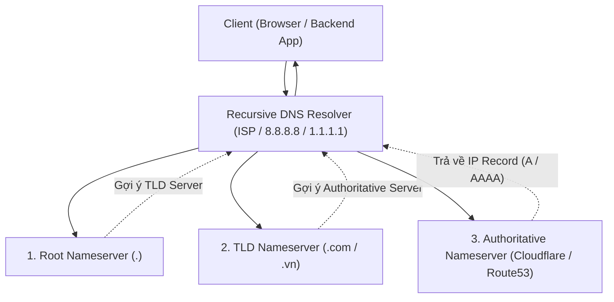

# 🌐 Hệ Thống Phân Giải Tên Miền DNS (Domain Name System)

> [[00 - Networks MOC|📁 Computer Networks MOC]] / [[MOC - Part 1 Core Foundations|🟢 Part 1 MOC]]

---

## 1. Bản Đồ Khái Niệm (Mermaid DAG)

---

## 2. Chân Lý Vô Điều Kiện (First Principles)

> [!NOTE] Tiên Đề Bất Biến
> **Máy tính trong mạng chỉ nhận diện nhau bằng địa chỉ số (IP), con người chỉ ghi nhớ được tên chữ (Domain).**
>
> DNS là cơ sở dữ liệu phân tán, phân cấp (Hierarchical Distributed Database) lớn nhất toàn cầu. Không có một máy chủ duy nhất nào chứa toàn bộ danh bạ Internet; thay vào đó, việc phân giải được thực hiện thông qua cơ chế ủy thác phân cấp (Delegation) từ Root Nameserver đến TLD Nameserver và kết thúc ở Authoritative Nameserver.

---

## 3. Trực Giác Motivated Discovery

> [!TIP] Động Lực Phát Minh (Tại sao file hosts.txt bị sụp đổ?)
> Thời kỳ sơ khai của ARPANET, tất cả tên máy tính và địa chỉ IP được lưu trong một file duy nhất gọi là `hosts.txt` do viện SRI quản lý. Mỗi tối, mọi máy tính phải tải file này về.
>
> Khi số lượng máy tính vượt qua con số hàng chục nghìn:
>
> 1. Thắt cổ chai băng thông và tải server tại viện SRI.
> 2. Xung đột tên máy tính không thể kiểm soát.
> 3. Độ trễ cập nhật quá lớn (thay đổi IP mất nhiều ngày mới phổ biến).
>
> Paul Mockapetris phát minh ra **DNS** năm 1983 để chia nhỏ cơ sở dữ liệu thành các vùng phân quyền (Zones) độc lập, kết hợp cơ chế Cache phân tầng đa cấp.

---

## 4. Phân Tích Kỹ Thuật Chuyên Sâu

### 4.1. Các Bản Ghi DNS Cốt Lõi Cho Kỹ Sư Backend

| Loại Record             | Giá Trị Lưu Trữ                | Ý Nghĩa Kỹ Thuật & Use Case                                                        |
| :---------------------- | :----------------------------- | :--------------------------------------------------------------------------------- |
| **A**                   | Địa chỉ IPv4 (32-bit)          | Ánh xạ domain sang địa chỉ IPv4 máy chủ web (`api.example.com` $                   |
| ightarrow$ `192.0.2.1`) |
| **AAAA**                | Địa chỉ IPv6 (128-bit)         | Ánh xạ domain sang địa chỉ IPv6                                                    |
| **CNAME**               | Tên miền khác (Canonical Name) | Tạo bí danh trỏ sang domain khác (ví dụ: trỏ `www` sang AWS CloudFront/ALB domain) |
| **MX**                  | Mail Server + Độ ưu tiên       | Định tuyến email đến đúng máy chủ thư điện tử (Google Workspace, Proton)           |
| **TXT**                 | Văn bản tùy ý                  | Xác thực quyền sở hữu domain, cấu hình chống giả mạo email (SPF, DKIM, DMARC)      |
| **NS**                  | Nameserver                     | Chỉ định máy chủ có thẩm quyền quản lý bản ghi của vùng tên miền                   |
| **SOA**                 | Start of Authority             | Chứa thông tin quản trị zone (Serial number, Refresh interval, TTL mặc định)       |

---

### 4.2. Cơ Chế Truy Vấn: Recursive vs Iterative

- **Recursive Query (Truy vấn đệ quy):** Client gửi truy vấn đến Recursive Resolver (như 8.8.8.8) với yêu cầu: "Hãy tìm đúng IP cho tôi hoặc báo lỗi, tôi không muốn tự đi hỏi tiếp".
- **Iterative Query (Truy vấn lặp):** Recursive Resolver lần lượt tự đi gõ cửa từng cấp:
  1. Hỏi Root Server: "example.com ở đâu?" $
     ightarrow$ Root trả về: "Tôi không biết, hãy hỏi TLD Server `.com` tại IP này".
  2. Hỏi TLD Server `.com`: "example.com ở đâu?" $
     ightarrow$ TLD trả về: "Hãy hỏi Authoritative Server của nó tại IP này".
  3. Hỏi Authoritative Server: Nhận về kết quả IP cuối cùng kèm chỉ số **TTL (Time-To-Live)**.

---

### 4.3. Chiến Lược Caching & DNS TTL Trong Microservices & Backend

- **TTL (Time To Live):** Thời gian máy chủ resolver được phép lưu cache kết quả.
  - _TTL cao (86400s - 1 ngày):_ Giảm tải cho Authoritative DNS, tăng tốc độ truy cập cho người dùng. Khó thay đổi IP server nhanh khi có sự cố.
  - _TTL thấp (60s):_ Cho phép chuyển hướng IP máy chủ (Failover / Blue-Green Deployment) gần như tức thì. Tăng lượng truy vấn DNS ra bên ngoài.
- **Node.js DNS Caching Issue:** Mặc định `http.Agent` của Node.js không cache bản ghi DNS; mỗi request mới có thể kích hoạt một cuộc gọi `getaddrinfo` qua hệ điều hành. Các hệ thống backend tải cao bắt buộc dùng module như `cacheable-lookup` hoặc triển khai CoreDNS / dnsmasq cục bộ.

---

## 5. Spaced Repetition Flashcards & Tham Chiếu

### Flashcards

Bản ghi CNAME khác bản ghi A trong DNS như thế nào? #card
Bản ghi A ánh xạ trực tiếp một tên miền sang một địa chỉ IP (IPv4), trong khi bản ghi CNAME ánh xạ một tên miền sang một tên miền khác (bí danh - alias).

Tại sao bản ghi CNAME không được phép đặt tại Apex Domain (Root domain như example.com)? #card
Vì theo tiêu chuẩn RFC 1034/1912, nếu một domain đã có bản ghi CNAME thì không được phép có bất kỳ bản ghi nào khác cùng tên, trong khi Apex domain bắt buộc phải có bản ghi SOA và NS.

Cơ chế DNSSEC bảo vệ hệ thống mạng chống lại hình thức tấn công nào? #card
Chống lại tấn công DNS Spoofing và DNS Cache Poisoning bằng cách sử dụng chữ ký số mật mã để xác thực tính toàn vẹn và nguồn gốc của dữ liệu bản ghi DNS.

### Tham Chiếu

- [[UDP]] - Giao thức tầng giao vận mặc định cho các truy vấn DNS (Port 53).
- [[TCP - IP]] - Được sử dụng khi gói tin phản hồi DNS vượt quá 512 bytes hoặc khi đồng bộ Zone Transfer (AXFR).
- [[HTTP - HTTPS]] - Chuẩn DoH (DNS over HTTPS) bảo vệ quyền riêng tư truy vấn tên miền.
