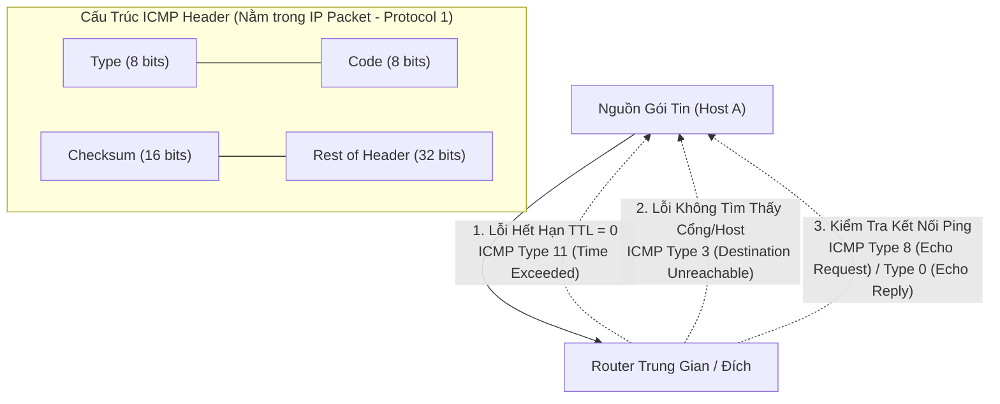

# 🩺 Giao Thức Điều Khiển Bản Tin Internet ICMP (Internet Control Message Protocol)

> [[00 - Networks MOC|📁 Computer Networks MOC]] / [[MOC - Part 1 Core Foundations|🟢 Part 1 MOC]]

---

## 1. Bản Đồ Khái Niệm (Mermaid DAG)

---

## 2. Chân Lý Vô Điều Kiện (First Principles)

> [!NOTE] Tiên Đề Bất Biến
> **Giao thức IP vốn dĩ không có cơ chế báo cáo sự cố hoặc kiểm soát lỗi đường truyền.**
>
> Khi một router trên đường truyền gặp sự cố (như không tìm thấy đường đi tới đích, mạng bị nghẽn, hoặc gói tin bị lặp vô tận làm giá trị TTL giảm về 0), router đó **không thể im lặng vứt bỏ gói tin**. ICMP được sinh ra như một giao thức đồng hành bắt buộc ở tầng Mạng (Network Layer) để gửi thông điệp chẩn đoán và cảnh báo lỗi ngược lại cho máy nguồn.

---

## 3. Trực Giác Motivated Discovery

> [!TIP] Động Lực Phát Minh (Làm sao biết gói tin bị nghẽn ở router nào?)
> Làm cách nào công cụ `traceroute` có thể vẽ ra toàn bộ danh sách 15 router trung gian từ máy tính của bạn đến máy chủ Google ở Mỹ?
>
> Traceroute lợi dụng trường **TTL (Time-To-Live)** của IP và bản tin ICMP:
>
> 1. Gửi gói tin đầu tiên với `TTL = 1` $
>    ightarrow$ Router đầu tiên giảm TTL về 0, hủy gói và bắt buộc phải gửi lại bản tin **ICMP Type 11 (Time Exceeded)** cho bạn $
>    ightarrow$ Bạn biết IP của router thứ 1.
> 2. Gửi tiếp gói với `TTL = 2` $
>    ightarrow$ Đến router thứ 2 mới bị hết hạn và gửi ICMP về $
>    ightarrow$ Bạn biết router thứ 2. Cứ thế lặp lại cho đến đích!

---

## 4. Phân Tích Kỹ Thuật Chuyên Sâu

### 4.1. Bảng Mã Thông Điệp ICMP Thường Gặp Trong Troubleshooting

| Type   | Code | Tên Thông Điệp        | Nguyên Nhân Kỹ Thuật                                                                                         |
| :----- | :--- | :-------------------- | :----------------------------------------------------------------------------------------------------------- |
| **0**  | 0    | Echo Reply            | Phản hồi lệnh Ping thành công                                                                                |
| **3**  | 0    | Net Unreachable       | Router không có route dẫn tới dải IP đích trong bảng định tuyến                                              |
| **3**  | 1    | Host Unreachable      | Máy đích không phản hồi tín hiệu ARP trong mạng LAN                                                          |
| **3**  | 3    | Port Unreachable      | Gói tin đến nơi nhưng cổng UDP/TCP đó không có service nào lắng nghe                                         |
| **3**  | 4    | Fragmentation Needed  | Gói tin vượt quá MTU đường truyền nhưng cờ Don't Fragment (DF) được bật (Cốt lõi của **Path MTU Discovery**) |
| **8**  | 0    | Echo Request          | Lệnh Ping gửi đi để kiểm tra độ trễ mạng                                                                     |
| **11** | 0    | Time-to-Live Exceeded | Gói tin bị giảm TTL về 0 trên đường đi (Dấu hiệu vòng lặp định tuyến hoặc Traceroute)                        |

---

### 4.2. Path MTU Discovery (PMTUD) Trong Hạ Tầng Backend

Một gói tin Ethernet chuẩn có kích thước tối đa (MTU) là 1500 bytes. Nếu gói tin đi qua đường hầm VPN (như WireGuard/IPsec), MTU có thể giảm xuống còn 1420 bytes:

- Nếu gói tin bật cờ DF (Don't Fragment) và lớn hơn 1420 bytes: Router VPN sẽ vứt gói tin và gửi lại **ICMP Type 3 Code 4** kèm giá trị MTU tiếp theo.
- **Hiện tượng Black Hole Connection:** Nếu quản trị viên cấu hình Firewall chặn bừa bãi toàn bộ gói ICMP, gói tin cảnh báo này sẽ bị drop $
  ightarrow$ Trình duyệt hoặc API client treo vĩnh viễn (kết nối bắt tay TCP nhỏ thì được, nhưng gửi dữ liệu lớn là đứng im).

---

## 5. Spaced Repetition Flashcards & Tham Chiếu

### Flashcards

Công cụ `traceroute` sử dụng trường nào trong IP Header kết hợp với thông điệp ICMP nào để xác định các hop trung gian? #card
Sử dụng trường TTL (Time To Live) tăng dần từ 1, kết hợp với thông điệp ICMP Type 11 (Time Exceeded) được gửi về từ các router trung gian khi TTL giảm về 0.

Tại sao việc cấu hình Firewall chặn hoàn toàn mọi gói tin ICMP Type 3 Code 4 có thể làm hỏng các kết nối HTTPS lớn? #card
Vì nó phá vỡ cơ chế Path MTU Discovery (PMTUD); server không nhận được thông báo giới hạn MTU của đường truyền để phân mảnh lại gói tin, dẫn đến hiện tượng Black Hole Connection khiến kết nối bị treo vĩnh viễn.

Gói tin ICMP chạy trực tiếp trên tầng nào trong mô hình TCP/IP? #card
Chạy trực tiếp trên tầng Mạng (Internet Layer), được đóng gói bên trong IP Packet (với trường IP Protocol = 1), không dùng cổng TCP hay UDP.

### Tham Chiếu

- [[TCP - IP]] - Giao thức tầng IP bọc bản tin ICMP.
- [[ARP]] - Phối hợp giải quyết lỗi Host Unreachable khi không tìm thấy MAC.
- [[BGP]] - Tránh các vòng lặp định tuyến gây ra lỗi ICMP Time Exceeded.
