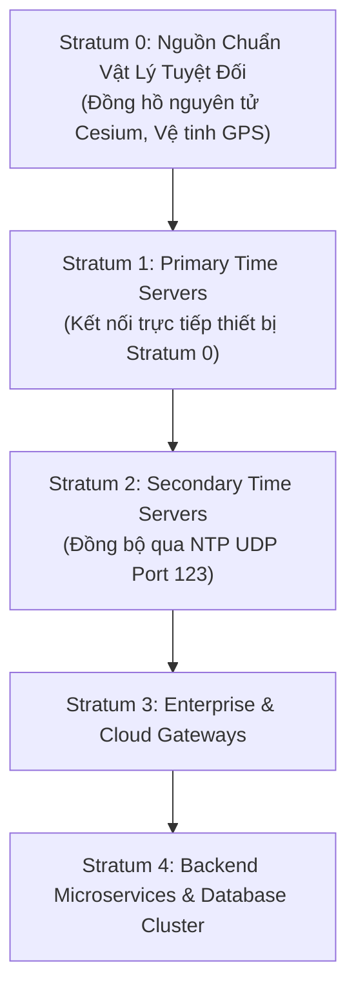
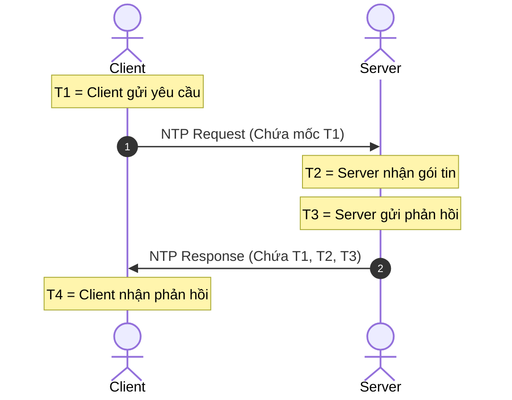

# ⏱️ Giao Thức Đồng Bộ Thời Gian Mạng NTP (Network Time Protocol)

> [[00 - Networks MOC|📁 Computer Networks MOC]] / [[MOC - Part 1 Core Foundations|🟢 Part 1 MOC]]

---

## 1. Bản Đồ Khái Niệm (Mermaid DAG)

---

## 2. Chân Lý Vô Điều Kiện (First Principles)

> [!NOTE] Tiên Đề Bất Biến
> **Không có hai chiếc đồng hồ vật lý (Hardware Quartz Clocks) nào trên thế giới chạy với tốc độ giống hệt nhau.**
>
> Mọi máy tính đều bị hiện tượng lệch giờ tự nhiên (**Clock Drift**) từ vài giây đến hàng chục giây mỗi ngày do nhiệt độ bo mạch và độ già hóa của thạch anh. Trong hệ thống phân tán, sự sai lệch thời gian dù chỉ vài mili-giây cũng có thể phá vỡ hoàn toàn tính nhất quán của dữ liệu (Data Consistency), thứ tự ghi log audit và các thuật toán đồng thuận.

---

## 3. Trực Giác Motivated Discovery

> [!TIP] Động Lực Phát Minh (Tại sao không thể chỉ hỏi: "Bây giờ là mấy giờ?")
> Nếu Client gửi câu hỏi "Mấy giờ rồi?" và Server trả về "12:00:00.000", câu trả lời đó đã bị **lỗi thời ngay lúc đến tay Client** do độ trễ truyền gói tin trên mạng (Network Latency).
>
> Thuật toán **Marzullo** trong NTP phát minh ra cơ chế đánh 4 mốc thời gian (**4 Timestamps**) trên đường đi và đường về để đo chính xác độ trễ khứ hồi của mạng, từ đó bù trừ độ lệch đồng hồ chính xác đến hàng phần nghìn giây.

---

## 4. Phân Tích Kỹ Thuật Chuyên Sâu

### 4.1. Công Thức Tính Độ Trễ Và Độ Lệch Thời Gian (RFC 5905)

Dựa vào 4 mốc thời gian:

1. **Độ trễ truyền mạng khứ hồi (Round-trip Delay $\delta$):**
   $$\delta = (T_4 - T_1) - (T_3 - T_2)$$
2. **Độ lệch đồng hồ giữa Client và Server (Clock Offset $ heta$):**
   $$	heta = rac{(T_2 - T_1) + (T_3 - T_4)}{2}$$

Client điều chỉnh đồng hồ cục bộ bằng cách cộng thêm giá trị offset $ heta$.

---

### 4.2. Cơ Chế Slew vs Step (Bảo Vệ Database Backend)

- **Step (Nhảy vọt):** Đặt lại đồng hồ tức thì về giờ mới.
  - _Nguy hiểm:_ Nếu đồng hồ bị chỉnh giật lùi về quá khứ, các transaction của Database, token JWT hết hạn, hoặc Cronjob sẽ bị kích hoạt trùng lặp hai lần.
- **Slew (Lướt chậm):** Nếu độ lệch thời gian nhỏ (< 128ms), hệ điều hành sẽ làm đồng hồ chạy nhanh hơn một chút hoặc chậm hơn một chút theo thời gian cho đến khi bắt kịp giờ chuẩn mà **không bao giờ để thời gian bị lùi lại**.

---

### 4.3. Tầm Quan Trọng Của NTP Trong Hệ Thống Phân Tán

- **Distributed Transactions:** Google Spanner sử dụng phần cứng **TrueTime API** (kết hợp GPS + đồng hồ nguyên tử) để đảm bảo độ lệch thời gian $\epsilon < 7 ext{ms}$, từ đó đạt được chuẩn External Consistency mà không cần cơ chế khóa nặng nề.
- **Cassandra Last-Write-Wins (LWW):** Apache Cassandra giải quyết xung đột ghi dựa vào timestamp của client; nếu các máy chủ lệch giờ nhau, bản ghi mới hơn có thể bị bản ghi cũ hơn ghi đè mất dữ liệu.

---

## 5. Spaced Repetition Flashcards & Tham Chiếu

### Flashcards

Tại sao trong các máy chủ Database chạy sản xuất, hệ điều hành ưu tiên đồng bộ giờ bằng cơ chế Slew thay vì Step? #card
Vì cơ chế Step có thể làm thời gian hệ thống nhảy lùi về quá khứ, gây lỗi nghiêm trọng cho các giao dịch cơ sở dữ liệu, vi phạm thứ tự log WAL và làm lặp lại các tác vụ định kỳ.

Giao thức NTP sử dụng tầng Transport nào và số hiệu cổng (port) mặc định là bao nhiêu? #card
Sử dụng giao thức UDP trên cổng 123.

Khái niệm Stratum trong kiến trúc phân cấp của NTP biểu thị điều gì? #card
Biểu thị khoảng cách (số bước nhảy) tính từ nguồn phát thời gian chuẩn tuyệt đối: Stratum 0 là đồng hồ nguyên tử/GPS, Stratum 1 là server kết nối trực tiếp với Stratum 0, Stratum 2 đồng bộ từ Stratum 1, tối đa đến Stratum 15.

### Tham Chiếu

- [[UDP]] - Giao thức truyền vận độ trễ thấp làm nền tảng cho NTP.
- [[TCP - IP]] - Mô hình mạng điều phối hạ tầng truyền thông cho hệ thống phân tán.
