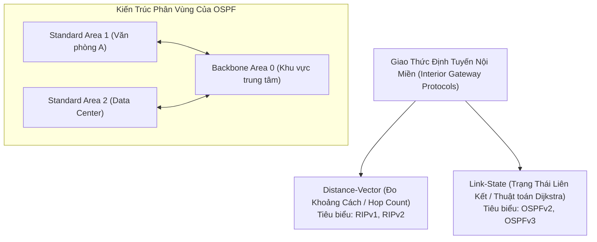

# 🧭 Các Giao Thức Định Tuyến Nội Miền RIP & OSPF

> [[00 - Networks MOC|📁 Computer Networks MOC]] / [[MOC - Part 1 Core Foundations|🟢 Part 1 MOC]]

---

## 1. Bản Đồ Khái Niệm (Mermaid DAG)

---

## 2. Chân Lý Vô Điều Kiện (First Principles)

> [!NOTE] Tiên Đề Bất Biến
> **Trong một hệ thống mạng phức tạp với nhiều đường đi dự phòng, các router phải tự động thống nhất đường truyền tối ưu mà không gây ra vòng lặp vô tận (Routing Loops).**
>
> - **Giao thức Distance-Vector (RIP):** Hoạt động theo nguyên tắc _"Định tuyến theo tin đồn (Routing by rumor)"_ - Mỗi router chỉ biết chi phí đường đi dựa vào lời kể của router hàng xóm kề cạnh.
> - **Giao thức Link-State (OSPF):** Mỗi router tự xây dựng **toàn bộ bản đồ hoàn chỉnh của toàn bộ mạng (Topology Database)**, sau đó độc lập chạy thuật toán Dijkstra để tự tìm đường đi ngắn nhất đến mọi đích.

---

## 3. Trực Giác Motivated Discovery

> [!TIP] Động Lực Phát Minh (Tại sao OSPF thay thế RIP?)
> Hãy so sánh 2 con đường để gửi dữ liệu giữa 2 văn phòng:
>
> - **Đường 1:** Đi qua 1 Router trung gian nhưng cáp nối là đường Dial-up cổ xưa tốc độ chỉ **56 Kbps**.
> - **Đường 2:** Đi qua 2 Router trung gian nhưng cáp quang Gigabit tốc độ **10 Gbps**.
>
> Giao thức **RIP** chỉ nhìn vào số bước nhảy (**Hop Count**); nó thấy Đường 1 mất 1 hop còn Đường 2 mất 2 hops $
> ightarrow$ **RIP sẽ chọn con đường rùa bò 56 Kbps!**
>
> **OSPF** ra đời để tính toán chi phí (**Cost**) dựa trên băng thông thực tế: Chi phí = $10^8 / ext{Bandwidth}$. Đường quang 10 Gbps có chi phí siêu nhỏ sẽ được chọn, giải quyết triệt để sự ngây thơ của RIP.

---

## 4. Phân Tích Kỹ Thuật Chuyên Sâu

### 4.1. Ma Trận So Sánh Kỹ Thuật: RIP vs OSPF

| Tiêu Chí                        | RIP (Routing Information Protocol)             | OSPF (Open Shortest Path First)                       |
| :------------------------------ | :--------------------------------------------- | :---------------------------------------------------- |
| **Thuật toán cốt lõi**          | Bellman-Ford (Distance Vector)                 | **Dijkstra SPF (Shortest Path First)**                |
| **Metric tính đường**           | Số bước nhảy (**Hop count**)                   | **Chi phí (Cost tỷ lệ nghịch với băng thông)**        |
| **Giới hạn quy mô**             | Tối đa 15 hops (16 = Không thể tới)            | Không giới hạn hop, phân vùng theo **Areas**          |
| **Tốc độ hội tụ (Convergence)** | Rất chậm (Gửi toàn bộ bảng định tuyến mỗi 30s) | **Tức thì (Chỉ gửi cập nhật LSA khi trạng thái đổi)** |
| **Giao thức vận chuyển**        | UDP Port 520                                   | Chạy trực tiếp trên IP (Protocol số 89)               |
| **Tài nguyên phần cứng**        | Tốn rất ít CPU/RAM                             | Đòi hỏi CPU và RAM tính toán đồ thị Dijkstra          |

---

### 4.2. Cơ Chế Phân Vùng (Area Hierarchy) Của OSPF

Để mở rộng cho mạng doanh nghiệp hàng nghìn router:

1. **Backbone Area (Area 0):** Vùng lõi trung tâm bắt buộc; mọi Area khác đều phải kết nối trực tiếp vào Area 0.
2. **Area Border Router (ABR):** Router đứng ở ranh giới giữa Area thường và Area 0, giúp tóm tắt các dải mạng (Route Summarization) để router ở vùng này không cần lưu thông tin chi tiết của vùng khác.
3. **DR (Designated Router) & BDR (Backup DR):** Trong mạng broadcast (như Ethernet nhiều router cắm chung Switch), các router bầu chọn 1 DR trung tâm để tránh việc mọi router phải thiết lập kết nối chéo $O(N^2)$ với nhau.

---

## 5. Spaced Repetition Flashcards & Tham Chiếu

### Flashcards

Tại sao giới hạn số bước nhảy (Hop Count) tối đa của giao thức RIP lại là 15? #card
Để hạn chế vấn đề đếm đến vô cùng (Count-to-Infinity) khi xảy ra vòng lặp định tuyến; hop thứ 16 được định nghĩa là vô cực (Unreachable).

Thuật toán nào được OSPF sử dụng để tính toán bảng định tuyến tối ưu? #card
Thuật toán Dijkstra (Shortest Path First - SPF) chạy trên cơ sở dữ liệu trạng thái liên kết (Link State Database - LSDB).

Giao thức OSPF chạy trên tầng giao vận nào và sử dụng port bao nhiêu? #card
OSPF không dùng TCP hay UDP; nó chạy trực tiếp trên tầng Mạng (Internet Layer) với số hiệu IP Protocol là 89.

### Tham Chiếu

- [[BGP]] - Giao thức định tuyến liên miền kết nối các mạng OSPF lại với nhau.
- [[TCP - IP]] - Tầng mạng IP chịu trách nhiệm chuyển tiếp gói tin theo bảng định tuyến.
- [[ICMP]] - Báo cáo lỗi khi gói tin gặp lỗi vòng lặp hoặc mạng không thể tới.
