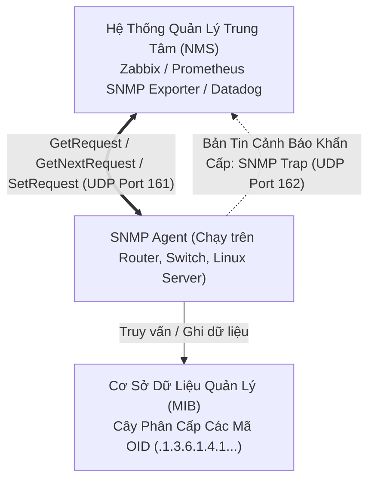

# 📊 Giao Thức Quản Lý Mạng Đơn Giản SNMP (Simple Network Management Protocol)

> [[00 - Networks MOC|📁 Computer Networks MOC]] / [[MOC - Part 1 Core Foundations|🟢 Part 1 MOC]]

---

## 1. Bản Đồ Khái Niệm (Mermaid DAG)



---

## 2. Chân Lý Vô Điều Kiện (First Principles)

> [!NOTE] Tiên Đề Bất Biến
> **Hạ tầng mạng bao gồm hàng nghìn thiết bị phần cứng đa dạng từ các nhà sản xuất khác nhau (Cisco, Juniper, Linux, Dell).**
>
> SNMP chuẩn hóa toàn bộ các thông số hoạt động của thiết bị (tải CPU, dung lượng RAM, trạng thái cổng mạng, nhiệt độ phần cứng) thành một **Cơ sở dữ liệu thông tin quản lý chung (MIB - Management Information Base)** dưới dạng cây phân cấp các định danh đối tượng (**OID**), cho phép một phần mềm giám sát duy nhất có thể thu thập và cấu hình thiết bị bất kể kiến trúc phần cứng.

---

## 3. Trực Giác Motivated Discovery

> [!TIP] Động Lực Phát Minh (Tại sao cần cơ chế Trap thay vì chỉ Polling?)
>
> - **Polling (NMS chủ động hỏi):** NMS cứ 1 phút lại gửi bản tin hỏi "Cổng mạng số 1 còn sống không?". Nếu có 5000 cổng mạng, việc này tạo ra lưu lượng mạng khổng lồ và nếu cổng mạng bị đứt cáp ở giây thứ 2, phải chờ đến giây thứ 60 NMS mới phát hiện ra.
> - **Trap (Agent chủ động báo động):** Khi một sự cố nghiêm trọng xảy ra (như đứt cáp, quạt tản nhiệt hỏng, nguồn điện phụ bị ngắt), SNMP Agent trên thiết bị lập tức tự động bắn một gói tin **SNMP Trap** về NMS ngay tức thì trong mili-giây.

---

## 4. Phân Tích Kỹ Thuật Chuyên Sâu

### 4.1. Kiến Trúc Cây OID (Object Identifier)

Mọi thông số trong MIB được biểu diễn bằng một chuỗi số phân cấp ngăn cách bởi dấu chấm:

```text
iso (1) . org (3) . dod (6) . internet (1) . mgmt (2) . mib-2 (1) . system (1)
```

- Ví dụ:
  - `1.3.6.1.2.1.1.5.0`: `sysName` (Tên hostname của thiết bị).
  - `1.3.6.1.2.1.2.2.1.10.1`: Lưu lượng byte nhận vào trên interface số 1 (`ifInOctets`).

---

### 4.2. So Sánh Các Phiên Bản SNMP

| Tiêu Chí         | SNMPv1                                                    | SNMPv2c                                           | SNMPv3                                                  |
| :--------------- | :-------------------------------------------------------- | :------------------------------------------------ | :------------------------------------------------------ |
| **Xác thực**     | Chuỗi mật khẩu thô (Community String: `public`/`private`) | Vẫn dùng Community String                         | **User-based Security Model (USM) với HMAC-SHA/MD5**    |
| **Mã hóa**       | Không (Plain Text)                                        | Không (Dễ bị Sniffing bắt chuỗi mật khẩu)         | **Có (Mã hóa toàn bộ gói tin bằng AES/DES)**            |
| **Thao tác mới** | Get, Set, Trap                                            | Thêm `GetBulkRequest` (Lấy cả bảng dữ liệu nhanh) | Bảo mật hoàn chỉnh, chống Replay Attack                 |
| **Khuyến nghị**  | Đã khai tử                                                | Chỉ dùng trong mạng nội bộ cô lập                 | **Tiêu chuẩn bắt buộc cho môi trường Enterprise/Cloud** |

---

## 5. Spaced Repetition Flashcards & Tham Chiếu

### Flashcards

Giao thức SNMP sử dụng các cổng UDP nào cho thao tác Polling và thao tác Trap? #card
UDP Port 161 dùng cho NMS gửi truy vấn Polling (Get/Set) đến Agent, UDP Port 162 dùng cho Agent chủ động gửi bản tin cảnh báo Trap đến NMS.

Sự khác biệt quan trọng nhất về an ninh giữa SNMPv2c và SNMPv3 là gì? #card
SNMPv2c gửi chuỗi xác thực (Community string) dưới dạng văn bản thô không mã hóa, trong khi SNMPv3 hỗ trợ đầy đủ xác thực người dùng (USM) và mã hóa nội dung gói tin bằng thuật toán AES.

OID trong kiến trúc SNMP là gì? #card
Object Identifier - một chuỗi số phân cấp chuẩn hóa theo cấu trúc cây đại diện cho một thuộc tính hoặc biến trạng thái cụ thể của thiết bị trong cơ sở dữ liệu MIB.

### Tham Chiếu

- [[UDP]] - Giao thức truyền vận nền tảng cho SNMP (Port 161, 162).
- [[TCP - IP]] - Mô hình mạng chuẩn hóa dữ liệu quản trị hệ thống.
