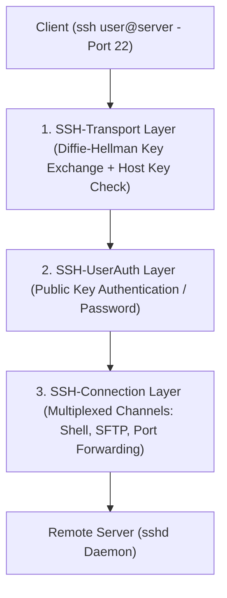
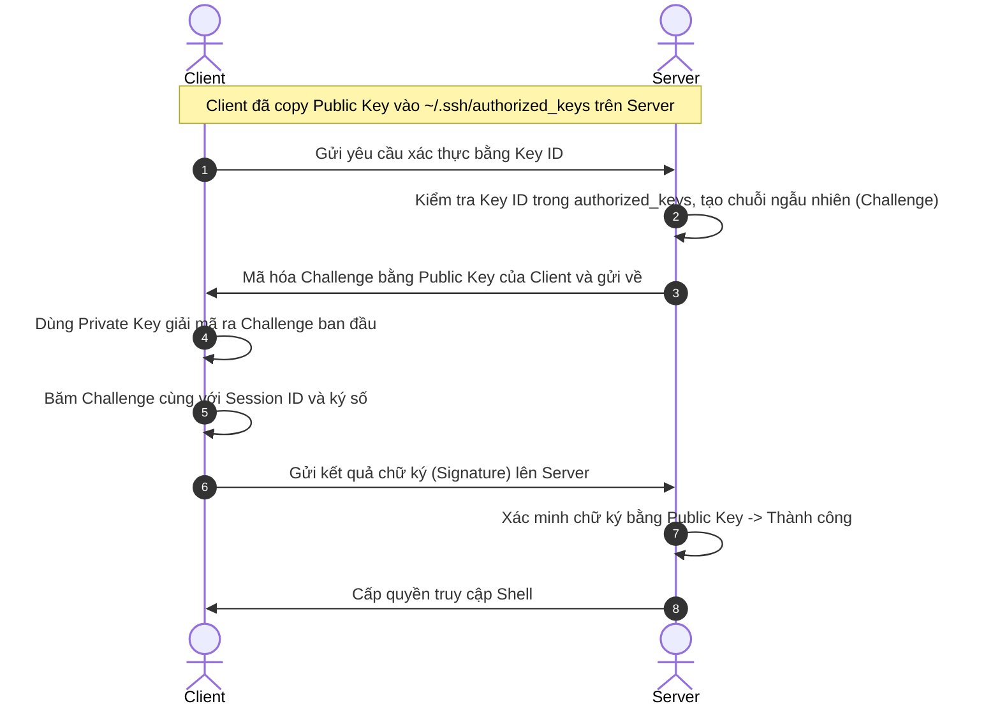

# 🛡️ Giao Thức SSH (Secure Shell)

> [[00 - Networks MOC|📁 Computer Networks MOC]] / [[MOC - Part 1 Core Foundations|🟢 Part 1 MOC]]

---

## 1. Bản Đồ Khái Niệm (Mermaid DAG)



---

## 2. Chân Lý Vô Điều Kiện (First Principles)

> [!NOTE] Tiên Đề Bất Biến
> **SSH thiết lập một đường hầm mã hóa an toàn hai chiều bên trên một mạng không an toàn, xác thực máy chủ trước khi xác thực người dùng.**
>
> SSH giải quyết triệt để 2 vấn đề lớn của quản trị hệ thống từ xa:
>
> 1. **Chống nghe lén (Sniffing):** Toàn bộ dòng lệnh và kết quả phản hồi đều được mã hóa đối xứng bằng khóa phiên độc lập sinh ra qua thuật toán trao đổi khóa Diffie-Hellman.
> 2. **Chống giả mạo máy chủ (Man-in-the-Middle):** Client lưu trữ vân tay khóa công khai của server trong file `known_hosts`; nếu khóa máy chủ thay đổi đột ngột, SSH sẽ lập tức ngắt kết nối và cảnh báo nguy cơ bị tấn công.

---

## 3. Trực Giác Motivated Discovery

> [!TIP] Động Lực Phát Minh (Tại sao Telnet bị đào thải?)
> Trước khi có SSH (năm 1995), các kỹ sư quản trị máy chủ Unix qua giao thức **Telnet** (Port 23) hoặc **rlogin**.
>
> Telnet gửi từng ký tự người dùng gõ trên bàn phím (bao gồm cả tài khoản root và mật khẩu quản trị) dưới dạng **văn bản thô (Plain Text)** qua đường truyền mạng. Bất kỳ ai cắm máy tính vào switch mạng hoặc các router trung gian đều có thể đọc trọn gói tin. Nhà khoa học Tatu Ylönen phát minh ra SSH ngay sau khi trường đại học của ông bị bắt trộm mật khẩu qua mạng.

---

## 4. Phân Tích Kỹ Thuật Chuyên Sâu

### 4.1. Cơ Chế Xác Thực Bằng Cặp Khóa (Public Key Authentication)

Quy trình xác thực an toàn không dùng mật khẩu:



---

### 4.2. SSH Tunneling & Port Forwarding (Kỹ Năng Cốt Lõi Của Backend)

SSH cho phép "bọc" lưu lượng của các ứng dụng khác đi xuyên qua cổng 22 an toàn:

1. **Local Port Forwarding (`ssh -L local_port:remote_ip:remote_port user@host`):**
   - _Use Case:_ Kết nối Database production (chỉ bind localhost 127.0.0.1:5432 trên server) về máy local port 9999 mà không cần mở port database ra Internet.
2. **Remote Port Forwarding (`ssh -R remote_port:local_ip:local_port user@host`):**
   - _Use Case:_ Public dịch vụ webhook đang chạy ở máy tính dev local ra một máy chủ có IP tĩnh công khai (nguyên lý tương tự ngrok).
3. **Dynamic Port Forwarding (`ssh -D 1080 user@host`):**
   - Biến máy chủ SSH thành một SOCKS5 Proxy an toàn để duyệt web bảo mật.

---

### 4.3. Tiêu Chuẩn Hardening SSH Server Cho Kỹ Sư Backend

Chỉnh sửa `/etc/ssh/sshd_config` trên production server:

```ini
# Đổi cổng mặc định tránh bot quét tự động
Port 2222

# Vô hiệu hóa đăng nhập trực tiếp bằng tài khoản root
PermitRootLogin no

# Bắt buộc xác thực bằng SSH Key, cấm mật khẩu chữ
PasswordAuthentication no
PubkeyAuthentication yes

# Giới hạn số lần thử lại tránh Brute Force
MaxAuthTries 3

# Tắt chuyển tiếp X11 không cần thiết
X11Forwarding no
```

---

## 5. Spaced Repetition Flashcards & Tham Chiếu

### Flashcards

Quá trình xác thực SSH Public Key Authentication bảo vệ Private Key của Client như thế nào? #card
Private Key không bao giờ được gửi qua mạng. Server gửi một chuỗi thách đố (Challenge) đã được mã hóa bằng Public Key, Client giải mã nó bằng Private Key trên máy nội bộ và gửi lại chữ ký số (Signature) để Server kiểm chứng.

File `~/.ssh/known_hosts` trên máy tính Client đóng vai trò gì trong kiến trúc bảo mật SSH? #card
Lưu trữ khóa công khai (Host Key) của các máy chủ đã từng kết nối để phát hiện tấn công Man-in-the-Middle (nếu máy chủ bị thay đổi khóa đột ngột, SSH sẽ chặn kết nối và phát cảnh báo).

Lệnh SSH Local Port Forwarding `ssh -L 5433:127.0.0.1:5432 user@server` có ý nghĩa kỹ thuật gì? #card
Mở một cổng 5433 tại máy local và chuyển hướng toàn bộ lưu lượng qua đường hầm SSH đến cổng 5432 của máy chủ đích, giúp kết nối trực tiếp vào Database nội bộ an toàn.

### Tham Chiếu

- [[SFTP]] - Giao thức truyền tệp hoạt động như một subsystem bên trong kênh SSH.
- [[TLS]] - Giao thức mật mã tương đương sử dụng cho lưu lượng Web HTTPS.
- [[TCP - IP]] - Giao thức truyền vận nền tảng (Port 22) của SSH.
