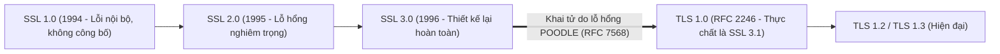

# 📜 Giao Thức SSL (Secure Sockets Layer - Lịch Sử & Kế Thừa)

> [[00 - Networks MOC|📁 Computer Networks MOC]] / [[MOC - Part 1 Core Foundations|🟢 Part 1 MOC]]

---

## 1. Bản Đồ Khái Niệm (Mermaid DAG)

---

## 2. Chân Lý Vô Điều Kiện (First Principles)

> [!NOTE] Tiên Đề Bất Biến
> **Mọi phiên bản của giao thức SSL (SSL 1.0, 2.0, 3.0) đều đã bị bẻ gãy về mặt mật mã học và chính thức bị IETF cấm sử dụng (RFC 7568).**
>
> Thuật ngữ "chứng chỉ SSL" ngày nay trong thương mại và phát triển phần mềm chỉ là một **tên gọi thói quen mang tính thương hiệu (marketing legacy term)**. Về mặt kỹ thuật, 100% các kết nối an toàn ngày nay đều chạy trên giao thức kế nhiệm là [[TLS]] (Transport Layer Security).

---

## 3. Trực Giác Motivated Discovery

> [!TIP] Động Lực Phát Minh (Tại sao Netscape tạo ra SSL vào năm 1994?)
> Khi World Wide Web bắt đầu bùng nổ, các ngân hàng và sàn thương mại điện tử (Amazon, eBay sơ khai) muốn người dùng nhập số thẻ tín dụng để thanh toán.
>
> Tuy nhiên, giao thức HTTP truyền thông tin hoàn toàn dưới dạng văn bản thô (Plain Text); bất kỳ máy tính trung gian hoặc nhà mạng nào cũng có thể chặn bắt dữ liệu bằng công cụ bắt gói tin (Sniffer). Netscape đã phát minh ra **SSL (Secure Sockets Layer)** như một lớp đệm chèn giữa tầng Transport (TCP) và tầng Application (HTTP) để giải quyết bài toán sống còn này.

---

## 4. Phân Tích Kỹ Thuật Chuyên Sâu

### 4.1. Lịch Sử & Các Lỗ Hổng Tử Huyệt Khiến SSL Bị Khai Tử

- **SSL 2.0 (1995):** Chứa nhiều lỗ hổng thiết kế nghiêm trọng, bao gồm khả năng bị tấn công hạ cấp (Downgrade Attack) khiến kẻ tấn công ép hai bên dùng bộ mã hóa yếu. Bị cấm bởi RFC 6176.
- **SSL 3.0 (1996):** Được thiết kế lại toàn diện bởi Paul Kocher. Tuy nhiên vào năm 2014, các nhà nghiên cứu của Google phát hiện ra lỗ hổng **POODLE (Padding Oracle On Downgraded Legacy Encryption)**. Lỗ hổng này khai thác cơ chế đệm CBC (Cipher Block Chaining) của SSL 3.0 để giải mã từng byte dữ liệu bảo mật (như Cookie phiên làm việc). IETF chính thức khai tử SSL 3.0 vào năm 2015 qua RFC 7568.

---

### 4.2. Phân Loại Chứng Chỉ Số (Theo Cấp Độ Xác Minh)

Mặc dù giao thức chạy bên dưới là TLS, thị trường vẫn dùng tên gọi "Chứng chỉ SSL" được phân cấp:

| Loại Chứng Chỉ                   | Cấp Độ Xác Minh                                        | Thời Gian Cấp      | Độ Tin Cậy & Biểu Tượng                    | Use Case Phù Hợp                      |
| :------------------------------- | :----------------------------------------------------- | :----------------- | :----------------------------------------- | :------------------------------------ |
| **DV (Domain Validation)**       | Chỉ kiểm tra quyền sở hữu tên miền qua DNS/Email       | Vài phút (Tự động) | Khóa bảo mật chuẩn (Let's Encrypt)         | Blog cá nhân, API nội bộ, dev/staging |
| **OV (Organization Validation)** | Xác minh pháp lý doanh nghiệp qua giấy phép kinh doanh | 1 - 3 ngày         | Hiển thị thông tin công ty trong chứng chỉ | Website doanh nghiệp, cổng thông tin  |
| **EV (Extended Validation)**     | Thẩm định nghiêm ngặt trực tiếp hồ sơ pháp nhân        | 3 - 7 ngày         | Độ uy tín cao nhất                         | Ngân hàng, cổng thanh toán tài chính  |

---

### 4.3. Các Dạng Chứng Chỉ Về Mặt Kỹ Thuật

- **Single Domain:** Chỉ bảo vệ duy nhất 1 tên miền (ví dụ: `example.com`).
- **Wildcard SSL:** Bảo vệ 1 tên miền chính và toàn bộ subdomain cấp 1 của nó (ví dụ: `*.example.com` sẽ bảo vệ cả `api.example.com`, `auth.example.com`, `app.example.com`).
- **Multi-Domain (SAN / UCC):** Bảo vệ nhiều tên miền hoàn toàn khác nhau trong một chứng chỉ duy nhất bằng trường Subject Alternative Name.

---

## 5. Spaced Repetition Flashcards & Tham Chiếu

### Flashcards

Tại sao việc cấu hình máy chủ Web (Nginx/Apache) còn hỗ trợ SSL 3.0 bị coi là một lỗ hổng bảo mật nghiêm trọng? #card
Vì SSL 3.0 dính lỗ hổng POODLE, cho phép kẻ tấn công thực hiện tấn công Man-in-the-Middle và ép hạ cấp kết nối (Downgrade Attack) để giải mã cookie hoặc token phiên làm việc nhạy cảm của người dùng.

Sự khác biệt cốt lõi giữa chứng chỉ DV (Domain Validation) và Wildcard SSL là gì? #card
Chứng chỉ DV xác thực quyền sở hữu một domain cụ thể, trong khi Wildcard SSL (`*.domain.com`) cho phép bảo vệ không giới hạn tất cả các subdomain cấp 1 trực thuộc tên miền đó.

RFC 7568 của IETF ban hành quy định gì đối với giao thức SSL 3.0? #card
Chính thức cấm sử dụng SSL 3.0, yêu cầu các client và server loại bỏ hoàn toàn việc đàm phán hoặc hỗ trợ SSL 3.0 và chuyển toàn bộ sang TLS.

### Tham Chiếu

- [[TLS]] - Giao thức hiện đại kế nhiệm thay thế hoàn toàn cho SSL.
- [[HTTP - HTTPS]] - Ứng dụng phổ biến nhất của các chứng chỉ bảo mật số.
- [[SSH]] - Giao thức bảo mật truy cập từ xa sử dụng các nguyên lý mật mã tương đồng.
