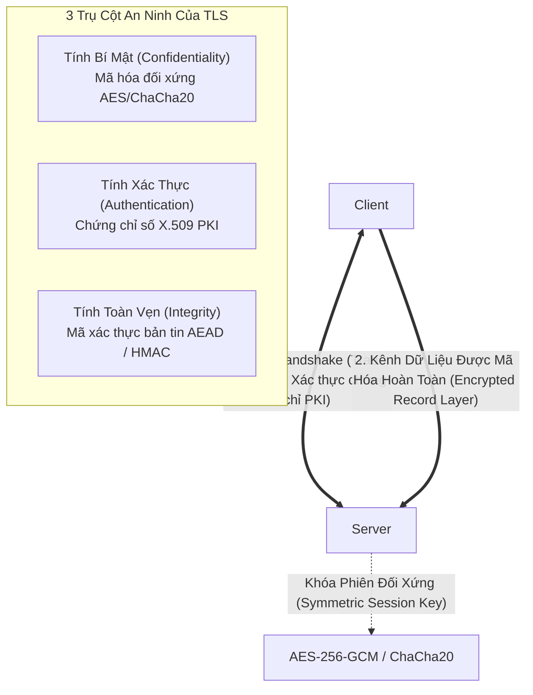
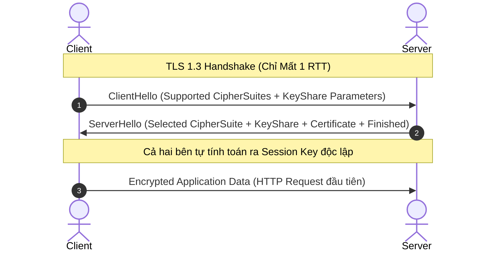
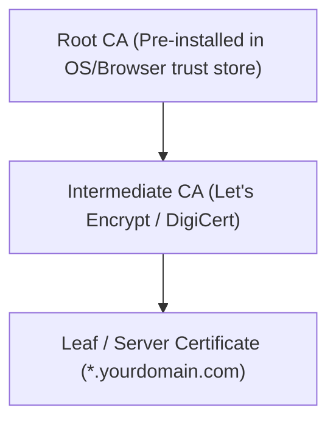

# 🔒 Giao Thức TLS (Transport Layer Security)

> [[00 - Networks MOC|📁 Computer Networks MOC]] / [[MOC - Part 1 Core Foundations|🟢 Part 1 MOC]]

---

## 1. Bản Đồ Khái Niệm (Mermaid DAG)

---

## 2. Chân Lý Vô Điều Kiện (First Principles)

> [!NOTE] Tiên Đề Bất Biến
> **Mã hóa bất đối xứng (Asymmetric Encryption) quá nặng để mã hóa toàn bộ dữ liệu ứng dụng.**
>
> Vì các thuật toán khóa công khai (như RSA, ECC) chậm hơn thuật toán khóa đối xứng từ 100 đến 1000 lần trên cùng khối lượng dữ liệu, **TLS hoạt động theo kiến trúc lai (Hybrid Cryptography)**:
>
> 1. Dùng thuật toán bất đối xứng (Diffie-Hellman / ECDHE) **duy nhất trong quá trình bắt tay (Handshake)** để xác thực máy chủ và thỏa thuận một khóa bí mật chung (**Session Key**).
> 2. Sử dụng chính khóa bí mật đó với các thuật toán đối xứng tốc độ cao (**AES-GCM, ChaCha20-Poly1305**) để mã hóa toàn bộ luồng dữ liệu ứng dụng thực tế.

---

## 3. Trực Giác Motivated Discovery

> [!TIP] Động Lực Nâng Cấp Lên TLS 1.3 (Rút ngắn thời gian bắt tay)
> Trong TLS 1.2, để bắt đầu gửi byte HTTP đầu tiên, trình duyệt phải trải qua **2 RTT** (ClientHello $
> ightarrow$ ServerHello $
> ightarrow$ KeyExchange $
> ightarrow$ Finished). Cộng thêm 1 RTT của TCP Three-way Handshake, tổng cộng mất **3 RTT** trước khi có dữ liệu! Trên mạng di động có độ trễ 100ms, người dùng phải chờ 300ms chỉ để nhìn thấy màn hình trắng.
>
> **TLS 1.3** loại bỏ hoàn toàn các bộ mã hóa lỗi thời (RSA key exchange, CBC ciphers), bắt buộc dùng **Elliptic Curve Diffie-Hellman (ECDHE)** và cho phép Client gửi kèm tham số trao đổi khóa ngay trong `ClientHello`. Kết quả: Thời gian bắt tay giảm xuống chỉ còn **1 RTT**, và hỗ trợ **0-RTT** cho kết nối lặp lại.

---

## 4. Phân Tích Kỹ Thuật Chuyên Sâu

### 4.1. Chi Tiết Tiến Trình Bắt Tay: TLS 1.2 vs TLS 1.3

---

### 4.2. Bộ Mã Hóa Hiện Đại (Cipher Suites trong TLS 1.3)

TLS 1.3 chỉ giữ lại 5 Cipher Suite đạt chuẩn an toàn cao nhất (tất cả đều là **AEAD - Authenticated Encryption with Associated Data**):

1. `TLS_AES_256_GCM_SHA384`
2. `TLS_CHACHA20_POLY1305_SHA256` (Tối ưu cho thiết bị di động không có phần cứng tăng tốc AES)
3. `TLS_AES_128_GCM_SHA256`
4. `TLS_AES_128_CCM_SHA256`
5. `TLS_AES_128_CCM_8_SHA256`

---

### 4.3. Hạ Tầng Khóa Công Khai (PKI) & Chuỗi Tin Cậy (Chain of Trust)

- **SNI (Server Name Indication):** Cho phép Client thông báo tên miền (Hostname) muốn kết nối ngay từ `ClientHello`, giúp 1 địa chỉ IP máy chủ có thể phục vụ nhiều chứng chỉ SSL/TLS cho nhiều website khác nhau.
- **OCSP Stapling:** Thay vì để trình duyệt phải tự gửi truy vấn đến CA để kiểm tra xem chứng chỉ có bị thu hồi hay không (làm lộ thông tin duyệt web và tăng độ trễ), Server tự lấy bản chứng thực trạng thái từ CA rồi "kẹp" kèm vào TLS handshake.

---

## 5. Spaced Repetition Flashcards & Tham Chiếu

### Flashcards

Tại sao TLS 1.3 loại bỏ hoàn toàn cơ chế trao đổi khóa bằng RSA và chỉ cho phép Diffie-Hellman tạm thời (Ephemeral Diffie-Hellman - ECDHE)? #card
Để đảm bảo tính bí mật chuyển tiếp hoàn hảo (Perfect Forward Secrecy - PFS). Nếu dùng RSA key exchange, nếu khóa riêng (private key) của server bị lộ trong tương lai, kẻ tấn công có thể giải mã toàn bộ lưu lượng mạng đã ghi lén trong quá khứ. Với ECDHE, mỗi phiên làm việc sinh ra một cặp khóa tạm thời độc lập.

AEAD (Authenticated Encryption with Associated Data) trong TLS cung cấp những tính năng bảo mật nào cùng lúc? #card
Cung cấp đồng thời cả tính bí mật (Confidentiality) qua mã hóa và tính toàn vẹn/xác thực nguồn gốc (Integrity & Authenticity) trong cùng một thuật toán duy nhất (như AES-GCM hoặc ChaCha20-Poly1305).

Cơ chế SNI (Server Name Indication) giải quyết bài toán kỹ thuật nào trong hạ tầng máy chủ Web? #card
Cho phép một máy chủ Web duy nhất có 1 địa chỉ IP có thể host nhiều domain khác nhau với các chứng chỉ TLS/SSL riêng biệt, bằng cách gửi tên miền trong bản tin ClientHello trước khi thiết lập kết nối mã hóa.

### Tham Chiếu

- [[SSL]] - Tiền thân của giao thức TLS (hiện đã bị khai tử).
- [[HTTP - HTTPS]] - Chuẩn HTTPS sử dụng TLS để bảo vệ toàn bộ dữ liệu web.
- [[QUIC]] - Giao thức tích hợp trực tiếp bắt tay TLS 1.3 ở tầng giao vận.
