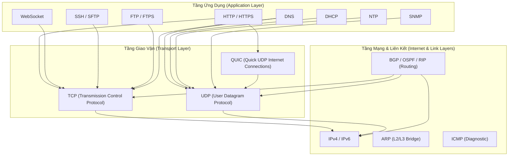

# 📊 Bảng Tra Cứu Toàn Diện Giao Thức Mạng Cho Backend Engineer

> [[00 - Networks MOC|📁 Computer Networks MOC]] / [[MOC - Part 1 Core Foundations|🟢 Part 1 MOC]]

---

## 1. Sơ Đồ Định Vị Phân Tầng Giao Thức (Protocol Stack Topology)

---

## 2. Ma Trận So Sánh Kỹ Thuật 20 Giao Thức Mạng

| Giao Thức                   | Tầng OSI           | Tầng Giao Vận (Transport) | Cổng Mặc Định (Port)     | Chuẩn RFC     | Độ Tin Cậy (Reliability)        | Cơ Chế Bảo Mật               | Use Case Cốt Lõi Trong Backend                               |
| :-------------------------- | :----------------- | :------------------------ | :----------------------- | :------------ | :------------------------------ | :--------------------------- | :----------------------------------------------------------- |
| **[[TCP - IP\|TCP]]**       | Transport          | -                         | -                        | RFC 9293      | Rất cao (ACK, Flow, Retransmit) | Kết hợp TLS                  | Truyền dữ liệu web, API, database, message queues            |
| **[[UDP]]**                 | Transport          | -                         | -                        | RFC 768       | Thấp (Best-effort)              | Kết hợp DTLS                 | Streaming, VoIP, gaming, DNS query, hạ tầng QUIC             |
| **[[QUIC]]**                | Transport          | UDP                       | 443                      | RFC 9000      | Cao (Streams độc lập, 0-RTT)    | Tích hợp TLS 1.3             | Nền tảng của HTTP/3, streaming độ trễ thấp                   |
| **[[BGP]]**                 | Network/App        | TCP                       | 179                      | RFC 4271      | Cao (Path-Vector)               | RPKI, MD5                    | Định tuyến liên miền giữa các Autonomous Systems             |
| **[[HTTP - HTTPS\|HTTP]]**  | Application        | TCP                       | 80                       | RFC 9110      | Cao (Kế thừa TCP)               | Không                        | REST API nội bộ, giao tiếp microservice không mã hóa         |
| **[[HTTP - HTTPS\|HTTPS]]** | Application        | TCP / QUIC                | 443                      | RFC 9110/8446 | Rất cao                         | [[TLS]] 1.2 / 1.3            | Tiêu chuẩn bắt buộc cho mọi API và ứng dụng web công khai    |
| **[[WebSocket]]**           | Application        | TCP                       | 80 / 443                 | RFC 6455      | Cao (Full-duplex stream)        | WSS (TLS)                    | Chat thời gian thực, bảng giá tài chính, gaming realtime     |
| **[[TLS]]**                 | Presentation/Trans | TCP / UDP                 | 443 / Tùy biến           | RFC 8446      | Rất cao                         | Mật mã lai (ECDHE + AES-GCM) | Lớp bảo vệ cho HTTPS, FTPS, WSS, mTLS giữa các microservices |
| **[[SSL]]**                 | Presentation       | TCP                       | -                        | RFC 6101      | **Không an toàn (Đã cấm)**      | CBC, RC4 (Lỗi thời)          | Tiền thân lịch sử của TLS (Hiện bị cấm tuyệt đối)            |
| **[[SSH]]**                 | Application        | TCP                       | 22                       | RFC 4251      | Rất cao                         | Cặp khóa Ed25519/RSA, AES    | Quản trị server từ xa, Port Forwarding, CI/CD deployment     |
| **[[DNS]]**                 | Application        | UDP / TCP                 | 53                       | RFC 1035      | Cao (UDP + Retry)               | DNSSEC, DoH, DoT             | Phân giải tên miền ra IP, Service Discovery trong Kubernetes |
| **[[DHCP]]**                | Application        | UDP                       | 67 (Server), 68 (Client) | RFC 2131      | Trung bình                      | DHCP Snooping                | Cấp phát IP động tự động trong mạng LAN / Cloud VPC          |
| **[[NTP]]**                 | Application        | UDP                       | 123                      | RFC 5905      | Cao (Thuật toán Marzullo)       | NTS (Network Time Security)  | Đồng bộ giờ cho Distributed Database, JWT, Audit Logging     |
| **[[ARP]]**                 | Data Link / Net    | -                         | -                        | RFC 826       | Cục bộ                          | Dynamic ARP Inspection       | Ánh xạ địa chỉ IP Layer 3 sang địa chỉ MAC Layer 2 trong LAN |
| **[[ICMP]]**                | Network            | IP (Protocol 1)           | -                        | RFC 792       | Best-effort                     | Không                        | Đo lường độ trễ (Ping), dò đường (Traceroute), Path MTU      |
| **[[SNMP]]**                | Application        | UDP                       | 161 (Poll), 162 (Trap)   | RFC 3411      | Trung bình                      | SNMPv3 USM (AES/SHA)         | Giám sát phần cứng server, switch, router trong hạ tầng NOC  |
| **[[RIP & OSPF\|RIP]]**     | Network            | UDP                       | 520                      | RFC 2453      | Thấp (Hop count max 15)         | MD5 Key                      | Định tuyến mạng nội bộ quy mô nhỏ (Legacy)                   |
| **[[RIP & OSPF\|OSPF]]**    | Network            | IP (Protocol 89)          | -                        | RFC 2328      | Rất cao (Dijkstra SPF)          | MD5 / SHA                    | Định tuyến nội miền (IGP) doanh nghiệp & Data Center         |
| **[[FTP]]**                 | Application        | TCP                       | 21 (Cmd), 20 (Data)      | RFC 959       | Cao                             | Không (Plain text)           | Truyền tệp truyền thống (Không dùng cho production)          |
| **[[FTPS]]**                | Application        | TCP                       | 21 / 990 + PASV          | RFC 4217      | Rất cao                         | [[TLS]]                      | Truyền tệp bảo mật tuân thủ PCI-DSS trong ngân hàng          |
| **[[SFTP]]**                | Application        | TCP                       | 22                       | Secsh Draft   | Rất cao                         | [[SSH]]                      | Tiêu chuẩn truyền tệp tự động hóa, sao lưu server, DevOps    |

---

## 3. Cẩm Nang Quyết Định Kiến Trúc (Architectural Decision Guide)

### Khi Nào Dùng Giao Thức Nào?

1. **Truyền dữ liệu ứng dụng Backend:**
   - Cần request/response chuẩn mực: $
     ightarrow$ **[[HTTP - HTTPS\|HTTPS (HTTP/2 hoặc HTTP/3)]]**.
   - Cần giao tiếp hai chiều thời gian thực với độ trễ thấp nhất: $
     ightarrow$ **[[WebSocket]]**.
   - Cần đẩy dữ liệu một chiều từ Server về Client (LLM streaming, notifications): $
     ightarrow$ **Server-Sent Events (SSE)** trên HTTPS.
2. **Truyền tệp dữ liệu lớn:**
   - Trong hạ tầng máy chủ và pipeline CI/CD: $
     ightarrow$ **[[SFTP]]** (qua cổng 22 an toàn).
   - Lưu trữ và phân phối tệp hiện đại: $
     ightarrow$ **Object Storage API (S3-compatible qua HTTPS)**.
3. **Mạng và hạ tầng phân tán:**
   - Đồng bộ thời gian để chống lỗi phân tán: $
     ightarrow$ **[[NTP]]**.
   - Tìm kiếm dịch vụ trong cụm máy chủ nội bộ: $
     ightarrow$ **[[DNS]] (CoreDNS / Consul)**.
   - Giám sát tình trạng phần cứng máy chủ: $
     ightarrow$ **[[SNMP\|SNMPv3]]** hoặc Prometheus Exporter.
