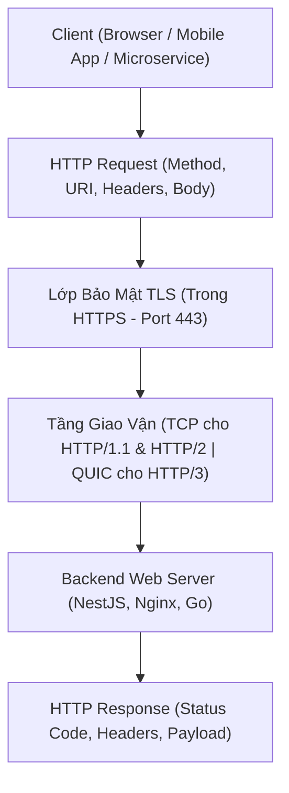

# 🌐 Giao Thức HTTP & HTTPS (Hypertext Transfer Protocol Secure)

> [[00 - Networks MOC|📁 Computer Networks MOC]] / [[MOC - Part 1 Core Foundations|🟢 Part 1 MOC]]

---

## 1. Bản Đồ Khái Niệm (Mermaid DAG)

---

## 2. Chân Lý Vô Điều Kiện (First Principles)

> [!NOTE] Tiên Đề Bất Biến
> **HTTP là giao thức phi trạng thái (Stateless Request-Response Protocol).**
>
> Mỗi cặp yêu cầu - phản hồi độc lập hoàn toàn với các yêu cầu trước đó. Bản thân HTTP chỉ là giao thức định dạng văn bản hoặc khung nhị phân; nó không quản lý phiên làm việc.
>
> **HTTPS không phải là một giao thức mới:** Nó đơn thuần là HTTP truyền thông qua một đường hầm mã hóa bảo mật được thiết lập bởi [[TLS]] (Transport Layer Security).

---

## 3. Trực Giác Motivated Discovery

> [!TIP] Động Lực Phát Minh (Tại sao HTTP phải liên tục tiến hóa từ 1.0 đến 3.0?)
>
> - **HTTP/1.0:** Mỗi tài nguyên (ảnh, CSS, JS) mở 1 kết nối TCP mới rồi đóng $
>   ightarrow$ Tốn hàng chục RTT bắt tay, mạng cực chậm.
> - **HTTP/1.1:** Thêm kết nối bền vững (**Keep-Alive**) để tái sử dụng socket, nhưng vẫn bị kẹt tuần tự (**HTTP Head-of-Line Blocking** - request trước chưa xong thì request sau phải đợi).
> - **HTTP/2:** Đột phá với **Binary Framing & Multiplexing**: Hàng trăm request/response chạy đồng thời trên 1 kết nối TCP duy nhất. Nhưng nếu 1 gói TCP rớt, toàn bộ kết nối bị khựng.
> - **HTTP/3:** Chuyển từ TCP sang [[QUIC]] (chạy trên [[UDP]]) để loại bỏ Head-of-Line blocking ở cả tầng giao vận lẫn tầng ứng dụng.

---

## 4. Phân Tích Kỹ Thuật Chuyên Sâu

### 4.1. Cấu Trúc Bản Tin HTTP/1.1 vs HTTP/2 Framing

- **HTTP/1.1 Message:** Dạng văn bản thuần (Plain Text), ngăn cách bởi ký tự xuống dòng `\r\n`:
  - Request Line: `GET /api/v1/users HTTP/1.1`
  - Headers: `Host: api.example.com`, `Authorization: Bearer <token>`
  - Empty Line
  - Body: JSON, Form-data, Binary
- **HTTP/2 Binary Framing:** Chia nhỏ message thành các Frame nhị phân (HEADERS frame, DATA frame) được gán `Stream ID`. Client và server ghép các frame lại theo Stream ID, cho phép xen kẽ dữ liệu mà không sợ nhầm lẫn.

---

### 4.2. Mã Trạng Thái HTTP (Status Codes) Phổ Biến Trong Backend

| Nhóm    | Ý Nghĩa                    | Các Mã Cốt Lõi                                                                                                                              |
| :------ | :------------------------- | :------------------------------------------------------------------------------------------------------------------------------------------ |
| **2xx** | Thành công (Success)       | `200 OK`, `201 Created` (POST thành công), `204 No Content` (DELETE)                                                                        |
| **3xx** | Chuyển hướng (Redirection) | `301 Moved Permanently` (Cache vĩnh viễn), `304 Not Modified` (Dùng cache trình duyệt)                                                      |
| **4xx** | Lỗi từ phía Client         | `400 Bad Request`, `401 Unauthorized` (Chưa login), `403 Forbidden` (Không đủ quyền), `404 Not Found`, `429 Too Many Requests` (Rate limit) |
| **5xx** | Lỗi từ phía Server         | `500 Internal Server Error`, `502 Bad Gateway` (Upstream chết), `503 Service Unavailable` (Quá tải), `504 Gateway Timeout`                  |

---

### 4.3. Cách HTTP/HTTPS Vận Chuyển Dữ Liệu Lớn (Ảnh, Video)

HTTP bản chất không quan tâm nội dung bên trong là chữ hay tệp nhị phân:

1. **Content-Type & Mime-Type:** Thông báo định dạng dữ liệu (ví dụ `image/png`, `video/mp4`, `application/pdf`).
2. **Chunked Transfer Encoding:** Server không cần biết trước dung lượng file (`Content-Length`), chia nhỏ luồng dữ liệu thành các khối (chunks) và stream dần về client.
3. **Range Requests (HTTP 206 Partial Content):** Client gửi header `Range: bytes=0-1048575` để chỉ tải 1 MB đầu tiên của video, hỗ trợ tua video và tải song song đa luồng.

---

## 5. Spaced Repetition Flashcards & Tham Chiếu

### Flashcards

Sự khác biệt cốt lõi giữa HTTP/1.1 Keep-Alive và HTTP/2 Multiplexing là gì? #card
HTTP/1.1 Keep-Alive chỉ tái sử dụng kết nối TCP nhưng vẫn phải xử lý tuần tự từng request (vẫn bị HTTP Head-of-Line blocking). HTTP/2 Multiplexing chia nhỏ request/response thành các binary frame và truyền xen kẽ đồng thời trên cùng một kết nối TCP duy nhất.

Mã trạng thái HTTP 401 khác HTTP 403 như thế nào? #card
HTTP 401 (Unauthorized) nghĩa là chưa xác thực danh tính (chưa đăng nhập hoặc token không hợp lệ). HTTP 403 (Forbidden) nghĩa là hệ thống đã nhận diện danh tính nhưng người dùng không có quyền truy cập tài nguyên đó.

Giao thức HTTPS bảo vệ dữ liệu bằng cách nào so với HTTP thông thường? #card
HTTPS chèn thêm một lớp mã hóa TLS nằm giữa tầng Application (HTTP) và tầng Transport (TCP). Mọi header, URL path, query params và body đều được mã hóa đối xứng bằng khóa phiên trao đổi qua TLS Handshake.

### Tham Chiếu

- [[TLS]] - Lớp bảo mật mã hóa cốt lõi tạo nên HTTPS.
- [[QUIC]] - Giao thức tầng giao vận cho chuẩn HTTP/3.
- [[WebSocket]] - Giao thức nâng cấp từ HTTP để hỗ trợ giao tiếp hai chiều thời gian thực.
