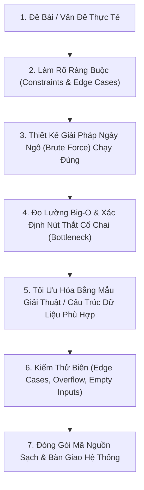

# 🧠 Tư Duy Thuật Toán (Algorithmic Thinking)

> [[00 - Master Dashboard|🧭 Dashboard]] / [[Master MOC|🗺️ Master MOC]] / [[Big-O Notation - MOC|⚡ Big-O MOC]]

---

## 1. Bản Đồ Khái Niệm (Mermaid DAG)



---

## 2. Chân Lý Vô Điều Kiện (First Principles)

> [!NOTE] Tiên Đề Tính Xác Định & Tính Hữu Hạn (Church-Turing Thesis)
> **Thuật toán là một chuỗi hữu hạn các chỉ thị cơ bản, không nhập nhằng (unambiguous), biến đổi trạng thái đầu vào (Input) thành kết quả mong muốn (Output) sau một số hữu hạn bước tính:**
>
> 1. **Tính xác định (Definiteness):** Máy tính không có trực giác. Mỗi câu lệnh phải tuyệt đối rõ ràng, không được chứa các mệnh đề mơ hồ.
> 2. **Tính hữu hạn (Finiteness):** Thuật toán bắt buộc phải dừng lại ở mọi trường hợp đầu vào hợp lệ. Nếu rơi vào vòng lặp vô tận, chương trình không phải là một thuật toán.
> 3. **Quy luật tiến hóa giải thuật:** Mọi giải thuật tối ưu đều bắt nguồn từ một giải thuật cơ bản chạy đúng (Correctness First $\to$ Performance Later). Tối ưu hóa sớm khi chưa đúng logic là nguồn gốc của mọi thảm họa phần mềm.

---

## 3. Trực Giác Motivated Discovery

> [!TIP] Động Lực 3Blue1Brown: Bản Vẽ Kết Cấu Của Kiến Trúc Sư
> Bạn muốn xây một cây cầu vượt qua con sông:
>
> Người thợ nghiệp dư sẽ vội vã xúc cát, trộn xi măng và đổ bê tông ngay ngày đầu tiên. Cây cầu xây xong có thể sập ngay vì nền đất yếu!
>
> Kiến trúc sư chuyên nghiệp làm việc hoàn toàn khác:
> 1. Đo lưu lượng xe và khảo sát lòng sông (Phân tích Input & Constraints).
> 2. Phác thảo một cây cầu gỗ đơn giản để người đi bộ qua sông tạm thời (Brute Force chạy đúng).
> 3. Tính toán trọng tải cầu bị rung lắc ở đâu (Xác định Bottleneck).
> 4. Thay bằng dầm thép và dây văng chịu lực (Tối ưu hóa bằng cấu trúc dữ liệu thích hợp).
> 5. Thử nghiệm xe tải nặng chạy qua (Kiểm thử Edge Cases).

---

## 4. 5 Tiêu Chí Vàng Của Một Thuật Toán Chuẩn

1. **Định nghĩa rõ Input & Output cùng Điều Kiện Tiên Quyết (Preconditions):**
   - _Ví dụ:_ Muốn tìm kiếm bằng [[Binary Search|Binary Search $O(\log n)$]], dữ liệu **bắt buộc phải được sắp xếp trước**.
2. **Thứ tự thực hiện xác định (Specific Order):** Đảo lộn thứ tự các bước sẽ dẫn đến sụp đổ toàn bộ logic.
3. **Mỗi bước phải tường minh và đơn lẻ (Atomic):** Mỗi lệnh là một thao tác cơ bản (so sánh, gán, tăng biến đếm).
4. **Luôn trả về kết quả (Produce a result):** Trả về giá trị rõ ràng (dù là `null`, `-1` hay `false`).
5. **Tính hữu hạn (Finiteness):** Kết thúc sau số bước hữu hạn, không treo máy.

---

## 5. Minh Họa Quy Trình Tối Ưu Tư Duy (TypeScript)

Chuyển đổi bài toán tìm hai số có tổng bằng $S$ từ Brute Force sang Tối ưu:

```typescript
// BƯỚC 1: Brute Force ngây ngô - O(n^2) Time, O(1) Space
// Ý tưởng: So khớp từng cặp phần tử
export function twoSumBruteForce(nums: number[], target: number): [number, number] | null {
  for (let i = 0; i < nums.length; i++) {
    for (let j = i + 1; j < nums.length; j++) {
      if (nums[i] + nums[j] === target) {
        return [i, j];
      }
    }
  }
  return null;
}

// BƯỚC 2: Nhận diện nút thắt: Phép tìm kiếm (target - nums[i]) tốn O(n) bên trong!
// BƯỚC 3: Thay thế bằng Hash Table để tra cứu trong O(1) -> O(n) Time, O(n) Space
export function twoSumOptimized(nums: number[], target: number): [number, number] | null {
  const seen = new Map<number, number>(); // lưu giá trị -> chỉ số

  for (let i = 0; i < nums.length; i++) {
    const complement = target - nums[i];
    if (seen.has(complement)) {
      return [seen.get(complement)!, i];
    }
    seen.set(nums[i], i);
  }

  return null;
}
```

---

## 6. Tư Duy Của Kiến Trúc Sư (Architect's Mindset)

- **Không có giải pháp "Tốt nhất", chỉ có giải pháp "Phù hợp nhất":** Tùy thuộc vào dữ liệu tĩnh hay động, đọc nhiều hay ghi nhiều (Read-heavy vs Write-heavy), tài nguyên RAM dồi dào hay thắt chặt.
- **Ranh giới và Trường hợp biên (Edge Cases):** Luôn thử thách thuật toán với các trường hợp cực đoan: Mảng rỗng (`[]`), mảng 1 phần tử, mảng trùng lặp, số âm, hoặc giá trị tràn số nguyên (`Integer Overflow`).

---

## 🧠 Thẻ Ghi Nhớ Nhanh (Spaced Repetition)

Quy trình 4 bước chuẩn mực để giải quyết một bài toán thuật toán là gì? #card
?
1. **Làm rõ yêu cầu & Ràng buộc:** Xác định Input, Output, kích thước $N$ và các Edge Cases.
2. **Thiết kế Brute Force:** Viết giải pháp cơ bản chạy đúng đầu tiên để thiết lập mốc đo hiệu năng.
3. **Tìm nút thắt cổ chai (Bottleneck):** Dùng Big-O để tìm ra vòng lặp hay phép toán nào đang ngốn thời gian nhất.
4. **Tối ưu hóa có chủ đích:** Áp dụng cấu trúc dữ liệu hoặc Pattern thuật toán phù hợp để giải quyết đúng nút thắt đó.

Tại sao câu châm ngôn "Premature optimization is the root of all evil" lại đặc biệt đúng trong tư duy thuật toán? #card
?
Vì tối ưu hóa sớm khi chưa nắm chắc bản chất bài toán và chưa có giải pháp chạy đúng (Correctness) sẽ tạo ra mã nguồn phức tạp, khó debug, dễ phát sinh lỗi logic và lãng phí thời gian vào những đoạn mã không phải là nút thắt cổ chai thực sự.
