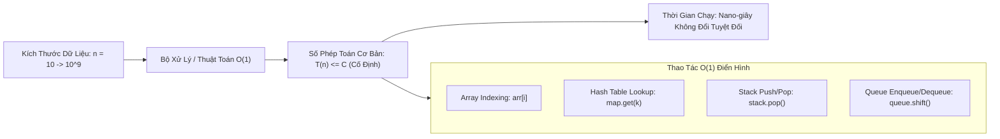

# 🟢 O(1) - Constant Time (Thời Gian Hằng Số)

> [[00 - Master Dashboard|🧭 Dashboard]] / [[Master MOC|🗺️ Master MOC]] / [[Big-O Notation - MOC|⚡ Big-O MOC]]

---

## 1. Bản Đồ Khái Niệm (Mermaid DAG)



---

## 2. Chân Lý Vô Điều Kiện (First Principles)

> [!NOTE] Tiên Đề Độc Lập Với Quy Mô Dữ Liệu
> **Độ phức tạp $O(1)$ khẳng định số phép toán cơ bản $T(n)$ bị chặn trên bởi một hằng số $C > 0$ độc lập hoàn toàn với kích thước đầu vào $n$:**
> $$ \exists C > 0, n_0 > 0 : T(n) \le C \quad \forall n \ge n_0 $$
>
> 1. **Không có nghĩa là "chạy trong 1 nano-giây":** Thuật toán thực hiện đúng 1 phép cộng hay thực hiện 1.000 phép tính toán học cố định đều là $O(1)$. Điều cốt lõi là khi $n$ tăng từ $10$ lên $10^{12}$, số phép toán vẫn **giữ nguyên không đổi**.
> 2. **Cơ chế phần cứng (Hardware Primitive):** Mọi thao tác $O(1)$ ở tầng ứng dụng đều ánh xạ trực tiếp về một chỉ thị CPU nguyên tử (Atomic Instruction) hoặc phép toán số học con trỏ $\text{Address} = \text{Base} + i \times \text{Size}$.

---

## 3. Trực Giác Motivated Discovery

> [!TIP] Động Lực 3Blue1Brown: Công Tắc Điện Trong Phòng
> Bạn bước vào một căn phòng và bấm công tắc đèn:
>
> - Nếu căn phòng chỉ rộng $10\text{ m}^2$, bóng đèn bật sáng ngay sau $1$ cái búng tay.
> - Nếu đó là một nhà thi đấu thể thao khổng lồ $50.000\text{ m}^2$, việc bấm công tắc tổng vẫn chỉ tốn đúng $1$ cái búng tay của bạn!
>
> Quy mô không gian phình to bao nhiêu không làm tốn thêm một chút công sức bấm công tắc nào của bạn. Đó chính là trực giác của $O(1)$.

---

## 4. Dấu Hiệu Nhận Biết & Cấu Trúc Dữ Liệu Điển Hình

| Cấu Trúc Dữ Liệu | Thao Tác $O(1)$ | Cơ Chế Đạt Được $O(1)$ |
| :--- | :--- | :--- |
| [[Array & Dynamic Array\|Mảng]] | Truy cập chỉ số: `arr[i]` | Số học con trỏ trực tiếp trên RAM |
| [[Hash Table & HashSet\|Bảng băm]] | Tra cứu, chèn, xóa trung bình | Hàm băm ánh xạ key thành bucket index |
| [[Stack\|Ngăn xếp]] | `push()`, `pop()`, `peek()` | Thao tác tại đỉnh con trỏ `top` |
| [[Queue & Deque\|Hàng đợi]] | `enqueue()`, `dequeue()` | Thao tác tại 2 đầu con trỏ `head`/`tail` |
| [[Linked List\|Danh sách liên kết]] | Chèn/xóa ở `head` | Đổi 1 con trỏ địa chỉ bộ nhớ |

---

## 5. Minh Họa Mã Nguồn (TypeScript)

```typescript
// 1. O(1) Tuyệt đối: Đọc trực tiếp ô nhớ qua index
export function getFirstElement<T>(arr: T[]): T | undefined {
  return arr[0]; // Đúng 1 chỉ thị, không phụ thuộc arr.length
}

// 2. O(1) Trung bình: Tra cứu bảng băm qua Key
export function getScore(userScores: Map<string, number>, username: string): number {
  return userScores.get(username) ?? 0; // O(1) Average
}

// 3. O(1) Hoạt động số học: Kiểm tra số chẵn lẻ bằng Bitwise AND
export function isEven(n: number): boolean {
  return (n & 1) === 0; // 1 chu kỳ xung nhịp CPU
}
```

---

## 6. Góc Nhìn Kiến Trúc Sư Hệ Thống (Architect's View)

- **Chén Thánh của Tối ưu:** $O(1)$ là mục tiêu tối thượng của các kỹ sư khi thiết kế tầng lưu trữ và tầng Cache.
- **Chiến lược Space-Time Trade-off:** Khi một hệ thống bị nghẽn ở thao tác tra cứu tuyến tính $O(n)$, ta sử dụng thêm RAM để thiết lập cấu trúc [[Hash Table & HashSet|Hash Table]] hoặc [[LRU Cache|LRU Cache]] để đưa thời gian phản hồi về $O(1)$.

---

## 🧠 Thẻ Ghi Nhớ Nhanh (Spaced Repetition)

Độ phức tạp $O(1)$ có đồng nghĩa với việc code chạy siêu nhanh trong 1 chu kỳ CPU không? #card
?
Không. $O(1)$ chỉ có nghĩa là số bước thực thi không phụ thuộc vào kích thước dữ liệu $N$. Một đoạn code thực hiện 1.000 phép tính ma trận cố định vẫn là $O(1)$, dù nó chạy chậm hơn một phép so sánh đơn lẻ $O(n)$ khi $n = 2$.

Tại sao thao tác truy cập phần tử mảng `arr[i]` luôn đạt $O(1)$? #card
?
Vì các phần tử mảng được cấp phát liên tục trong RAM, CPU tính toán trực tiếp địa chỉ ô nhớ bằng công thức số học con trỏ `Base + i * Size` trong 1 phép tính duy nhất mà không cần duyệt qua các phần tử trước đó.
