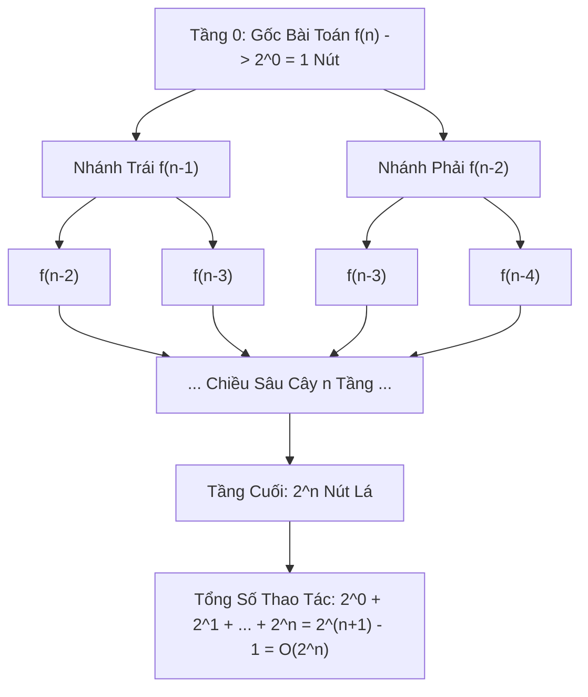

# ☠️ O(2^n) - Exponential Time (Thời Gian Lũy Thừa)

> [[00 - Master Dashboard|🧭 Dashboard]] / [[Master MOC|🗺️ Master MOC]] / [[Big-O Notation - MOC|⚡ Big-O MOC]]

---

## 1. Bản Đồ Khái Niệm (Mermaid DAG)



---

## 2. Chân Lý Vô Điều Kiện (First Principles)

> [!NOTE] Tiên Đề Bùng Nổ Tổ Hợp Mũ (Combinatorial Explosion)
> **Độ phức tạp $O(2^n)$ xuất hiện khi mỗi khi kích thước dữ liệu tăng thêm đúng $1$ đơn vị ($n \to n + 1$), số lượng trạng thái tính toán nhân đôi ($2\times$):**
> $$ T(n) = 2 \cdot T(n-1) + O(1) \implies T(n) = \Theta(2^n) $$
>
> 1. **Tổng số nút cây đệ quy:** Cây nhị phân đầy đủ có tổng số nút là cấp số nhân $\sum_{i=0}^n 2^i = 2^{n+1} - 1 = O(2^n)$.
> 2. **Giới hạn phần cứng tuyệt đối:**
>    - Với $n = 30$: $2^{30} \approx 10^9$ phép tính $\approx 1$ giây.
>    - Với $n = 50$: $2^{50} \approx 1.12 \times 10^{15}$ phép tính $\approx 13$ ngày.
>    - Với $n = 100$: $2^{100} \approx 1.26 \times 10^{30}$ phép tính $\approx 4 \times 10^{14}$ năm (gấp 30.000 lần tuổi của vũ trụ).

---

## 3. Trực Giác Motivated Discovery

> [!TIP] Động Lực 3Blue1Brown: Bàn Cờ Vua & Hạt Thóc Của Nhà Thông Thái
> Nhà vua muốn thưởng cho người phát minh ra bàn cờ vua 64 ô:
>
> Người phát minh chỉ xin: *"Ô thứ nhất đặt 1 hạt thóc. Mỗi ô tiếp theo xin đặt gấp đôi số hạt thóc của ô trước đó (2, 4, 8, 16...)"*.
>
> Nhà vua vui vẻ đồng ý vì tưởng phần thưởng quá nhỏ. Nhưng đến ô thứ 64, tổng số hạt thóc là $2^{64} - 1 \approx 1.84 \times 10^{19}$ hạt, tương đương **hàng trăm tỷ tấn thóc**, vượt xa toàn bộ sản lượng nông nghiệp của nhân loại trong hàng nghìn năm!

---

## 4. Dấu Hiệu Nhận Biết & Bài Toán Điển Hình

| Bài Toán | Đặc Điểm Nhận Diện | Nguyên Nhân Bùng Nổ $O(2^n)$ |
| :--- | :--- | :--- |
| **Naive Fibonacci** | Đệ quy gọi 2 lần không cache | Cây nhị phân phân nhánh trùng lặp |
| **Power Set (Tập con)** | Sinh toàn bộ $2^n$ tập con | Mỗi phần tử có 2 lựa chọn (chọn / không chọn) |
| **0/1 Knapsack Brute Force** | Thử mọi cách nhét đồ vào balo | Xét duyệt toàn bộ tổ hợp $2^n$ vật phẩm |
| **Mật mã Brute Force** | Thử chìa khóa nhị phân độ dài $n$ | Không gian khóa có kích thước $2^n$ bit |

---

## 5. Minh Họa Mã Nguồn (TypeScript)

```typescript
// 1. O(2^n) Điển hình: Đệ quy Fibonacci ngây ngô không cache
export function fibonacciNaive(n: number): number {
  if (n <= 1) return n;
  // Mỗi tầng n sinh ra 2 lời gọi hàm độc lập
  return fibonacciNaive(n - 1) + fibonacciNaive(n - 2);
}

// 2. O(2^n) Sinh tất cả các tập con (Power Set) của mảng n phần tử
export function subsets<T>(nums: T[]): T[][] {
  const result: T[][] = [];

  function backtrack(index: number, current: T[]) {
    if (index === nums.length) {
      result.push([...current]); // Lưu 1 tập con trong 2^n tập
      return;
    }
    // Lựa chọn 1: Không lấy phần tử nums[index]
    backtrack(index + 1, current);

    // Lựa chọn 2: Có lấy phần tử nums[index]
    current.push(nums[index]);
    backtrack(index + 1, current);
    current.pop();
  }

  backtrack(0, []);
  return result; // Mảng kết quả có đúng 2^n mảng con
}
```

---

## 6. Chiến Lược Giải Cứu Của Kiến Trúc Sư Hệ Thống

- **Cấm kỵ trong Production:** Tuyệt đối không cho phép thuật toán $O(2^n)$ chạy trên dữ liệu động của người dùng nếu $n > 30$.
- **Vũ khí cứu cánh — [[Recursion & Memoization|Quy Hoạch Động (DP) & Memoization]]:**
  - Nhận diện các bài toán con trùng lặp (Overlapping Subproblems) trên cây đệ quy.
  - Sử dụng bảng băm hoặc mảng để lưu kết quả đã tính (Memoization) $\to$ Giảm thời gian từ $O(2^n)$ ngoạn mục xuống còn $O(n)$!

---

## 🧠 Thẻ Ghi Nhớ Nhanh (Spaced Repetition)

Tại sao đệ quy Fibonacci ngây ngô lại có độ phức tạp thời gian là $O(2^n)$? #card
?
Vì mỗi nút trên cây đệ quy tự gọi lại 2 hàm con, hình thành một cây nhị phân có chiều sâu $n$. Tổng số nút trên cây đệ quy xấp xỉ bằng tổng cấp số nhân $2^0 + 2^1 + \dots + 2^n = 2^{n+1} - 1 \implies \Theta(2^n)$.

Kỹ thuật cốt lõi nào giúp biến đổi thuật toán đệ quy $O(2^n)$ thành $O(n)$? #card
?
**Dynamic Programming (Quy hoạch động) kèm Memoization (Ghi nhớ)** — Lưu kết quả của các trạng thái con vào bảng tra cứu (Lookup Table) ngay khi tính xong lần đầu, biến cây đệ quy phân nhánh thành đồ thị có hướng không chu trình (DAG) duyệt 1 chiều.
