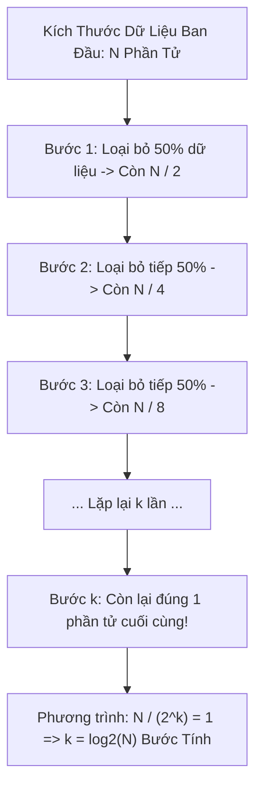

# 🟢 O(log n) - Logarithmic Time (Thời Gian Logarit)

> [[00 - Master Dashboard|🧭 Dashboard]] / [[Master MOC|🗺️ Master MOC]] / [[Big-O Notation - MOC|⚡ Big-O MOC]]

---

## 1. Bản Đồ Khái Niệm (Mermaid DAG)



---

## 2. Chân Lý Vô Điều Kiện (First Principles)

> [!NOTE] Tiên Đề Thu Hẹp Không Gian Theo Cấp Số Nhân
> **Độ phức tạp $O(\log n)$ xuất hiện khi không gian bài toán bị thu hẹp lại theo một tỷ lệ cố định (thường là $1/2$) sau mỗi bước tính cơ bản:**
> $$ \frac{N}{2^k} = 1 \implies 2^k = N \implies k = \log_2 N $$
>
> 1. **Tốc độ tăng trưởng cực kỳ phẳng:** Khi dữ liệu tăng từ $1.000$ lên $1.000.000$ (gấp $1.000$ lần), số bước tính chỉ tăng từ khoảng $10$ lên $20$ bước (chỉ tăng gấp đôi).
> 2. **Điều kiện tiên quyết:** Để đạt được $O(\log n)$, hệ thống bắt buộc phải có thông tin cấu trúc tiên nghiệm (như dữ liệu đã được sắp xếp trong [[Binary Search]] hoặc cây phân cấp cân bằng trong [[Binary Search Tree (BST)|Red-Black Tree]] / B+Tree).

---

## 3. Trực Giác Motivated Discovery

> [!TIP] Động Lực 3Blue1Brown: Xé Đôi Cuốn Từ Điển 1.000 Trang
> Bạn cần tìm từ *"Zebra"* trong cuốn từ điển dày 1.000 trang:
>
> - **Cách tuyến tính $O(n)$:** Lật từng trang từ trang 1 đến trang 1.000. Bạn phải lật đúng 1.000 lần.
> - **Cách logarit $O(\log n)$:** Lật trang 500 ở giữa. Từ *"Zebra"* nằm ở nửa sau $\to$ Xé bỏ vứt ngay 500 trang đầu! Tiếp tục mở trang 750 $\to$ vứt bỏ tiếp 250 trang...
>
> Bạn chỉ cần tối đa **10 lần lật sách** ($2^{10} = 1024$) là tìm ra chính xác trang sách chứa từ cần tìm.

---

## 4. Bảng So Sánh Số Bước Tính Thực Tế

| Quy Mô Dữ Liệu ($N$) | Tuyến Tính $O(n)$ | Logarit $O(\log_2 n)$ | Mức Độ Chênh Lệch |
| :--- | :--- | :--- | :--- |
| **$N = 100$** | 100 bước | $\approx 7$ bước | Nhanh hơn 14 lần |
| **$N = 10.000$** | 10.000 bước | $\approx 14$ bước | Nhanh hơn 700 lần |
| **$N = 1.000.000$ (1 Triệu)** | 1.000.000 bước | $\approx 20$ bước | Nhanh hơn 50.000 lần |
| **$N = 1.000.000.000$ (1 Tỷ)** | 1.000.000.000 bước | $\approx 30$ bước | Nhanh hơn 33.000.000 lần |

---

## 5. Minh Họa Mã Nguồn (TypeScript)

```typescript
// 1. Vòng lặp Logarit cơ bản: Bước nhảy nhân đôi (hoặc chia đôi)
export function countLogSteps(n: number): number {
  let steps = 0;
  let current = n;

  while (current > 1) {
    current = Math.floor(current / 2); // Chia đôi sau mỗi bước
    steps++;
  }

  return steps; // Với n = 1024 -> trả về 10
}

// 2. Tìm kiếm nhị phân O(log n) trên mảng đã sắp xếp
export function binarySearchLog(arr: number[], target: number): number {
  let low = 0;
  let high = arr.length - 1;

  while (low <= high) {
    const mid = low + Math.floor((high - low) / 2);
    if (arr[mid] === target) return mid;
    if (arr[mid] < target) low = mid + 1;
    else high = mid - 1;
  }

  return -1;
}
```

---

## 6. Góc Nhìn Kiến Trúc Sư Hệ Thống (Architect's View)

- **Cấu trúc chỉ mục cơ sở dữ liệu:** Mọi hệ thống Database hiện đại (PostgreSQL, MySQL InnoDB) đều tổ chức chỉ mục dạng [[Database-knowledge/01 - Core Concepts/Index|B+Tree]] với độ cao cây chỉ từ 3 đến 4 tầng, cho phép tìm kiếm bất kỳ bản ghi nào trong hàng chục triệu dòng dữ liệu chỉ với tối đa 3-4 lần đọc đĩa (I/O).
- **Chiến lược đầu tư sắp xếp:** Nếu dữ liệu cần tra cứu hàng triệu lần, ta chấp nhận tốn chi phí sắp xếp 1 lần $O(n \log n)$ để đổi lấy toàn bộ các lượt tra cứu về sau đạt tốc độ ánh sáng $O(\log n)$.

---

## 🧠 Thẻ Ghi Nhớ Nhanh (Spaced Repetition)

Bản chất toán học khiến $O(\log n)$ có số bước tăng cực kỳ chậm là gì? #card
?
Vì số bước tính $k$ tỷ lệ nghịch với số mũ lũy thừa của 2 ($2^k = N \implies k = \log_2 N$). Khi kích thước dữ liệu $N$ tăng gấp đôi, số bước tính toán chỉ tăng thêm đúng 1 đơn vị.

Dấu hiệu nhận biết thuật toán đạt độ phức tạp $O(\log n)$ trong mã nguồn là gì? #card
?
Biến điều khiển vòng lặp được nhân hoặc chia theo cấp số nhân ở mỗi bước (`i *= 2` hoặc `i /= 2`), hoặc không gian bài toán bị phân chia thành các phần độc lập và loại bỏ một tỷ lệ cố định sau mỗi bước lặp (như trong Binary Search).
