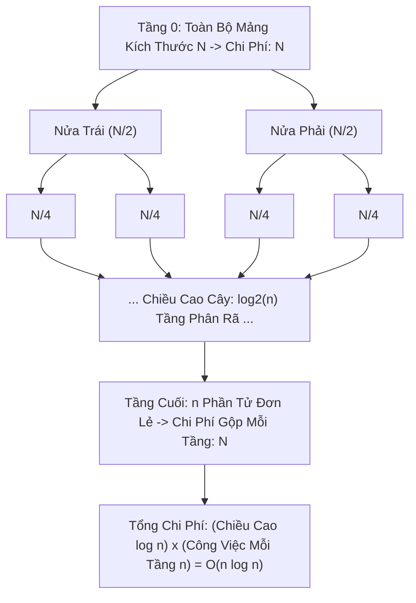

# 🟠 O(n log n) - Linearithmic Time (Thời Gian Tựa Tuyến Tính)

> [[00 - Master Dashboard|🧭 Dashboard]] / [[Master MOC|🗺️ Master MOC]] / [[Big-O Notation - MOC|⚡ Big-O MOC]]

---

## 1. Bản Đồ Khái Niệm (Mermaid DAG)



---

## 2. Chân Lý Vô Điều Kiện (First Principles)

> [!NOTE] Tiên Đề Giới Hạn Dưới Của Thuật Toán Sắp Xếp So Sánh
> **Không một thuật toán sắp xếp nào dựa trên phép so sánh cặp phần tử có thể vượt qua giới hạn dưới toán học $\Omega(n \log n)$ trong trường hợp xấu nhất:**
>
> 1. **Chứng minh qua Cây Quyết Định (Decision Tree):**
>    - Có $n!$ hoán vị có thể có của một mảng gồm $n$ phần tử.
>    - Mỗi phép so sánh nhị phân chỉ chia đôi số lượng hoán vị còn lại.
>    - Chiều cao tối thiểu của cây quyết định là:
>      $$ h \ge \log_2(n!) \approx n \log_2 n - n \log_2 e = \Omega(n \log n) \quad (\text{Theo xấp xỉ Stirling}) $$
> 2. **Tiêu chuẩn vàng của sắp xếp:** $O(n \log n)$ là tốc độ tối ưu tuyệt đối mà các thuật toán như [[Merge Sort]], [[Quick Sort]], và [[Binary Heap & Priority Queue#Heap Sort|Heap Sort]] đạt được.

---

## 3. Trực Giác Motivated Discovery

> [!TIP] Động Lực 3Blue1Brown: Giải Đấu Loại Trực Tiếp 64 Đội Bóng
> Bạn tổ chức một giải bóng đá thế giới có 64 đội tham gia:
>
> - **Chiều sâu logarit ($\log_2 64 = 6$ vòng đấu):** Sau mỗi vòng (Vòng bảng, 1/16, Tứ kết, Bán kết, Chung kết), số đội bóng bị loại đúng một nửa.
> - **Chi phí tuyến tính $O(n)$ ở mỗi vòng:** Ở mỗi vòng đấu, tất cả các cầu thủ còn lại đều phải bước ra sân thi đấu và chạy hết sức.
>
> Tổng năng lượng tiêu hao của toàn bộ giải đấu bằng: **(Số vòng đấu $= \log_2 N$) $\times$ (Năng lượng thi đấu của các đội $= N$) $= N \log_2 N$**.

---

## 4. Dấu Hiệu Nhận Biết & Thuật Toán Điển Hình

| Thuật Toán | Best Case | Average Case | Worst Case | Không Gian (Space) |
| :--- | :--- | :--- | :--- | :--- |
| [[Merge Sort\|Sắp xếp Trộn]] | $O(n \log n)$ | $O(n \log n)$ | $O(n \log n)$ | $O(n)$ (Mảng phụ) |
| [[Quick Sort\|Sắp xếp Nhanh]] | $O(n \log n)$ | $O(n \log n)$ | $O(n^2)$ (Pivot tồi) | $O(\log n)$ (Call stack) |
| [[Binary Heap & Priority Queue\|Heap Sort]] | $O(n \log n)$ | $O(n \log n)$ | $O(n \log n)$ | $O(1)$ In-place |

---

## 5. Minh Họa Mã Nguồn (TypeScript)

Mô phỏng quy luật lặp $O(n \log n)$ và thuật toán sắp xếp trộn cơ bản:

```typescript
// 1. Cấu trúc lặp O(n log n): Vòng lặp ngoài duyệt n, vòng trong chia đôi log n
export function countNLogNSteps(n: number): number {
  let operations = 0;

  for (let i = 0; i < n; i++) {
    // Vòng lặp trong chạy log2(n) lần
    for (let j = 1; j < n; j *= 2) {
      operations++;
    }
  }

  return operations; // Với n = 1024 -> operations = 1024 * 10 = 10,240
}

// 2. Minh họa Merge Sort đạt đúng O(n log n)
export function mergeSort(arr: number[]): number[] {
  if (arr.length <= 1) return arr;

  const mid = Math.floor(arr.length / 2);
  const left = mergeSort(arr.slice(0, mid)); // Chia đôi: log n tầng
  const right = mergeSort(arr.slice(mid));

  return merge(left, right); // Gộp: tốn đúng O(n) ở mỗi tầng
}

function merge(left: number[], right: number[]): number[] {
  const result: number[] = [];
  let i = 0, j = 0;

  while (i < left.length && j < right.length) {
    if (left[i] <= right[j]) result.push(left[i++]);
    else result.push(right[j++]);
  }

  return result.concat(left.slice(i)).concat(right.slice(j));
}
```

---

## 6. Góc Nhìn Kiến Trúc Sư Hệ Thống (Architect's View)

- **Ngưỡng tiệm cận an toàn cho tập dữ liệu lớn:** $O(n \log n)$ vẫn là độ phức tạp rất an toàn. Với $1$ triệu bản ghi, $n \log_2 n \approx 2 \times 10^7$ phép tính, CPU hiện đại hoàn tất chỉ trong khoảng $20 - 50$ mili-giây.
- **Quy tắc đầu tư chi phí một lần:** Trong thiết kế kiến trúc phần mềm, ta sẵn sàng trả chi phí $O(n \log n)$ một lần duy nhất lúc khởi tạo dữ liệu để sắp xếp hoặc xây dựng cây chỉ mục (B+Tree Index), sau đó biến toàn bộ các truy vấn tìm kiếm về sau thành $O(\log n)$ bằng [[Binary Search]].

---

## 🧠 Thẻ Ghi Nhớ Nhanh (Spaced Repetition)

Tại sao không thể tồn tại thuật toán sắp xếp dựa trên phép so sánh hai phần tử chạy nhanh hơn $O(n \log n)$? #card
?
Vì cây quyết định (Decision Tree) phân nhánh nhị phân cần tối thiểu $n!$ nút lá để đại diện cho toàn bộ các hoán vị có thể có của mảng. Chiều cao của cây quyết định bắt buộc phải lớn hơn hoặc bằng $\log_2(n!) \approx n \log_2 n - n \log_2 e = \Omega(n \log n)$.

Mô hình "Chia để trị" (Divide and Conquer) sinh ra độ phức tạp $O(n \log n)$ như thế nào? #card
?
Cây đệ quy chia đôi mảng có tổng cộng $\log_2 n$ tầng chiều sâu. Tại mỗi tầng của cây, tổng số thao tác gộp (merge) hoặc phân hoạch (partition) trên toàn bộ các mảng con đúng bằng $O(n)$. Nhân hai đại lượng này lại ta có độ phức tạp thời gian tổng thể là $O(n \cdot \log n)$.
