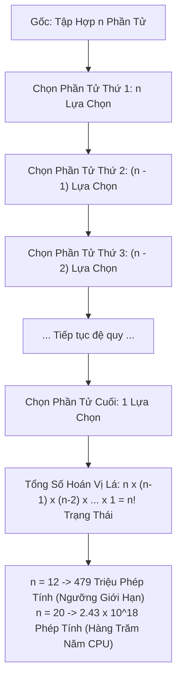

# ☢️ O(n!) - Factorial Time (Thời Gian Giai Thừa)

> [[00 - Master Dashboard|🧭 Dashboard]] / [[Master MOC|🗺️ Master MOC]] / [[Big-O Notation - MOC|⚡ Big-O MOC]]

---

## 1. Bản Đồ Khái Niệm (Mermaid DAG)



---

## 2. Chân Lý Vô Điều Kiện (First Principles)

> [!NOTE] Tiên Đề Hoán Vị Toàn Cục & Xấp Xỉ Stirling
> **Độ phức tạp $O(n!)$ xuất hiện khi bài toán yêu cầu khảo sát toàn bộ $n!$ hoán vị có thể có của $n$ phần tử phân biệt:**
> $$ n! = n \times (n - 1) \times (n - 2) \times \dots \times 1 $$
>
> 1. **Tốc độ bùng nổ vượt mặt hàm mũ:** Theo xấp xỉ Stirling, $n! \approx \sqrt{2\pi n} \left(\frac{n}{e}\right)^n \gg 2^n$. Tốc độ tăng trưởng của $n!$ áp đảo mọi hàm toán học phổ thông khác.
> 2. **Bức tường bất khả thi:** 
>    - $10! = 3.628.800$ (Vài mili-giây).
>    - $15! \approx 1.3 \times 10^{12}$ (Vài giờ trên CPU đơn nhân).
>    - $20! \approx 2.43 \times 10^{18}$ (Khoảng 77 năm nếu tính 1 tỷ phép tính/giây).
>    - $100! \approx 9.33 \times 10^{157}$ (Vượt xa tổng số nguyên tử trong toàn bộ vũ trụ quan sát được $\approx 10^{80}$).

---

## 3. Trực Giác Motivated Discovery

> [!TIP] Động Lực 3Blue1Brown: Xếp Thứ Tự Ngồi Trên Xe Buýt
> Bạn có một chiếc xe buýt gồm $n$ chỗ ngồi cho đúng $n$ hành khách:
>
> - Hành khách thứ nhất bước lên xe: Có $n$ ghế trống để lựa chọn.
> - Hành khách thứ hai bước lên: Chỉ còn $n - 1$ ghế trống.
> - Hành khách thứ ba: Còn $n - 2$ ghế trống...
> - Hành khách cuối cùng: Chỉ còn đúng 1 chiếc ghế duy nhất.
>
> Tổng số cách sắp xếp thứ tự chỗ ngồi cho toàn bộ xe buýt là: $n \times (n-1) \times (n-2) \times \dots \times 1 = n!$ kịch bản! Chỉ cần $15$ người, số cách xếp ghế đã lên tới hơn $1.300$ tỷ cách!

---

## 4. Dấu Hiệu Nhận Biết & Bài Toán Điển Hình

| Bài Toán | Đặc Điểm Nhận Diện | Quy Mô Giới Hạn |
| :--- | :--- | :--- |
| **Permutations (Hoán vị)** | Liệt kê mọi thứ tự sắp xếp của $n$ phần tử | $n \le 10$ |
| **Traveling Salesperson Problem (TSP)** | Thử mọi hành trình qua $n$ thành phố | $n \le 12$ với Brute-force |
| **N-Queens Brute Force** | Đặt $n$ quân hậu vào mọi vị trí hoán vị cột | $n \le 12$ |

---

## 5. Minh Họa Mã Nguồn (TypeScript)

Sinh toàn bộ $n!$ hoán vị của một mảng:

```typescript
// O(n!) Time: Thuật toán sinh hoán vị bằng Backtracking
export function permute<T>(nums: T[]): T[][] {
  const result: T[][] = [];
  const used = new Array(nums.length).fill(false);

  function backtrack(current: T[]) {
    // Khi đã chọn đủ n phần tử -> Thu được 1 hoán vị
    if (current.length === nums.length) {
      result.push([...current]);
      return;
    }

    for (let i = 0; i < nums.length; i++) {
      if (used[i]) continue; // Bỏ qua phần tử đã chọn

      used[i] = true;
      current.push(nums[i]);

      backtrack(current); // Đệ quy cho n - 1 phần tử còn lại

      // Quay lui (Backtrack)
      current.pop();
      used[i] = false;
    }
  }

  backtrack([]);
  return result; // Mảng chứa đúng n! phần tử
}
```

---

## 6. Chiến Lược Giải Cứu Của Kiến Trúc Sư Hệ Thống

1. **Quy hoạch động trạng thái (Bitmask DP):** Đưa bài toán TSP từ $O(n!)$ xuống $O(n^2 \cdot 2^n)$ (thuật toán Held-Karp), giải được tới $n \approx 20$.
2. **Nhánh cận & Tỉa nhánh (Branch and Bound / Pruning):** Dừng ngay nhánh đệ quy khi phát hiện vi phạm điều kiện ràng buộc thay vì duyệt trâu toàn bộ $n!$ trạng thái.
3. **Thuật toán xấp xỉ & Heuristic (Approximation Algorithms):** Trong thực tế công nghiệp (tối ưu hóa lộ trình giao vận Grab, Shopee, FedEx với hàng trăm điểm giao), kỹ sư chấp nhận lời giải gần tối ưu bằng thuật toán Di truyền (Genetic Algorithm), Luyện kim nhân tạo (Simulated Annealing) hoặc Tham lam (Greedy) trong thời gian thực.

---

## 🧠 Thẻ Ghi Nhớ Nhanh (Spaced Repetition)

Khi nào một bài toán xuất hiện độ phức tạp $O(n!)$? #card
?
Khi bài toán bắt buộc phải tạo ra, duyệt qua hoặc kiểm tra **tất cả các hoán vị (permutations)** của $n$ phần tử phân biệt (như bài toán TSP giải bằng Brute Force).

Tại sao bài toán Người giao hàng (TSP) trong thực tế doanh nghiệp với 100 điểm giao không bao giờ được giải bằng thuật toán chính xác? #card
?
Vì $100! \approx 9.33 \times 10^{157}$, siêu máy tính mạnh nhất cũng không thể giải xong trong thời gian bằng tuổi thọ vũ trụ. Các kỹ sư bắt buộc phải dùng thuật toán Heuristic hoặc Thuật toán xấp xỉ (Approximation) để tìm đường đi gần tối ưu trong vài mili-giây.
