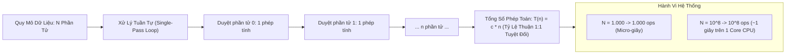

# 🟡 O(n) - Linear Time (Thời Gian Tuyến Tính)

> [[00 - Master Dashboard|🧭 Dashboard]] / [[Master MOC|🗺️ Master MOC]] / [[Big-O Notation - MOC|⚡ Big-O MOC]]

---

## 1. Bản Đồ Khái Niệm (Mermaid DAG)



---

## 2. Chân Lý Vô Điều Kiện (First Principles)

> [!NOTE] Tiên Đề Giới Hạn Quét Tuần Tự (Single-Pass Limit)
> **Độ phức tạp $O(n)$ khẳng định thời gian thực thi tăng trưởng tỷ lệ thuận bậc một với quy mô dữ liệu đầu vào $n$:**
> $$ \exists c > 0, n_0 > 0 : T(n) \le c \cdot n \quad \forall n \ge n_0 $$
>
> 1. **Giới hạn dưới của việc đọc dữ liệu:** Mọi bài toán bắt buộc phải khảo sát từng phần tử ít nhất một lần (như tính tổng, tìm phần tử lớn nhất trong mảng lộn xộn) đều có chặn dưới lý thuyết là **$\Omega(n)$**. Không thể làm nhanh hơn $O(n)$ nếu không có cấu trúc dữ liệu phụ trợ.
> 2. **Hiệu năng phần cứng (Hardware Prefetching):** Khi duyệt mảng tuyến tính trên bộ nhớ RAM liên tục, CPU Cache Line nạp trước các khối 64 bytes dữ liệu vào L1/L2 Cache $\to$ Thuật toán $O(n)$ trên Mảng có thông lượng dữ liệu (Throughput) cao hơn rất nhiều so với $O(n)$ trên [[Linked List]].

---

## 3. Trực Giác Motivated Discovery

> [!TIP] Động Lực 3Blue1Brown: Đếm Hạt Đậu Trong Chiếc Lọ Thủy Tinh
> Bạn có một lọ thủy tinh chứa đầy hạt đậu:
>
> Để biết chính xác có bao nhiêu hạt đậu trong lọ, bạn không thể dùng mẹo lật đôi hay bấm nút hằng số. Cách duy nhất là nhặt từng hạt một ra ngoài và đếm: *"Một, hai, ba..."*.
>
> Nếu lọ có 100 hạt, bạn nhặt 100 lần. Nếu chiếc lọ khổng lồ chứa 100.000 hạt, bạn bắt buộc phải nhặt 100.000 lần. Thời gian đếm tăng chính xác theo tỷ lệ $1:1$ với số lượng hạt đậu.

---

## 4. Dấu Hiệu Nhận Biết & Thao Tác Điển Hình

| Cấu Trúc / Thuật Toán | Thao Tác $O(n)$ | Nguyên Nhân Bản Chất |
| :--- | :--- | :--- |
| [[Array & Dynamic Array\|Mảng]] | Chèn / Xóa ở đầu hoặc giữa mảng | Phải dịch chuyển $n - i$ phần tử còn lại |
| [[Linked List\|Danh sách liên kết]] | Tìm kiếm giá trị hoặc lấy phần tử thứ $k$ | Bắt buộc duyệt con trỏ tuần tự từ `head` |
| [[Linear Search\|Tìm kiếm tuyến tính]] | Quét mảng chưa sắp xếp | Không có thông tin tiên nghiệm |
| [[Two Pointers Pattern\|Hai con trỏ]] | Thu hẹp 2 đầu mảng đã sắp xếp | Mỗi con trỏ chỉ đi qua mỗi phần tử đúng 1 lần |
| [[Sliding Window Pattern\|Cửa sổ trượt]] | Trượt cửa sổ kích thước động | Mỗi phần tử được nạp và xả tối đa 1 lần |

---

## 5. Minh Họa Mã Nguồn (TypeScript)

```typescript
// 1. O(n) Tuyến tính: Tìm giá trị lớn nhất trong mảng chưa sắp xếp
export function findMax(nums: number[]): number {
  if (nums.length === 0) throw new Error("Mảng rỗng");

  let maxVal = nums[0];
  // Duyệt qua toàn bộ n phần tử: đúng n bước tính
  for (let i = 1; i < nums.length; i++) {
    if (nums[i] > maxVal) {
      maxVal = nums[i];
    }
  }

  return maxVal;
}

// 2. O(n) Tuyến tính: Tính tổng toàn bộ phần tử
export function sumArray(nums: number[]): number {
  let total = 0;
  for (const x of nums) {
    total += x;
  }
  return total;
}
```

---

## 6. Góc Nhìn Kiến Trúc Sư Hệ Thống (Architect's View)

- **Mức độ an toàn:** $O(n)$ là ngưỡng chuẩn mực chấp nhận được cho các tác vụ xử lý hàng loạt (Batch Processing, Data Pipelines, ETL).
- **Điểm nghẽn trong Hệ thống Real-time:** Trong các dịch vụ Web có hàng chục nghìn request/giây, một truy vấn quét $O(n)$ (như Full Table Scan trong SQL) trên bảng dữ liệu 10 triệu dòng sẽ làm tê liệt toàn bộ CPU máy chủ cơ sở dữ liệu.
- **Giải pháp chuyển hóa:** Luôn tạo [[Database-knowledge/01 - Core Concepts/Index|B+Tree Index]] trên các trường dữ liệu tìm kiếm thường xuyên để ép thời gian từ $O(n)$ xuống $O(\log n)$.

---

## 🧠 Thẻ Ghi Nhớ Nhanh (Spaced Repetition)

Khi nào một bài toán có giới hạn dưới lý thuyết không thể thấp hơn $\Omega(n)$? #card
?
Khi bài toán bắt buộc phải khảo sát hoặc đọc qua toàn bộ mọi phần tử đầu vào ít nhất một lần để đưa ra câu trả lời (như tìm giá trị lớn nhất, tính tổng, kiểm tra tính đối xứng của dữ liệu chưa có chỉ mục).

Tại sao duyệt mảng $O(n)$ trong thực tế thường chạy nhanh hơn gấp nhiều lần duyệt Linked List $O(n)$? #card
?
Vì các phần tử mảng nằm liên tiếp trong bộ nhớ RAM, kích hoạt cơ chế Spatial Locality và Hardware Prefetching của CPU nạp sẵn cả khối dữ liệu vào L1/L2 Cache, giảm thiểu Cache Miss. Trong khi đó, các node của Linked List nằm rải rác trên Heap, gây ra Cache Miss liên tục ở mỗi bước nhảy con trỏ.
