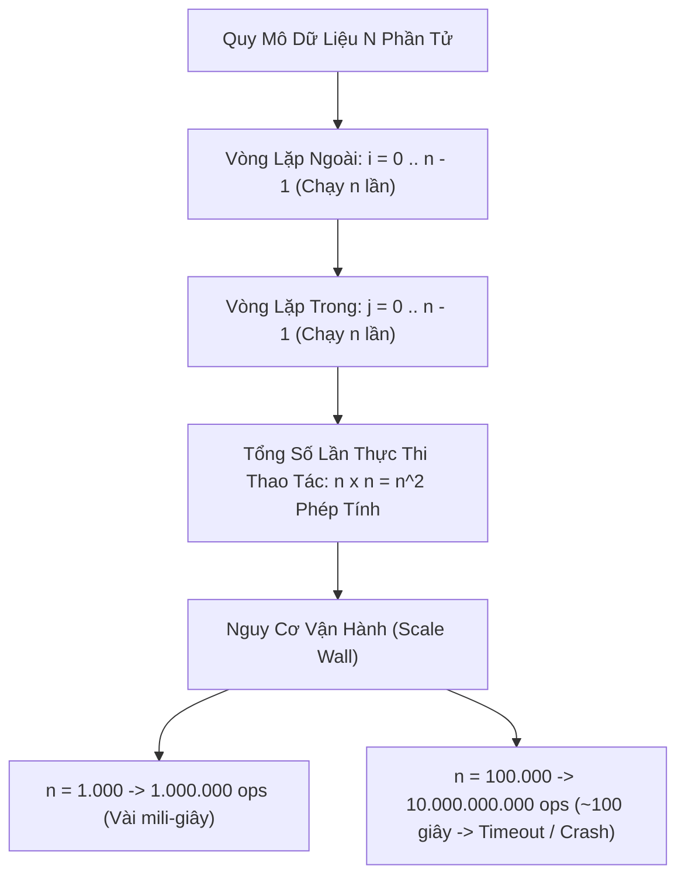

# 🔴 O(n^2) - Quadratic Time (Thời Gian Bậc Hai)

> [[00 - Master Dashboard|🧭 Dashboard]] / [[Master MOC|🗺️ Master MOC]] / [[Big-O Notation - MOC|⚡ Big-O MOC]]

---

## 1. Bản Đồ Khái Niệm (Mermaid DAG)



---

## 2. Chân Lý Vô Điều Kiện (First Principles)

> [!NOTE] Tiên Đề Phân Rã Ma Trận Cặp Đôi (Cartesian Product) & Tổng Gauss
> **Độ phức tạp $O(n^2)$ xuất hiện khi thuật toán phải duyệt qua toàn bộ không gian tích Descartes $N \times N$ hoặc tất cả các cặp đôi không có thứ tự:**
>
> 1. **Công thức cấp số cộng Gauss:** Dù vòng lặp trong chỉ chạy từ $i+1$ đến $n-1$, tổng số bước vẫn là bậc hai:
>    $$ \sum_{i=1}^{n-1} (n - i) = \frac{n(n - 1)}{2} = \frac{n^2 - n}{2} \implies \Theta(n^2) $$
> 2. **Bức tường mở rộng (Scalability Wall):** Khi $N$ tăng gấp 10 lần, thời gian xử lý tăng vọt gấp **100 lần**. Với $N \ge 10^5$, thuật toán $O(n^2)$ chắc chắn làm sập hoặc làm nghẽn tiến trình CPU trong môi trường Production.

---

## 3. Trực Giác Motivated Discovery

> [!TIP] Động Lực 3Blue1Brown: Buổi Tiệc Kết Bạn Bắt Tay Chéo
> Bạn tổ chức một buổi tiệc kết bạn (Speed Dating) cho 100 người:
>
> Ban tổ chức yêu cầu: **Mỗi người trong phòng phải lần lượt đứng lên bắt tay và làm quen với tất cả những người còn lại**.
>
> - Người thứ nhất bắt tay với 99 người.
> - Người thứ hai bắt tay với 98 người còn lại...
>
> Tổng số lượt bắt tay trong hội trường là: $\frac{100 \times 99}{2} = 4.950$ lượt! Nếu hội trường có $10.000$ người, số lượt bắt tay tăng vọt lên gần **$50.000.000$ lượt**, làm mọi người kiệt sức trước khi kịp nói chuyện.

---

## 4. Dấu Hiệu Nhận Biết & Thuật Toán Điển Hình

| Cấu Trúc / Thuật Toán | Trường Hợp $O(n^2)$ | Nguyên Nhân Bản Chất |
| :--- | :--- | :--- |
| [[Bubble Sort]], [[Selection Sort]], [[Insertion Sort]] | Cả 3 trường hợp xấu nhất | Hai vòng lặp so sánh và đổi chỗ từng cặp |
| [[Quick Sort]] | Worst Case (Mảng đã sắp xếp + Pivot xấu) | Cây phân hoạch bị lệch thành danh sách tuyến tính $n$ tầng |
| Brute Force Two Sum | Duyệt mọi cặp $(i, j)$ | Thử từng cặp để kiểm tra tổng bằng Target |
| [[Graph Representations & Traversal\|Ma trận kề Đồ thị]] | Khởi tạo ma trận $V \times V$ | Cần cấp phát và duyệt bảng lưới 2 chiều |

---

## 5. Minh Họa Mã Nguồn (TypeScript)

```typescript
// 1. O(n^2) Điển hình: Hai vòng lặp lồng nhau duyệt mọi cặp phần tử
export function hasDuplicatePairwise(nums: number[]): boolean {
  const n = nums.length;
  // Tổng số lần chạy: n * (n - 1) / 2 = O(n^2)
  for (let i = 0; i < n; i++) {
    for (let j = i + 1; j < n; j++) {
      if (nums[i] === nums[j]) {
        return true; // Tìm thấy cặp trùng nhau
      }
    }
  }
  return false;
}

// 2. O(n^2) Ma trận: Nhân ma trận hoặc in bảng cửu chương n x n
export function generateMultiplicationTable(n: number): number[][] {
  const table: number[][] = [];
  for (let i = 1; i <= n; i++) {
    const row: number[] = [];
    for (let j = 1; j <= n; j++) {
      row.push(i * j);
    }
    table.push(row);
  }
  return table;
}
```

---

## 6. Chiến Lược Giải Cứu Của Kiến Trúc Sư Hệ Thống

1. **Đánh đổi RAM lấy Tốc độ ($O(n^2) \to O(n)$):**
   - Sử dụng cấu trúc [[Hash Table & HashSet|Hash Table]] ($O(n)$ Space) để nhớ các phần tử đã duyệt qua. Thao tác kiểm tra tồn tại từ $O(n)$ đưa về $O(1)$ $\to$ Tổng thời gian còn đúng $O(n)$ (ví dụ: [[Two Pointers Pattern]] hoặc Two Sum tối ưu).
2. **Sắp xếp trước rồi dùng Two Pointers ($O(n^2) \to O(n \log n)$):**
   - Sắp xếp mảng mất $O(n \log n)$, sau đó dùng kỹ thuật [[Two Pointers Pattern|Hai con trỏ]] duyệt mất $O(n)$. Tổng chi phí chỉ là $O(n \log n)$ mà giữ được $O(1)$ Space.

---

## 🧠 Thẻ Ghi Nhớ Nhanh (Spaced Repetition)

Tại sao vòng lặp lồng `for (let i = 0; i < n; i++) for (let j = i + 1; j < n; j++)` vẫn thuộc lớp $O(n^2)$ dù số bước lặp giảm dần? #card
?
Vì tổng số bước lặp bằng tổng dãy số tự nhiên Gauss: $\sum_{i=1}^{n-1} (n - i) = \frac{n(n - 1)}{2} = \frac{1}{2}n^2 - \frac{1}{2}n$. Theo quy tắc phân tích tiệm cận (Asymptotic Analysis), ta bỏ qua hằng số $\frac{1}{2}$ và số hạng bậc thấp, độ phức tạp tiệm cận chính xác là $\Theta(n^2)$.

Hai chiến lược kinh điển nhất để tối ưu thuật toán $O(n^2)$ xuống là gì? #card
?
1. Dùng **Hash Table** để tra cứu trong $O(1)$, đưa thời gian từ $O(n^2)$ xuống $O(n)$ (đánh đổi $O(n)$ Space).
2. **Sắp xếp mảng** trong $O(n \log n)$ rồi áp dụng kỹ thuật **Two Pointers** trong $O(n)$, đưa thời gian về $O(n \log n)$ mà bảo toàn $O(1)$ Space.
