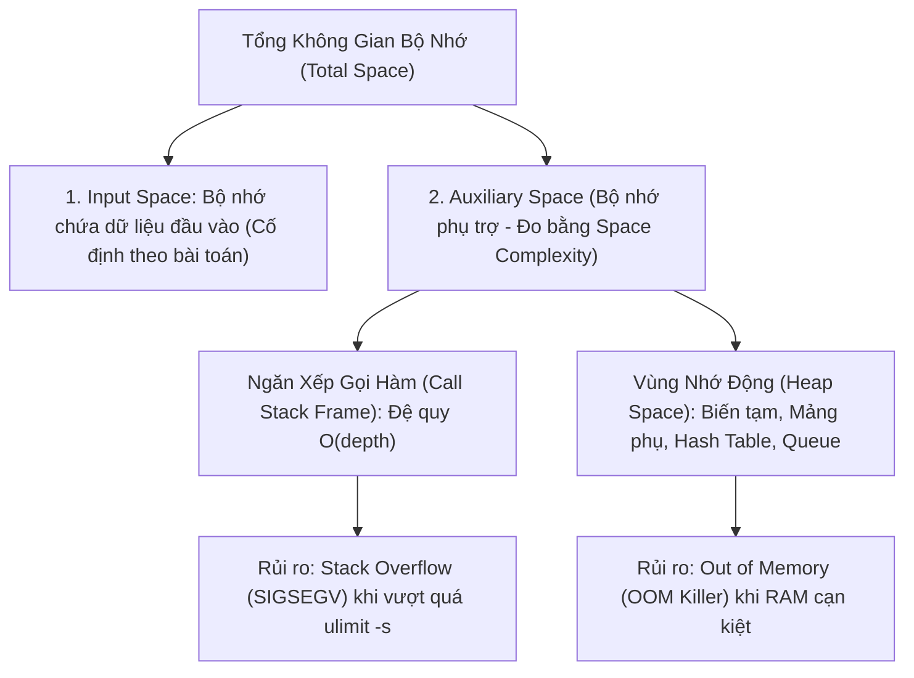

# 💾 Độ Phức Tạp Không Gian (Space Complexity)

> [[00 - Master Dashboard|🧭 Dashboard]] / [[Master MOC|🗺️ Master MOC]] / [[Big-O Notation - MOC|⚡ Big-O MOC]]

---

## 1. Bản Đồ Khái Niệm (Mermaid DAG)



---

## 2. Chân Lý Vô Điều Kiện (First Principles)

> [!NOTE] Tiên Đề Bộ Nhớ Phụ Trợ (Auxiliary Space) & Giới Hạn Phần Cứng
> **Space Complexity của một thuật toán chỉ đo lường lượng bộ nhớ RAM phụ trợ phát sinh trong quá trình chạy, KHÔNG tính kích thước của tập dữ liệu đầu vào:**
> $$ \text{Total Space}(n) = \text{Input Space}(n) + \text{Auxiliary Space}(n) $$
>
> 1. **Thuật toán tại chỗ (In-place Algorithm):** Khi một thuật toán chỉ sử dụng một số lượng biến cố định ($O(1)$ Auxiliary Space) để biến đổi trực tiếp trên mảng đầu vào (như [[Quick Sort]], [[Two Pointers Pattern]]), nó đạt mức an toàn bộ nhớ cao nhất.
> 2. **Hậu quả vận hành:** Bộ nhớ RAM là hữu hạn. Khi tiến trình sử dụng bộ nhớ vượt quá ngưỡng cgroup hoặc RAM vật lý, nhân Linux sẽ kích hoạt ****Linux OOM Killer**** gửi tín hiệu `SIGKILL` tiêu diệt tiến trình ngay lập tức.

---

## 3. Trực Giác Motivated Discovery

> [!TIP] Động Lực 3Blue1Brown: Xưởng Mộc Của Bác Thợ
> Bạn có một khúc gỗ lim nặng 100kg cần đẽo thành chiếc ghế:
>
> - **Input Space:** Khúc gỗ 100kg là vật liệu có sẵn mang đến xưởng (dữ liệu đầu vào). Dù bạn có làm gì thì khúc gỗ đó vẫn ở đó.
> - **Auxiliary Space (Space Complexity):** Là diện tích mặt bàn và số lượng xô chậu bác thợ phải kê thêm trong xưởng để đựng vỏ bào, mạt cưa, keo dán trong lúc đẽo ghế.
>   - Bác thợ khéo tay đẽo trực tiếp trên khúc gỗ, không kê thêm bàn nào $\to O(1)$ In-place!
>   - Bác thợ khác phải kê thêm 10 chiếc bàn phụ bằng đúng kích thước khúc gỗ để dán từng miếng ghép $\to O(n)$ Space!

---

## 4. Các Cấp Độ Space Complexity Thường Gặp

| Cấp Độ | Tên Gọi & Hành Vi | Ví Dụ Điển Hình |
| :--- | :--- | :--- |
| [[O(1) - Constant Time\|$O(1)$ Space]] | **Tại chỗ (In-place):** Bộ nhớ phụ cố định, chỉ dùng vài biến con trỏ. | [[Binary Search]] vòng lặp, [[Two Pointers Pattern]]. |
| [[O(log n) - Logarithmic Time\|$O(\log n)$ Space]] | **Chi phí Call Stack:** Mỗi lần chia đôi dữ liệu lưu 1 stack frame. | Đệ quy [[Binary Search]], đệ quy [[Quick Sort]]. |
| [[O(n) - Linear Time\|$O(n)$ Space]] | **Cấp phát cấu trúc dữ liệu mới theo $N$:** Mảng phụ, bảng băm. | [[Merge Sort]] (mảng phụ merge), [[Hash Table & HashSet]]. |
| [[O(n^2) - Quadratic Time\|$O(n^2)$ Space]] | **Bảng lưới $N \times N$:** Ma trận hai chiều. | [[Graph Representations & Traversal\|Ma trận kề (Adjacency Matrix)]] $V \times V$. |

---

## 5. Minh Họa Mã Nguồn (TypeScript)

So sánh giải thuật đảo mảng $O(1)$ Space (In-place) vs $O(n)$ Space (Cấp phát mảng mới):

```typescript
// 1. O(1) Space: Đảo mảng tại chỗ bằng Two Pointers (Không tốn thêm RAM)
export function reverseInPlace(nums: number[]): void {
  let left = 0;
  let right = nums.length - 1;

  while (left < right) {
    const temp = nums[left];
    nums[left] = nums[right];
    nums[right] = temp;
    left++;
    right--;
  }
}

// 2. O(n) Space: Tạo mảng mới sao chép toàn bộ phần tử
export function reverseWithExtraMemory(nums: number[]): number[] {
  const result: number[] = new Array(nums.length); // Cấp phát thêm n ô nhớ trên Heap!

  for (let i = 0; i < nums.length; i++) {
    result[i] = nums[nums.length - 1 - i];
  }

  return result;
}
```

---

## 6. Lời Khuyên Của Kiến Trúc Sư Hệ Thống (Architect's Note)

1. **Cẩn trọng với Đệ Quy (Recursion Stack):** Code đệ quy thanh lịch và ngắn gọn, nhưng mỗi tầng đệ quy tốn một Stack Frame trong RAM. Nếu số tầng đệ quy lên tới hàng chục nghìn, chương trình sẽ crash ngay lập tức vì `Stack Overflow`. Luôn cân nhắc chuyển sang dạng vòng lặp (Iterative) khi làm việc với dữ liệu lớn.
2. **Cơ chế ngôn ngữ lập trình (Tail Call Optimization):** Một số ngôn ngữ như Swift hay C++ hỗ trợ tối ưu đệ quy đuôi (Tail Call Optimization), nhưng các ngôn ngữ như Python hay JavaScript mặc định không tối ưu Call Stack. Hãy thấu hiểu runtime của ngôn ngữ bạn đang dùng.

---

## 🧠 Thẻ Ghi Nhớ Nhanh (Spaced Repetition)

Space Complexity đo lường điều gì và có tính kích thước mảng đầu vào không? #card
?
Space Complexity (Auxiliary Space) chỉ đo lượng bộ nhớ phụ trợ mà thuật toán tự sinh thêm trong quá trình tính toán (biến tạm, cấu trúc dữ liệu mới, call stack). Nó **hoàn toàn KHÔNG tính** kích thước của dữ liệu đầu vào.

Tại sao Merge Sort lại tốn $O(n)$ Space trong khi Quick Sort chỉ tốn $O(\log n)$ Space? #card
?
Vì Merge Sort bắt buộc phải cấp phát một mảng tạm thời kích thước $N$ để hòa trộn (merge) hai nửa mảng đã sắp xếp, trong khi Quick Sort phân hoạch tại chỗ (In-place) và chỉ tiêu tốn bộ nhớ ngăn xếp cuộc gọi (Call Stack) tương ứng với chiều cao cây đệ quy $O(\log n)$.
