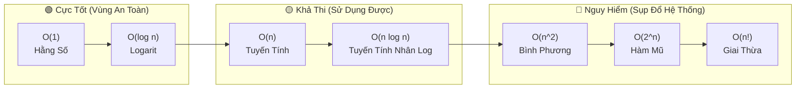

# ⏳ Độ Phức Tạp Thời Gian (Time Complexity)

> [[00 - Master Dashboard|🧭 Dashboard]] / [[Master MOC|🗺️ Master MOC]] / [[Big-O Notation - MOC|⚡ Big-O MOC]]

---

## 1. Bản Đồ Khái Niệm (Mermaid DAG)



---

## 2. Chân Lý Vô Điều Kiện (First Principles)

> [!NOTE] Tiên Đề Phân Tích Tiệm Cận (Asymptotic Analysis) & Giới Hạn Tăng Trưởng
> **Độ phức tạp thời gian không đo lường thời gian chạy vật lý (Wall-clock Time) bằng giây, mà đo tốc độ tăng trưởng của số phép toán cơ bản $T(n)$ khi quy mô dữ liệu $n \to \infty$:**
>
> 1. **Định nghĩa toán học Big-O (Chặn trên tiệm cận):**
>    $$ f(n) \in O(g(n)) \iff \exists c > 0, n_0 > 0 : 0 \le f(n) \le c \cdot g(n) \quad \forall n \ge n_0 $$
> 2. **Định luật bất biến phần cứng:** Một CPU hiện đại xử lý khoảng $\approx 10^8$ phép tính/giây. Dù phần cứng có nâng cấp gấp 100 lần, thuật toán $O(2^n)$ với $n = 100$ vẫn mất hàng tỷ năm (lớn hơn tuổi thọ vũ trụ), trong khi $O(\log n)$ chỉ mất chưa đầy $1$ micro-giây.

---

## 3. Trực Giác Motivated Discovery

> [!TIP] Động Lực 3Blue1Brown: Siêu Máy Tính NASA vs Chiếc Điện Thoại Cùi Bắp
> Bạn cho 2 kỹ sư giải cùng một bài toán tìm kiếm trên $1$ tỷ bản ghi ($n = 10^9$):
>
> - **Kỹ sư A:** Dùng siêu máy tính tối tân nhất của NASA trị giá hàng chục triệu USD nhưng chạy thuật toán Tuyến tính ngây thơ $O(n)$ $\to$ Cần $10^9$ phép tính $\approx 10$ giây để quét qua hết.
> - **Kỹ sư B:** Dùng một chiếc smartphone cũ giá rẻ chạy thuật toán [[Binary Search|Tìm kiếm nhị phân]] $O(\log n)$ $\to$ Chỉ mất đúng $\lceil \log_2(10^9) \rceil \approx 30$ phép tính $\approx 0.0000003$ giây!
>
> Thuật toán tốt trên phần cứng yếu luôn đè bẹp thuật toán tồi trên phần cứng mạnh nhất thế giới.

---

## 4. Các Cấp Độ Time Complexity (Trực Quan Hóa Bằng Hình Tượng)

| Cấp Độ | Hình Tượng Thực Tế | Hành Vi Khi $N$ Tăng | Note Chi Tiết |
| :--- | :--- | :--- | :--- |
| [[O(1) - Constant Time\|$O(1)$]] | **Lấy hạt đậu đúng ô trên khay:** Biết chính xác vị trí ô số 5, thò tay lấy ra ngay. 10 ô hay 1 triệu ô cũng chỉ mất 1 thao tác. | Không đổi | [[O(1) - Constant Time]] |
| [[O(log n) - Logarithmic Time\|$O(\log n)$]] | **Tìm lá bài trong bộ bài ĐÃ SẮP XẾP:** Lật lá chính giữa, loại bỏ $50\%$ số lá không phù hợp sau mỗi lần lật. | Tăng 1 bước khi $n$ nhân đôi | [[O(log n) - Logarithmic Time]] |
| [[O(n) - Linear Time\|$O(n)$]] | **Tìm lá bài trong bộ bài LỘN XỘN:** Mò kim đáy bể, buộc phải lật tuần tự từ lá đầu đến lá cuối. | Tỷ lệ thuận $1:1$ | [[O(n) - Linear Time]] |
| [[O(n log n) - Linearithmic Time\|$O(n \log n)$]] | **Chia đôi lớp học để sắp hàng:** Chia đôi danh sách và duyệt gộp lại. Tiêu chuẩn vàng của sắp xếp. | Nhanh hơn bậc 2 | [[O(n log n) - Linearithmic Time]] |
| [[O(n^2) - Quadratic Time\|$O(n^2)$]] | **Bắt tay chéo toàn bộ hội trường:** Mỗi người phải lần lượt bắt tay với tất cả những người còn lại trong phòng. | Tăng theo bình phương | [[O(n^2) - Quadratic Time]] |
| [[O(2^n) - Exponential Time\|$O(2^n)$]] | **Tung đồng xu $n$ lần:** Mỗi đồng xu thêm vào nhân đôi tổng số trường hợp có thể xảy ra. | Nhân đôi mỗi khi $n+1$ | [[O(2^n) - Exponential Time]] |
| [[O(n!) - Factorial Time\|$O(n!)$]] | **Hoán vị xếp chỗ ngồi:** Với $N$ người, vị trí đầu có $N$ cách, vị trí 2 có $N-1$... | Phình to theo giai thừa | [[O(n!) - Factorial Time]] |

---

## 5. Minh Họa Mã Nguồn (TypeScript)

Đo lường số bước tính toán thực tế qua các cấp độ vòng lặp:

```typescript
// 1. O(1) - Hằng số: Số thao tác không phụ thuộc vào n
export function constantOp(arr: number[]): number {
  return arr.length > 0 ? arr[0] : -1; // Đúng 1 bước
}

// 2. O(log n) - Logarit: Chia đôi bước nhảy ở mỗi vòng lặp
export function logOp(n: number): number {
  let operations = 0;
  for (let i = 1; i < n; i *= 2) {
    operations++; // n = 1024 -> operations = 10
  }
  return operations;
}

// 3. O(n) - Tuyến tính: Duyệt đơn vòng lặp
export function linearOp(n: number): number {
  let operations = 0;
  for (let i = 0; i < n; i++) {
    operations++; // n = 1024 -> operations = 1024
  }
  return operations;
}

// 4. O(n^2) - Bình phương: Hai vòng lặp lồng nhau
export function quadraticOp(n: number): number {
  let operations = 0;
  for (let i = 0; i < n; i++) {
    for (let j = 0; j < n; j++) {
      operations++; // n = 1024 -> operations = 1,048,576
    }
  }
  return operations;
}
```

---

## 6. Sự Đánh Đổi Giữa Time Complexity và [[Space Complexity]]

> [!IMPORTANT] Định Luật Bất Thành Văn Của Hệ Thống
> **Chúng ta thường xuyên đánh đổi bộ nhớ (RAM/Space) để mua lại tốc độ xử lý (Time).**

- Khi đối mặt với thuật toán tra cứu chậm $O(n^2)$, ta dùng cấu trúc [[Hash Table & HashSet|Hash Table]] hoặc mảng đệm [[LRU Cache|Cache]] ($O(n)$ Space) để lưu sẵn kết quả. Thao tác kiểm tra tồn tại từ $O(n)$ trở thành $O(1)$.
- Tăng chi phí bộ nhớ từ $O(1) \to O(n)$, nhưng giảm thời gian từ $O(n^2) \to O(n)$.

---

## 🧠 Thẻ Ghi Nhớ Nhanh (Spaced Repetition)

Tại sao thuật toán $O(\log n)$ lại nhanh vượt trội khi dữ liệu lớn? #card
?
Vì sau mỗi bước, thuật toán loại bỏ được một nửa ($50\%$) khối lượng dữ liệu còn lại. Với 1 tỷ phần tử ($\approx 2^{30}$), chỉ mất khoảng 30 bước tính.

Thế nào là sự đánh đổi Space-Time Trade-off? #card
?
Sử dụng thêm tài nguyên bộ nhớ phụ trợ (RAM/Storage) như Hashmap, Lookup Table hay Cache để lưu trước trạng thái tính toán, qua đó giảm số bước tính toán (thời gian chạy) của chương trình.
