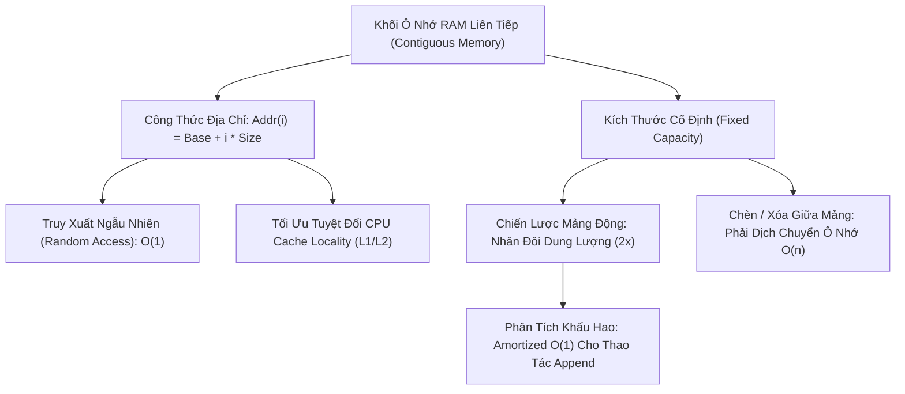

# 📦 Mảng & Mảng Động (Array & Dynamic Array)

> [[00 - Master Dashboard|🧭 Dashboard]] / [[Master MOC|🗺️ Master MOC]] / [[Roadmap|📋 Roadmap]]

---

## 1. Bản Đồ Khái Niệm (Mermaid DAG)



---

## 2. Chân Lý Vô Điều Kiện (First Principles)

> [!NOTE] Tiên Đề Bất Biến & Công Thức Địa Chỉ Ô Nhớ
> **Mảng là cấu trúc dữ liệu duy nhất mà phần tử thứ $i$ được tính toán trực tiếp thông qua số học con trỏ trong đúng 1 chu kỳ CPU:**
> $$ \text{Address}(i) = \text{BaseAddress} + (i \times \text{ElementSize}) $$
>
> 1. **Truy cập ngẫu nhiên (Random Access) luôn là $O(1)$:** Do các ô nhớ nằm liền kề nhau tuyệt đối, CPU không cần duyệt tuần tự.
> 2. **Định lý nhân đôi dung lượng ($2\times$ Resizing):** Nếu mở rộng mảng theo cấp số nhân ($2\times$), tổng chi phí sao chép sau $N$ lần `append` là $\sum_{k=0}^{\log_2 N} 2^k \approx 2N \implies$ Chi phí khấu hao (Amortized Cost) cho mỗi lần `push` là **$O(1)$**. Nếu mở rộng theo cấp số cộng ($+K$ ô), chi phí sẽ suy biến thành thảm họa **$O(N^2)$**.

---

## 3. Trực Giác Motivated Discovery

> [!TIP] Động Lực 3Blue1Brown: Dãy Tủ Khóa & Chuyện Chuyển Nhà
> Hãy tưởng tượng một dãy tủ gửi đồ đánh số liên tiếp từ $0, 1, 2\dots 99$:
> - Muốn lấy đồ ở tủ số 42, bạn không cần mở từng tủ từ 0 đến 41; bạn bước thẳng tới tủ 42 vì bạn biết nó cách cửa đúng $42 \times \text{chiều rộng tủ}$.
>
> **Nhưng chuyện gì xảy ra khi bạn mua thêm đồ và dãy 100 tủ đã hết sạch?**
> Bạn không thể cơi nới thêm ô 101 vì ô bên cạnh đã bị người khác xây nhà. Cách duy nhất là: **Thuê một khu đất mới to gấp đôi (200 tủ), bê toàn bộ đồ cũ sang khu mới, rồi đập bỏ khu cũ**. Hành động chuyển nhà tốn $O(n)$ thời gian, nhưng vì bạn nhân đôi diện tích, bạn sẽ được tận hưởng thời gian dài tiếp theo nạp đồ siêu tốc $O(1)$ mà không phải chuyển nhà nữa!

---

## 4. Phân Tích Kỹ Thuật & Đa Miền Hệ Thống

### Bảng Độ Phức Tạp (Complexity Sheet)

| Thao Tác | Mảng Tĩnh (Static Array) | Mảng Động (Dynamic Array - Amortized) | Nguyên Nhân Vật Lý |
| :--- | :--- | :--- | :--- |
| **Đọc qua Index (`arr[i]`)** | [[O(1) - Constant Time|$O(1)$]] | [[O(1) - Constant Time|$O(1)$]] | Tính toán địa chỉ bộ nhớ trực tiếp |
| **Ghi đè (`arr[i] = x`)** | [[O(1) - Constant Time|$O(1)$]] | [[O(1) - Constant Time|$O(1)$]] | Ghi trực tiếp vào ô nhớ RAM |
| **Thêm ở cuối (`push` / `append`)** | Không hỗ trợ (nếu đầy) | [[O(1) - Constant Time|$O(1)$]] (Khấu hao) | $O(n)$ khi dính pha resize, $O(1)$ đa số lần |
| **Chèn ở đầu / giữa** | [[O(n) - Linear Time|$O(n)$]] | [[O(n) - Linear Time|$O(n)$]] | Phải dịch chuyển toàn bộ phần tử sau sang phải |
| **Xóa ở đầu / giữa** | [[O(n) - Linear Time|$O(n)$]] | [[O(n) - Linear Time|$O(n)$]] | Phải dịch chuyển toàn bộ phần tử sau sang trái |

### 🌐 Liên Kết Đa Miền Hệ Thống (Hardware & Database)
- **CPU Cache Line (L1/L2):** Khi CPU đọc 1 phần tử của mảng, phần cứng tự động nạp luôn một khối **64 bytes liền kề (Cache Line)** lên bộ đệm L1/L2. Do đó, duyệt mảng theo thứ tự tuần tự nhanh hơn duyệt [[Linked List]] từ 10 đến 50 lần (tận dụng Spatial Locality).
- **Database Storage Engine:** Đơn vị đọc ghi vật lý của cơ sở dữ liệu là [[Database-knowledge/01 - Core Concepts/Block (Page)|Block / Page (8KB)]], bản chất là một mảng byte liên tục trên đĩa.

---

## 5. Cài Đặt Chuẩn Mực (TypeScript - DynamicArray)

```typescript
export class DynamicArray<T> {
  private data: (T | undefined)[];
  private capacity: number;
  private length: number;

  constructor(initialCapacity = 4) {
    this.capacity = initialCapacity;
    this.length = 0;
    this.data = new Array(this.capacity);
  }

  // Truy cập ngẫu nhiên trong O(1)
  get(index: number): T {
    if (index < 0 || index >= this.length) {
      throw new RangeError("Index out of bounds");
    }
    return this.data[index]!;
  }

  // Thêm vào cuối mảng: Amortized O(1)
  push(element: T): void {
    if (this.length === this.capacity) {
      this.resize(this.capacity * 2);
    }
    this.data[this.length] = element;
    this.length++;
  }

  // Xóa phần tử cuối trong O(1)
  pop(): T | undefined {
    if (this.length === 0) return undefined;
    const value = this.data[this.length - 1];
    this.data[this.length - 1] = undefined;
    this.length--;

    // Thu hẹp mảng để tiết kiệm RAM nếu phần tử giảm xuống dưới 1/4 dung lượng
    if (this.length > 0 && this.length === Math.floor(this.capacity / 4)) {
      this.resize(Math.floor(this.capacity / 2));
    }
    return value;
  }

  // Chèn vào vị trí bất kỳ: O(n) do phải dịch mảng
  insert(index: number, element: T): void {
    if (index < 0 || index > this.length) {
      throw new RangeError("Index out of bounds");
    }
    if (this.length === this.capacity) {
      this.resize(this.capacity * 2);
    }
    for (let i = this.length; i > index; i--) {
      this.data[i] = this.data[i - 1];
    }
    this.data[index] = element;
    this.length++;
  }

  get size(): number { return this.length; }

  private resize(newCapacity: number): void {
    const newData = new Array(newCapacity);
    for (let i = 0; i < this.length; i++) {
      newData[i] = this.data[i];
    }
    this.data = newData;
    this.capacity = newCapacity;
  }
}
```

---

## 🧠 Thẻ Ghi Nhớ Nhanh (Spaced Repetition)

Tại sao thao tác truy xuất `arr[i]` của mảng luôn đạt thời gian $O(1)$? #card
?
Vì các phần tử nằm trong các ô nhớ RAM liên tiếp nhau, địa chỉ của phần tử $i$ được tính bằng phép toán trực tiếp: `Địa chỉ = Base + i * Size`, CPU nhảy thẳng tới ô nhớ đó trong 1 chu kỳ mà không cần duyệt.

Tại sao chiến lược mở rộng kích thước mảng động phải nhân đôi ($2\times$) thay vì tăng cố định ($+K$ ô)? #card
?
Nếu tăng cố định $+K$ ô, mỗi lần đầy mảng ta phải sao chép lại toàn bộ, dẫn đến tổng chi phí sau $N$ lần chèn là $O(N^2)$ (trung bình $O(N)$ mỗi lần chèn). Khi nhân đôi ($2\times$), tổng chi phí sao chép chỉ là $2N$, đạt chi phí khấu hao $O(1)$ cho mỗi lần `push`.
