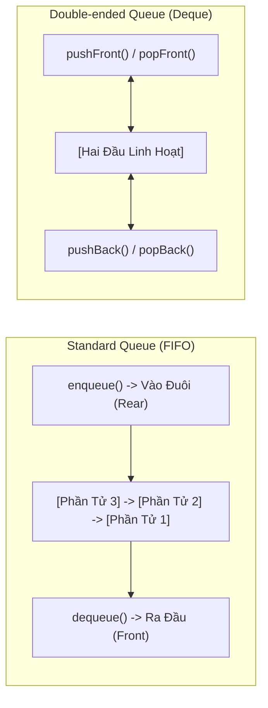

# 🚶 Hàng Đợi & Hàng Đợi Hai Đầu (Queue & Deque)

> [[00 - Master Dashboard|🧭 Dashboard]] / [[Master MOC|🗺️ Master MOC]] / [[Roadmap|📋 Roadmap]]

---

## 1. Bản Đồ Khái Niệm (Mermaid DAG)



---

## 2. Chân Lý Vô Điều Kiện (First Principles)

> [!NOTE] Tiên Đề Bất Biến (FIFO Principle)
> **Phần tử được nạp vào đầu tiên (First In) bắt buộc phải là phần tử đầu tiên được lấy ra (First Out).**
>
> 1. **Cạm bẫy Mảng Array ngây thơ:** Dùng `Array.shift()` trong JavaScript/Python để làm hàng đợi có độ phức tạp **$O(n)$** do phải dịch chuyển toàn bộ mảng. Hàng đợi chuẩn công nghiệp bắt buộc phải dùng **Doubly Linked List** hoặc **Vòng đệm tròn (Circular Buffer)** để đảm bảo mọi thao tác đều đạt $O(1)$.
> 2. **Deque (Double-Ended Queue):** Là siêu cấu trúc tổng quát hóa cả Stack và Queue, cho phép thêm và xóa ở **cả hai đầu** trong $O(1)$.

---

## 3. Trực Giác Motivated Discovery

> [!TIP] Động Lực 3Blue1Brown: Xếp Hàng Mua Trà Sữa
> Ai đến trước thì được phục vụ trước và rời hàng trước. Đến sau thì đứng vào cuối hàng. Đây là nguyên tắc công bằng cơ bản nhất của xã hội.
>
> Trong thế giới máy tính, CPU và Card mạng không thể xử lý hàng triệu gói tin đến cùng một phần triệu giây. Do đó, các gói tin được xếp vào một **Hàng đợi đệm (Ingress Buffer Queue)** để xử lý tuần tự mà không bị thất thoát dữ liệu!

---

## 4. Phân Tích Kỹ Thuật & Đa Miền Hệ Thống

### Bảng Độ Phức Tạp (Complexity Sheet)

| Thao Tác | Queue Chuẩn (Linked List / Ring Buffer) | Array Ngây Ngô (`shift`) | Deque (2 Đầu) |
| :--- | :--- | :--- | :--- |
| **Thêm vào đuôi (`enqueue` / `pushBack`)** | [[O(1) - Constant Time|$O(1)$]] | $O(1)$ (Amortized) | [[O(1) - Constant Time|$O(1)$]] |
| **Lấy ra ở đầu (`dequeue` / `popFront`)** | [[O(1) - Constant Time|$O(1)$]] | 🔴 [[O(n) - Linear Time|$O(n)$]] | [[O(1) - Constant Time|$O(1)$]] |
| **Thao tác ở đầu ngược lại (`pushFront` / `popBack`)** | Không hỗ trợ | Không hỗ trợ | [[O(1) - Constant Time|$O(1)$]] |

### 🌐 Ứng Dụng Trong Hệ Thống Thực Tế
- **Backend & Network:** Buffer trong giao thức [[Backend-full-course/Part 1 - Core Foundations/01 - Computer Networks & Protocols/Core Transport & Routing/TCP - IP|TCP/IP]], hàng đợi tin nhắn bất đồng bộ trong RabbitMQ, Apache Kafka.
- **Runtime Web:** Task Queue và Microtask Queue trong **JavaScript Event Loop**.
- **Giải thuật:** Duyệt đồ thị theo chiều rộng (Breadth-First Search - BFS) tìm đường đi ngắn nhất.

---

## 5. Cài Đặt Chuẩn Mực (TypeScript - Doubly Linked List Queue)

```typescript
class Node<T> {
  value: T;
  next: Node<T> | null = null;
  prev: Node<T> | null = null;
  constructor(val: T) { this.value = val; }
}

export class Deque<T> {
  private head: Node<T> | null = null;
  private tail: Node<T> | null = null;
  public size = 0;

  pushBack(val: T): void {
    const node = new Node(val);
    if (!this.tail) {
      this.head = this.tail = node;
    } else {
      node.prev = this.tail;
      this.tail.next = node;
      this.tail = node;
    }
    this.size++;
  }

  popFront(): T | undefined {
    if (!this.head) return undefined;
    const val = this.head.value;
    this.head = this.head.next;
    if (this.head) this.head.prev = null;
    else this.tail = null;
    this.size--;
    return val;
  }

  pushFront(val: T): void {
    const node = new Node(val);
    if (!this.head) {
      this.head = this.tail = node;
    } else {
      node.next = this.head;
      this.head.prev = node;
      this.head = node;
    }
    this.size++;
  }

  popBack(): T | undefined {
    if (!this.tail) return undefined;
    const val = this.tail.value;
    this.tail = this.tail.prev;
    if (this.tail) this.tail.next = null;
    else this.head = null;
    this.size--;
    return val;
  }
}
```

---

## 🧠 Thẻ Ghi Nhớ Nhanh (Spaced Repetition)

Tại sao không nên dùng `Array.shift()` trong JavaScript để cài đặt Queue cho dữ liệu lớn? #card
?
Vì `Array.shift()` phải dịch chuyển toàn bộ $n - 1$ phần tử còn lại sang trái một ô nhớ, dẫn đến độ phức tạp thời gian $O(n)$ cho mỗi lần lấy phần tử ra khỏi Queue, làm nghẽn hiệu năng khi $N$ lớn.

Deque (Double-Ended Queue) khác gì so với Queue thông thường? #card
?
Queue thông thường chỉ cho phép thêm ở một đầu (đuôi) và xóa ở đầu kia (đầu). Deque cho phép thực hiện cả thêm (`push`) và xóa (`pop`) ở **cả hai đầu** (Front và Back) trong thời gian tối ưu $O(1)$.
