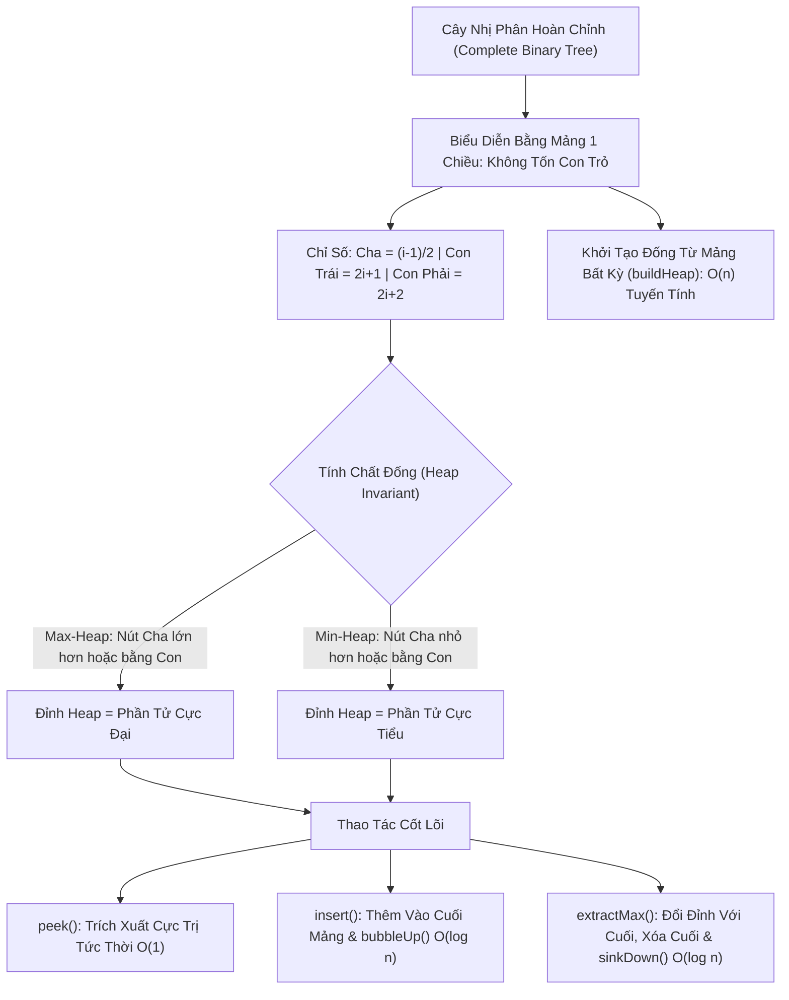

# 🏔️ Cây Vun Đống & Hàng Đợi Ưu Tiên (Binary Heap & Priority Queue)

> [[00 - Master Dashboard|🧭 Dashboard]] / [[Master MOC|🗺️ Master MOC]] / [[Roadmap|📋 Roadmap]]

---

## 1. Bản Đồ Khái Niệm (Mermaid DAG)



---

## 2. Chân Lý Vô Điều Kiện (First Principles)

> [!NOTE] Tiên Đề Bất Biến & Định Lý Khởi Tạo Tuyến Tính $O(n)$
> **Cây nhị phân hoàn chỉnh (Complete Binary Tree) luôn luôn được ánh xạ 1-1 vào mảng một chiều mà không cần cấp phát bất kỳ con trỏ tham chiếu nào:**
> - Nút cha của nút tại vị trí $i$: $\text{parent}(i) = \lfloor (i - 1) / 2 \rfloor$.
> - Con bên trái: $\text{left}(i) = 2i + 1$; Con bên phải: $\text{right}(i) = 2i + 2$.
>
> 1. **Trích xuất cực trị luôn là $O(1)$:** Phần tử ưu tiên cao nhất (Max hoặc Min) luôn ngự trị tại gốc đống (vị trí `arr[0]`).
> 2. **Định lý Xây dựng đống trong thời gian tuyến tính ($O(n)$):** Trái ngược với ngộ nhận rằng gọi $n$ lần hàm `insert` tốn $O(n \log n)$, thao tác `buildHeap` đáy-lên (Bottom-up Heapify) trên một mảng có sẵn chỉ tốn đúng **$\Theta(n)$** thời gian nhờ chuỗi hội tụ:
>    $$ \sum_{h=0}^{\lfloor \log_2 n \rfloor} \frac{n}{2^{h+1}} \times O(h) = O\left(n \sum_{h=0}^{\infty} \frac{h}{2^h}\right) = O(2n) = \Theta(n) $$

---

## 3. Trực Giác Motivated Discovery

> [!TIP] Động Lực 3Blue1Brown: Phòng Cấp Cứu Bệnh Viện (Triage System)
> Trong phòng cấp cứu, bệnh nhân không được phục vụ theo thứ tự đến trước - về trước (FIFO của Queue thông thường).
>
> Một bệnh nhân bị ngừng tim đến sau bắt buộc phải được đẩy thẳng vào phòng mổ trước một người chỉ bị xước tay đến từ 2 tiếng trước!
>
> **Hàng đợi ưu tiên (Priority Queue)** ra đời để mô phỏng điều này: Bạn liên tục nạp hàng ngàn công việc với mức độ khẩn cấp khác nhau. Cấu trúc Binary Heap đảm bảo rằng khi CPU hoặc Bác sĩ hỏi: *"Ai cần xử lý ngay bây giờ?"*, hệ thống chỉ tay ngay vào người quan trọng nhất tại đỉnh đống trong đúng **0 giây ($O(1)$)**!

---

## 4. Phân Tích Kỹ Thuật & Đa Miền Hệ Thống

### Bảng Độ Phức Tạp (Complexity Sheet)

| Thao Tác | Thời Gian (Time) | Không Gian (Space) | Cơ Chế |
| :--- | :--- | :--- | :--- |
| **Xem cực trị (`peek`)** | [[O(1) - Constant Time|$O(1)$]] | [[O(1) - Constant Time|$O(1)$]] | Đọc trực tiếp phần tử `arr[0]` |
| **Thêm phần tử (`insert`)** | [[O(log n) - Logarithmic Time|$O(\log n)$]] | [[O(1) - Constant Time|$O(1)$]] | Đẩy vào cuối mảng rồi `bubbleUp` lên |
| **Rút cực trị (`extractMax/Min`)** | [[O(log n) - Logarithmic Time|$O(\log n)$]] | [[O(1) - Constant Time|$O(1)$]] | Đưa phần tử cuối lên đầu rồi `sinkDown` |
| **Khởi tạo từ mảng (`buildHeap`)** | [[O(n) - Linear Time|$O(n)$]] | [[O(1) - Constant Time|$O(1)$]] | Duyệt ngược từ các nút cha cuối cùng |

### 🌐 Ứng Dụng Trong Hệ Thống Thực Tế
- **Hệ điều hành (Linux Kernel):** Bộ điều phối tiến trình (Process Scheduler) sử dụng Priority Queue để chọn Process có độ ưu tiên cao nhất cấp phát CPU.
- **Giải thuật mạng:** Thuật toán Dijkstra tìm đường đi ngắn nhất sử dụng Min-Heap để trích xuất đỉnh có khoảng cách ngắn nhất trong $O((V + E) \log V)$.
- **Xử lý dữ liệu lớn:** Tìm kiếm [[Top K Elements Pattern|Top K Elements]] trong dòng dữ liệu hàng triệu sự kiện mỗi giây.

---

## 5. Cài Đặt Chuẩn Mực (TypeScript - MaxHeap)

```typescript
export class MaxHeap {
  private heap: number[] = [];

  constructor(initialArray?: number[]) {
    if (initialArray) {
      this.heap = [...initialArray];
      this.buildHeap();
    }
  }

  // Khởi tạo đống trong O(n) tuyến tính
  private buildHeap(): void {
    const startIdx = Math.floor(this.heap.length / 2) - 1;
    for (let i = startIdx; i >= 0; i--) {
      this.sinkDown(i);
    }
  }

  // Xem phần tử lớn nhất: O(1)
  peek(): number | undefined {
    return this.heap[0];
  }

  // Thêm phần tử mới: O(log n)
  insert(val: number): void {
    this.heap.push(val);
    this.bubbleUp(this.heap.length - 1);
  }

  // Rút phần tử lớn nhất ra khỏi đống: O(log n)
  extractMax(): number | undefined {
    if (this.heap.length === 0) return undefined;
    const maxVal = this.heap[0];
    const end = this.heap.pop()!;
    if (this.heap.length > 0) {
      this.heap[0] = end;
      this.sinkDown(0);
    }
    return maxVal;
  }

  private bubbleUp(idx: number): void {
    while (idx > 0) {
      const parentIdx = Math.floor((idx - 1) / 2);
      if (this.heap[idx] <= this.heap[parentIdx]) break;
      [this.heap[idx], this.heap[parentIdx]] = [this.heap[parentIdx], this.heap[idx]];
      idx = parentIdx;
    }
  }

  private sinkDown(idx: number): void {
    const len = this.heap.length;
    while (true) {
      let largest = idx;
      const left = 2 * idx + 1;
      const right = 2 * idx + 2;

      if (left < len && this.heap[left] > this.heap[largest]) largest = left;
      if (right < len && this.heap[right] > this.heap[largest]) largest = right;

      if (largest === idx) break;
      [this.heap[idx], this.heap[largest]] = [this.heap[largest], this.heap[idx]];
      idx = largest;
    }
  }

  get size(): number { return this.heap.length; }
}
```

---

## 🧠 Thẻ Ghi Nhớ Nhanh (Spaced Repetition)

Tại sao Binary Heap có thể biểu diễn hoàn hảo trên Mảng mà không tốn con trỏ cây? #card
?
Vì Binary Heap luôn là một Cây nhị phân hoàn chỉnh (Complete Binary Tree), các tầng đều được lấp đầy từ trái sang phải, không có lỗ hổng. Mối quan hệ cha-con được tính toán trực tiếp: `cha = (i-1)/2`, `con_trái = 2i+1`, `con_phải = 2i+2`.

Tại sao thuật toán `buildHeap` từ một mảng có sẵn chỉ tốn $O(n)$ thời gian thay vì $O(n \log n)$? #card
?
Vì phần lớn số nút tập trung ở đáy cây (nửa số nút là lá với chiều cao $h = 0$, không cần `sinkDown`). Càng lên cao thì số nút càng ít, tổng chi phí dịch chuyển $\sum \frac{n}{2^h} h$ hội tụ về $O(2n) = \Theta(n)$.
