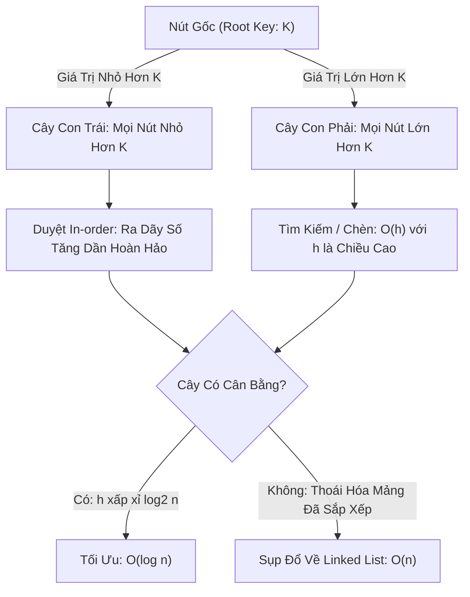

# 🌲 Cây Tìm Kiếm Nhị Phân (Binary Search Tree - BST)

> [[00 - Master Dashboard|🧭 Dashboard]] / [[Master MOC|🗺️ Master MOC]] / [[Roadmap|📋 Roadmap]]

---

## 1. Bản Đồ Khái Niệm (Mermaid DAG)



---

## 2. Chân Lý Vô Điều Kiện (First Principles)

> [!NOTE] Tiên Đề Bất Biến (BST Invariant Property)
> **Với mọi nút $x$ trong cây:**
> 1. Mọi nút $y$ thuộc cây con bên trái của $x$ đều thỏa mãn: $y.\text{key} < x.\text{key}$.
> 2. Mọi nút $z$ thuộc cây con bên phải của $x$ đều thỏa mãn: $z.\text{key} > x.\text{key}$.
>
> **Hệ quả toán học:** Phép duyệt cây theo thứ tự giữa (**In-order Traversal**: Trái $\to$ Gốc $\to$ Phải) luôn luôn trích xuất toàn bộ dữ liệu ra một **mảng có thứ tự tăng dần tuyệt đối** trong thời gian $\Theta(n)$.

---

## 3. Trực Giác Motivated Discovery

> [!TIP] Động Lực 3Blue1Brown: Bản Đồ Chỉ Đường Tại Mỗi Ngã Ba
> Trong một mảng thông thường, để tìm một số, bạn phải mò mẫm từng ô ($O(n)$). Nếu mảng đã sắp xếp, bạn có thể nhảy nhị phân ($O(\log n)$), nhưng mỗi lần chèn thêm số mới lại phải dịch chuyển hàng ngàn phần tử ($O(n)$).
>
> Làm thế nào để **VỪA TÌM KIẾM NHANH $O(\log n)$ VỪA CHÈN NHANH $O(\log n)$?**
>
> BST giải quyết bài toán này bằng cách biến dữ liệu thành một cây phân nhánh: Đứng trước bất kỳ ngã ba nào, bạn chỉ cần so sánh giá trị cần tìm với nút hiện tại: Nếu nhỏ hơn $\to$ rẽ trái; nếu lớn hơn $\to$ rẽ phải. Mỗi bước rẽ loại bỏ ngay một nửa số nút còn lại trên cây!

---

## 4. Phân Tích Kỹ Thuật & Sự Đánh Đổi

### Bảng Độ Phức Tạp (Complexity Sheet)

| Thao Tác | BST Cân Bằng (Balanced BST) | BST Bị Lệch (Degenerate / Skewed) | Ghi Chú |
| :--- | :--- | :--- | :--- |
| **Tìm kiếm (Search)** | [[O(log n) - Logarithmic Time|$O(\log n)$]] | [[O(n) - Linear Time|$O(n)$]] | Phụ thuộc chiều cao cây ($h$) |
| **Chèn (Insert)** | [[O(log n) - Logarithmic Time|$O(\log n)$]] | [[O(n) - Linear Time|$O(n)$]] | Đi theo nhánh tới vị trí lá |
| **Xóa (Delete)** | [[O(log n) - Logarithmic Time|$O(\log n)$]] | [[O(n) - Linear Time|$O(n)$]] | Thay thế bằng In-order Successor |
| **Không gian (Space)** | [[O(n) - Linear Time|$O(n)$]] | [[O(n) - Linear Time|$O(n)$]] | Lưu trữ các con trỏ `left`, `right` |

### 🌐 Liên Kết Đa Miền: Từ BST Dẫn Tới [[Database-knowledge/01 - Core Concepts/Index|B+Tree Index Trong Database]]
- **Tại sao Database không dùng BST trên Ổ Cứng?** BST có Fan-out (hệ số rẽ nhánh) chỉ bằng 2. Với 1 triệu bản ghi, chiều cao cây là $\approx 20$ tầng. Khi lưu trên đĩa, mỗi lần nhảy tầng con trỏ là 1 lần Random Disk I/O (chết nghẽn hiệu năng).
- **Tiến hóa sang B+Tree:** Database mở rộng Fan-out lên hàng nghìn (1 nút = 1 Disk Block 8KB) để ép chiều cao cây xuống chỉ còn 3 tầng, giảm số lần đọc đĩa xuống tối đa! (Xem thêm: [[Database-knowledge/01 - Core Concepts/Block (Page)]]).

---

## 5. Cài Đặt Chuẩn Mực (TypeScript)

```typescript
export class TreeNode {
  value: number;
  left: TreeNode | null = null;
  right: TreeNode | null = null;

  constructor(value: number) {
    this.value = value;
  }
}

export class BinarySearchTree {
  root: TreeNode | null = null;

  // Chèn giá trị mới theo quy tắc BST
  insert(value: number): void {
    const newNode = new TreeNode(value);
    if (!this.root) {
      this.root = newNode;
      return;
    }

    let curr: TreeNode = this.root;
    while (true) {
      if (value < curr.value) {
        if (!curr.left) {
          curr.left = newNode;
          break;
        }
        curr = curr.left;
      } else if (value > curr.value) {
        if (!curr.right) {
          curr.right = newNode;
          break;
        }
        curr = curr.right;
      } else {
        break; // Không cho phép giá trị trùng lặp
      }
    }
  }

  // Tìm kiếm giá trị trong O(h)
  search(value: number): boolean {
    let curr = this.root;
    while (curr) {
      if (value === curr.value) return true;
      curr = value < curr.value ? curr.left : curr.right;
    }
    return false;
  }

  // Duyệt cây In-order trích xuất dữ liệu tăng dần
  inOrderTraversal(node = this.root, result: number[] = []): number[] {
    if (node) {
      this.inOrderTraversal(node.left, result);
      result.push(node.value);
      this.inOrderTraversal(node.right, result);
    }
    return result;
  }
}
```

---

## 🧠 Thẻ Ghi Nhớ Nhanh (Spaced Repetition)

Quy tắc bất biến (BST Invariant Property) là gì? #card
?
Với mọi node: **Tất cả các node ở cây con bên trái < Node hiện tại < Tất cả các node ở cây con bên phải**.

Tại sao chèn một mảng đã sắp xếp sẵn vào BST thông thường lại làm hiệu năng suy biến về $O(n)$? #card
?
Vì mỗi phần tử mới luôn lớn hơn phần tử trước đó $\to$ luôn được rẽ nhánh sang phải $\to$ cây mọc dài thành một đường thẳng (thoái hóa thành Linked List), chiều cao cây $h = n$. Để giải quyết, người ta dùng các cây tự cân bằng (AVL Tree, Red-Black Tree).
