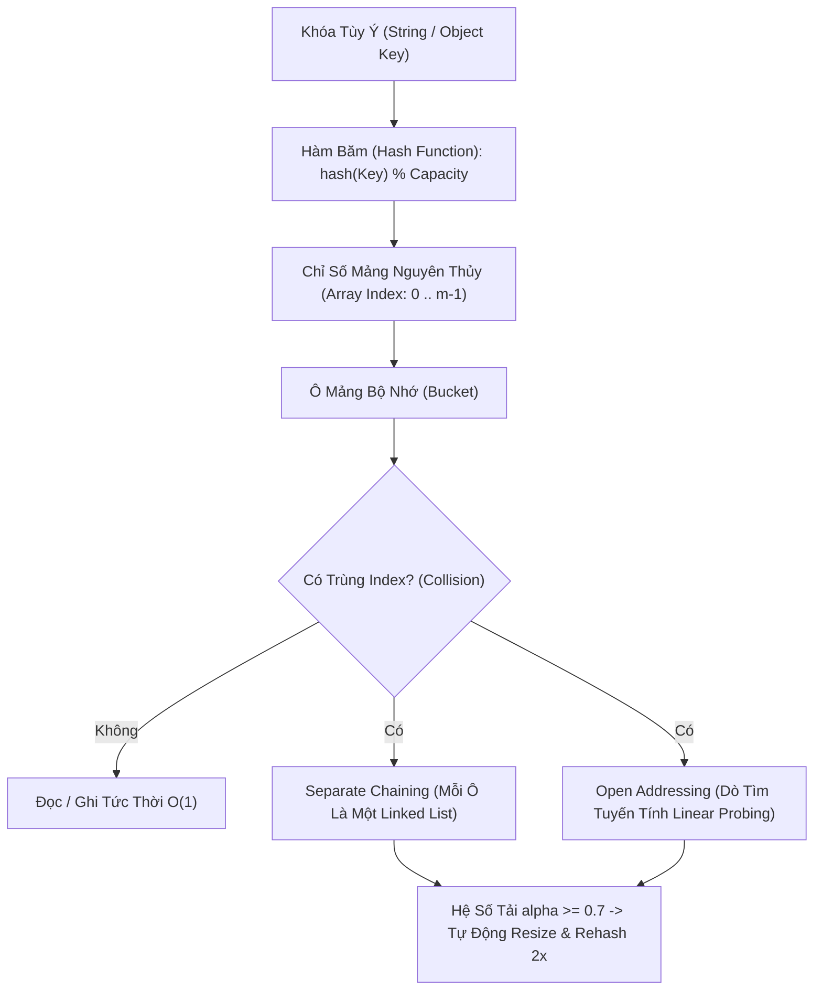

# ⚡ Bảng Băm & Tập Hợp Băm (Hash Table & HashSet)

> [[00 - Master Dashboard|🧭 Dashboard]] / [[Master MOC|🗺️ Master MOC]] / [[Roadmap|📋 Roadmap]]

---

## 1. Bản Đồ Khái Niệm (Mermaid DAG)



---

## 2. Chân Lý Vô Điều Kiện (First Principles)

> [!NOTE] Tiên Đề Dirichlet (Pigeonhole Principle) & Hệ Số Tải
> **Va chạm băm (Hash Collision) là tất yếu về mặt toán học:** Vì tập hợp các khóa tiềm năng ($|U|$) lớn hơn rất nhiều so với kích thước bảng băm ($m$), theo nguyên lý lồng chim bồ câu, luôn tồn tại ít nhất 2 khóa khác nhau sinh ra cùng một chỉ số băm.
>
> 1. **Thời gian chạy trung bình:** Dưới giả định băm đều đơn giản (Simple Uniform Hashing), thời gian trung bình cho các thao tác `get`, `set`, `delete` là **$\Theta(1 + \alpha)$**, trong đó $\alpha = \frac{n}{m}$ là **Hệ số tải (Load Factor)**.
> 2. **Sự suy biến trường hợp xấu nhất ($O(n)$):** Nếu hàm băm kém chất lượng hoặc bị tấn công ác ý (Hash DOS Attack) khiến toàn bộ $n$ khóa rơi vào cùng 1 bucket, bảng băm suy biến hoàn toàn thành [[Linked List]], kéo hiệu năng sụp đổ về **$O(n)$**.

---

## 3. Trực Giác Motivated Discovery

> [!TIP] Động Lực 3Blue1Brown: Thư Viện Phân Mã Màu
> Tìm một cuốn sách giữa 1 triệu cuốn xếp lộn xộn mất $O(n)$. Nếu sắp xếp theo bảng chữ cái thì mất $O(\log n)$, nhưng mỗi lần thêm sách mới lại phải dịch chuyển giá sách.
>
> **Làm thế nào để bỏ sách vào là biết ngay ở đâu mà KHÔNG cần dịch chuyển kệ sách?**
> Bạn tạo ra một công thức toán học (Hàm băm): Đưa tên cuốn sách vào máy tính, nó trích xuất mã chữ cái và xuất ra một con số: ví dụ *"Harry Potter"* $\to$ Tủ số 742. Bạn bước thẳng tới tủ 742 cất sách hoặc lấy sách ra trong đúng 1 bước chân ($O(1)$)! Nếu tủ 742 đã có sách khác, bạn chỉ cần móc thêm một chiếc giỏ treo cạnh tủ (Separate Chaining) để chứa cuốn sách thứ hai.

---

## 4. Phân Tích Kỹ Thuật & Đa Miền Hệ Thống

### Bảng Độ Phức Tạp (Complexity Sheet)

| Thao Tác | Trung Bình (Average) | Xấu Nhất (Worst Case - Trùng toàn bộ) | Không Gian (Space) |
| :--- | :--- | :--- | :--- |
| **Tra cứu (`get`)** | [[O(1) - Constant Time|$O(1)$]] | [[O(n) - Linear Time|$O(n)$]] | [[O(n) - Linear Time|$O(n)$]] |
| **Thêm mới (`set`)** | [[O(1) - Constant Time|$O(1)$]] | [[O(n) - Linear Time|$O(n)$]] | [[O(n) - Linear Time|$O(n)$]] |
| **Xóa (`delete`)** | [[O(1) - Constant Time|$O(1)$]] | [[O(n) - Linear Time|$O(n)$]] | [[O(n) - Linear Time|$O(n)$]] |

### 🌐 Ứng Dụng Trong Cơ Sở Dữ Liệu & Hệ Thống
- **Database Hash Index:** [[Database-knowledge/01 - Core Concepts/Index|Hash Index trong PostgreSQL]]: Cho phép tìm kiếm điểm (Equality Query `WHERE id = 'xyz'`) siêu tốc trong 1 lần đọc đĩa, nhưng **không hỗ trợ tìm kiếm khoảng** (`WHERE age BETWEEN 20 AND 30`) như B+Tree.
- **Query Optimization:** [[Database-knowledge/01 - Core Concepts/Join Methods|Hash Join trong SQL Optimizer]]: Tạo một bảng băm từ bảng nhỏ trên RAM, sau đó quét bảng lớn để đối chiếu khóa ngoại trong $O(M + N)$.
- **Distributed Caching:** Redis và Memcached tổ chức toàn bộ dữ liệu key-value trong RAM dưới dạng Hash Table khổng lồ.

---

## 5. Cài Đặt Chuẩn Mực (TypeScript - Separate Chaining)

```typescript
class HashNode<K, V> {
  key: K;
  value: V;
  next: HashNode<K, V> | null = null;
  constructor(key: K, value: V) {
    this.key = key;
    this.value = value;
  }
}

export class HashTable<K, V> {
  private buckets: (HashNode<K, V> | null)[];
  private capacity: number;
  private count = 0;

  constructor(initialCapacity = 16) {
    this.capacity = initialCapacity;
    this.buckets = new Array(this.capacity).fill(null);
  }

  // Hàm băm chuyển đổi chuỗi thành index trong [0 .. capacity-1]
  private hash(key: K): number {
    const str = String(key);
    let hashVal = 0;
    for (let i = 0; i < str.length; i++) {
      hashVal = (hashVal * 31 + str.charCodeAt(i)) % this.capacity;
    }
    return Math.abs(hashVal);
  }

  // Thêm hoặc cập nhật cặp Key - Value: O(1) trung bình
  set(key: K, value: V): void {
    const index = this.hash(key);
    let curr = this.buckets[index];

    // Kiểm tra xem Key đã tồn tại chưa để ghi đè
    while (curr) {
      if (curr.key === key) {
        curr.value = value;
        return;
      }
      curr = curr.next;
    }

    // Nếu chưa có, chèn Node mới vào đầu danh sách (Separate Chaining)
    const newNode = new HashNode(key, value);
    newNode.next = this.buckets[index];
    this.buckets[index] = newNode;
    this.count++;

    // Tự động resize và rehash khi hệ số tải vượt ngưỡng 0.75
    if (this.count / this.capacity >= 0.75) {
      this.rehash(this.capacity * 2);
    }
  }

  // Tra cứu giá trị theo Key: O(1) trung bình
  get(key: K): V | undefined {
    const index = this.hash(key);
    let curr = this.buckets[index];
    while (curr) {
      if (curr.key === key) return curr.value;
      curr = curr.next;
    }
    return undefined;
  }

  // Xóa Key khỏi bảng
  delete(key: K): boolean {
    const index = this.hash(key);
    let curr = this.buckets[index];
    let prev: HashNode<K, V> | null = null;

    while (curr) {
      if (curr.key === key) {
        if (prev) prev.next = curr.next;
        else this.buckets[index] = curr.next;
        this.count--;
        return true;
      }
      prev = curr;
      curr = curr.next;
    }
    return false;
  }

  private rehash(newCapacity: number): void {
    const oldBuckets = this.buckets;
    this.capacity = newCapacity;
    this.buckets = new Array(newCapacity).fill(null);
    this.count = 0;

    for (const head of oldBuckets) {
      let curr = head;
      while (curr) {
        this.set(curr.key, curr.value);
        curr = curr.next;
      }
    }
  }
}
```

---

## 🧠 Thẻ Ghi Nhớ Nhanh (Spaced Repetition)

Hệ số tải (Load Factor $\alpha$) trong Hash Table là gì và tại sao cần giữ $\alpha \le 0.75$? #card
?
$\alpha = \frac{n}{m}$ (số phần tử chia cho số ô bucket). Nếu $\alpha$ quá lớn, số lượng va chạm tăng cao, danh sách liên kết tại mỗi ô dài ra khiến tốc độ tra cứu suy biến từ $O(1) \to O(n)$. Giữ $\alpha \le 0.75$ đảm bảo cân bằng tối ưu giữa việc tiết kiệm RAM và tốc độ $O(1)$.

Tại sao Hash Table không phù hợp cho các truy vấn tìm kiếm theo khoảng (Range Queries)? #card
?
Vì hàm băm phân tán các giá trị ngẫu nhiên khắp các ô nhớ trong mảng mà không duy trì bất kỳ thứ tự sắp xếp nào. Muốn tìm các phần tử trong khoảng `[10 .. 50]`, Hash Table buộc phải duyệt qua toàn bộ bảng ($O(n)$) thay vì $O(\log n)$ như [[Binary Search Tree (BST)|BST]] hay B+Tree.
