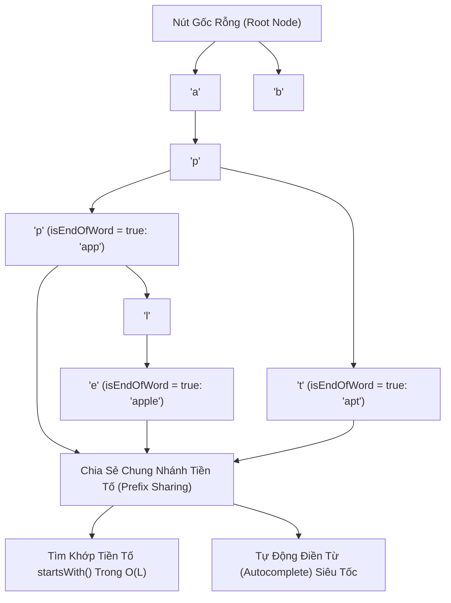

# 🔤 Cây Tiền Tố (Trie - Prefix Tree)

> [[00 - Master Dashboard|🧭 Dashboard]] / [[Master MOC|🗺️ Master MOC]] / [[Roadmap|📋 Roadmap]]

---

## 1. Bản Đồ Khái Niệm (Mermaid DAG)



---

## 2. Chân Lý Vô Điều Kiện (First Principles)

> [!NOTE] Tiên Đề Độc Lập Với Kích Thước Dữ Liệu
> **Thời gian tìm kiếm, chèn và kiểm tra tiền tố trong Trie chỉ phụ thuộc duy nhất vào độ dài của từ khóa ($L$), HOÀN TOÀN ĐỘC LẬP với tổng số lượng từ ($N$) đang lưu trữ trong từ điển:**
> $$ \text{Time Complexity} = O(L) $$
>
> 1. **Dù từ điển chứa 100 từ hay 1 tỷ từ:** Thao tác kiểm tra từ `"cat"` luôn luôn chỉ mất đúng **3 bước nhảy con trỏ** (`c` $\to$ `a` $\to$ `t`).
> 2. **Sự đánh đổi không gian bộ nhớ (Space Trade-off):** Mỗi nút trong Trie chứa một mảng liên kết các ký tự con (ví dụ 26 con trỏ cho bảng chữ cái tiếng Anh). Nếu các từ ít chia sẻ tiền tố chung, cây Trie sẽ tiêu tốn dung lượng RAM rất lớn so với [[Hash Table & HashSet|Hash Table]].

---

## 3. Trực Giác Motivated Discovery

> [!TIP] Động Lực 3Blue1Brown: Thanh Tìm Kiếm Google Autocomplete
> Bạn có một từ điển 10 triệu từ. Khi người dùng vừa gõ vào thanh tìm kiếm chữ `"app"`, bạn phải gợi ý ngay các từ tiếp theo (`"apple"`, `"application"`, `"approve"`).
>
> - **Nếu dùng Hash Table:** Hash Table chỉ tra cứu được từ **chính xác 100%**. Để tìm các từ bắt đầu bằng `"app"`, bạn buộc phải quét qua toàn bộ 10 triệu từ ($O(N)$ thảm họa!).
> - **Giải pháp của Trie:** Các từ có cùng tiền tố sẽ đi chung một con đường. Bạn chỉ cần bước 3 bước theo nhánh `a` $\to$ `p` $\to$ `p`. Đứng tại nút `p` này, toàn bộ cây con phía dưới nó chính là tập hợp tất cả các từ có tiền tố `"app"`!

---

## 4. Phân Tích Kỹ Thuật & Đa Miền Hệ Thống

### Bảng Độ Phức Tạp (Complexity Sheet)

| Thao Tác | Thời Gian (Time) | Không Gian Bộ Nhớ (Space) | Điều Kiện |
| :--- | :--- | :--- | :--- |
| **Chèn từ (`insert`)** | [[O(1) - Constant Time|$O(L)$]] | $O(L \times \Sigma)$ | $L$ là độ dài từ, $\Sigma$ là kích thước bảng chữ cái |
| **Tìm từ chính xác (`search`)** | [[O(1) - Constant Time|$O(L)$]] | $O(1)$ | Trả về `true` nếu `isEndOfWord === true` |
| **Kiểm tra tiền tố (`startsWith`)** | [[O(1) - Constant Time|$O(L)$]] | $O(1)$ | Chỉ cần duyệt hết tiền tố $L$, không cần xét lá |

### 🌐 Ứng Dụng Trong Mạng Máy Tính & Định Tuyến (CCNA)
- **Longest Prefix Match trong IP Routing:** Router mạng (Cisco / Juniper) sử dụng biến thể của Trie (Patuicia Trie / Radix Tree) để tìm kiếm bảng định tuyến IP: Tìm subnet mask dài nhất khớp với địa chỉ IP đích của gói tin trong hàng triệu route trong thời gian thực nano-giây.

---

## 5. Cài Đặt Chuẩn Mực (TypeScript - Trie)

```typescript
class TrieNode {
  children: Map<string, TrieNode> = new Map();
  isEndOfWord = false;
}

export class Trie {
  private root: TrieNode;

  constructor() {
    this.root = new TrieNode();
  }

  // Chèn một từ vào Trie: O(L)
  insert(word: string): void {
    let curr = this.root;
    for (const char of word) {
      if (!curr.children.has(char)) {
        curr.children.set(char, new TrieNode());
      }
      curr = curr.children.get(char)!;
    }
    curr.isEndOfWord = true;
  }

  // Tìm kiếm từ chính xác: O(L)
  search(word: string): boolean {
    let curr = this.root;
    for (const char of word) {
      if (!curr.children.has(char)) return false;
      curr = curr.children.get(char)!;
    }
    return curr.isEndOfWord;
  }

  // Kiểm tra tiền tố có tồn tại: O(L)
  startsWith(prefix: string): boolean {
    let curr = this.root;
    for (const char of prefix) {
      if (!curr.children.has(char)) return false;
      curr = curr.children.get(char)!;
    }
    return true;
  }
}
```

---

## 🧠 Thẻ Ghi Nhớ Nhanh (Spaced Repetition)

Điểm khác biệt cốt lõi nhất giữa Trie và Hash Table khi xử lý chuỗi ký tự là gì? #card
?
Hash Table chỉ hỗ trợ tìm kiếm khớp chính xác 100% từng từ ($O(1)$) và không thể tìm kiếm theo tiền tố. Trie hỗ trợ tìm kiếm tiền tố (Prefix Search / Autocomplete) trong thời gian $O(L)$ và có khả năng chia sẻ không gian bộ nhớ giữa các từ có cùng tiền tố.

Tại sao Trie có tốc độ tìm kiếm độc lập với số lượng từ khóa trong từ điển? #card
?
Vì mỗi ký tự của từ khóa tương ứng với một bước chuyển con trỏ đi xuống cây con. Độ dài từ khóa là $L$ thì số bước nhảy con trỏ luôn luôn là $L$, không phụ thuộc vào việc từ điển có 1 ngàn hay 1 tỷ từ.
